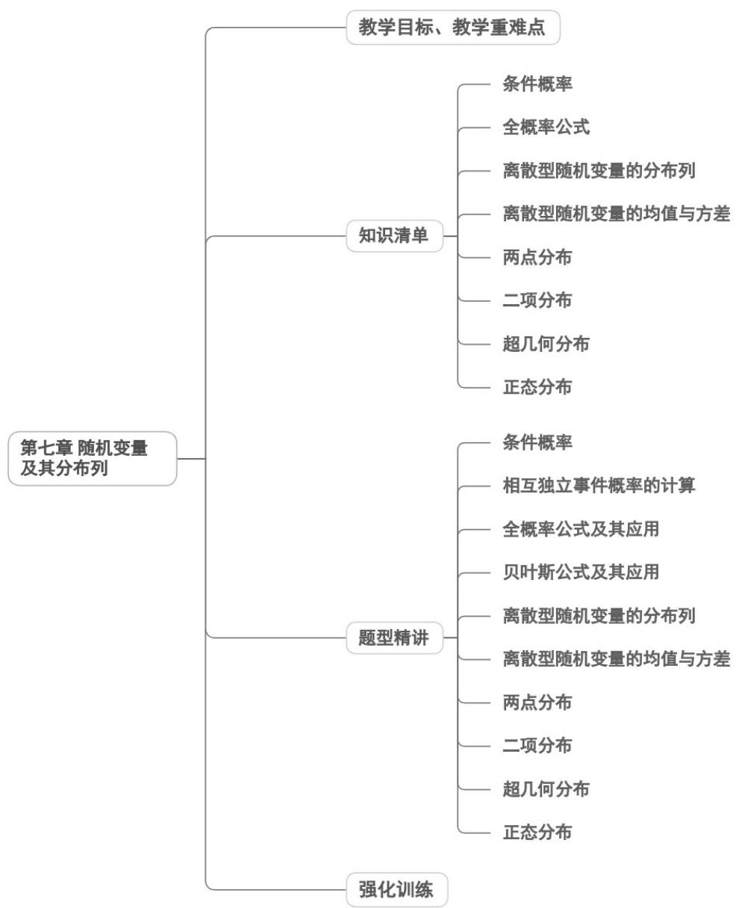

<!-- source-part:1 pages:1-50 -->

## 第七章 随机变量及其分布列



## 教学目标、教学重难点

<table><tr><td>教学目标</td><td>1. 理解随机变量的定义,能区分离散型随机变量(取值可一一列举)与连续型随机变量(取值不可一一列举),掌握用字母表示随机变量的规范方法,能将随机试验结果数字化(如用0-1表示硬币正反面)。2.掌握离散型随机变量分布列的概念与结构,明确分布列“表格形式”“概率等式形式”的表示方法,牢记分布列的两大核心性质(所有概率非负、概率和为1),能依据性质检验分布列的合理性。3.熟练掌握两类经典分布模型:两点分布(0-1分布)、超几何分布与二项分布,理解各分布的适用场景(如放回抽样对应二项分布、不放回抽样对应超几何分布),能准确写出对应分布列。4.掌握数学期望与方差的定义式及计算方法,理解其统计意义(期望反映平均水平,方差刻画离散程度),能运用期望、方差分析随机现象的稳定性与集中趋势。</td></tr><tr><td>教学重难点</td><td>重点1.随机变量的概念理解与数字化转化:核心是让学生掌握“用数字表示随机试验结果”的方法,无论是自然对应(如骰子点数)还是人为约定(如硬币正反面用0-1表示),明确随机变量的本质是“刻画随机现象的变量”。2.离散型随机变量分布列的概念与性质:理解分布列是“随机变量取值与对应概率的对应关系”,能规范列出分布列,并利用“概率非负”“概率和为1”两大性质检验结果正确性。3.经典分布模型的识别与应用:能根据实际问题情境(放回/不放回、独立重复试验等)准确区分两点分布、超几何分布与二项分布,熟练写出分布列并计算相关概率。4.期望与方差的计算与意义解读:掌握期望、方差的基本计算方法,能结合具体问题解释其实际含义(如比较两组数据的稳定性、评估方案的合理性)。难点1.随机变量的抽象理解:难以摆脱“变量必为确定性数值”的固有认知,对“随机变量取值的不确定性与概率的确定性”存在困惑,不会恰当定义随机变量。2.分布列与函数的关系辨析:类比函数研究分布列时,难以理解“随机变量为自变量、</td></tr></table>

```txt
概率为因变量”的对应关系，对分布列的表示方法掌握不灵活。

3. 经典分布模型的精准区分：易混淆超几何分布与二项分布（核心是“不放回”与“放回/独立重复”的判断），对两点分布的适用条件（只有两个可能取值）理解不透彻。

4. 复杂情境下的概率计算与模型构建：面对含限制条件的实际问题（如多步随机试验、分层抽样中的概率问题），难以准确界定随机变量的取值范围，易出现概率计算重复或遗漏。

5. 期望与方差的意义内化：能机械套用公式计算，但无法结合具体情境解释结果的实际价值（如不知道方差越小说明数据越稳定），缺乏运用数字特征分析问题的意识。
```

![[高中/课堂同步/题库/人教A版高中数学同步讲义(2026)/05_选择性必修第三册/第七章 随机变量及其分布/讲义/第七章_随机变量及其分布列_高效培优讲义_数学人教A版高二选择性必修第/知识清单_sec_01/知识清单_sec_01.md]]
![[高中/课堂同步/题库/人教A版高中数学同步讲义(2026)/05_选择性必修第三册/第七章 随机变量及其分布/讲义/第七章_随机变量及其分布列_高效培优讲义_数学人教A版高二选择性必修第/知识点_01_条件概率_sec_02/知识点_01_条件概率_sec_02.md]]
![[高中/课堂同步/题库/人教A版高中数学同步讲义(2026)/05_选择性必修第三册/第七章 随机变量及其分布/讲义/第七章_随机变量及其分布列_高效培优讲义_数学人教A版高二选择性必修第/即学即练_sec_03/即学即练_sec_03.md]]
![[高中/课堂同步/题库/人教A版高中数学同步讲义(2026)/05_选择性必修第三册/第七章 随机变量及其分布/讲义/第七章_随机变量及其分布列_高效培优讲义_数学人教A版高二选择性必修第/知识点_02_全概率公式_sec_04/知识点_02_全概率公式_sec_04.md]]
![[高中/课堂同步/题库/人教A版高中数学同步讲义(2026)/05_选择性必修第三册/第七章 随机变量及其分布/讲义/第七章_随机变量及其分布列_高效培优讲义_数学人教A版高二选择性必修第/即学即练_sec_05/即学即练_sec_05.md]]
![[高中/课堂同步/题库/人教A版高中数学同步讲义(2026)/05_选择性必修第三册/第七章 随机变量及其分布/讲义/第七章_随机变量及其分布列_高效培优讲义_数学人教A版高二选择性必修第/知识点_03_离散型随机变量的分布列_sec_06/知识点_03_离散型随机变量的分布列_sec_06.md]]
![[高中/课堂同步/题库/人教A版高中数学同步讲义(2026)/05_选择性必修第三册/第七章 随机变量及其分布/讲义/第七章_随机变量及其分布列_高效培优讲义_数学人教A版高二选择性必修第/即学即练_sec_07/即学即练_sec_07.md]]
![[高中/课堂同步/题库/人教A版高中数学同步讲义(2026)/05_选择性必修第三册/第七章 随机变量及其分布/讲义/第七章_随机变量及其分布列_高效培优讲义_数学人教A版高二选择性必修第/知识点_04_离散型随机变量的均值与方差_sec_08/知识点_04_离散型随机变量的均值与方差_sec_08.md]]
![[高中/课堂同步/题库/人教A版高中数学同步讲义(2026)/05_选择性必修第三册/第七章 随机变量及其分布/讲义/第七章_随机变量及其分布列_高效培优讲义_数学人教A版高二选择性必修第/即学即练_sec_09/即学即练_sec_09.md]]
![[高中/课堂同步/题库/人教A版高中数学同步讲义(2026)/05_选择性必修第三册/第七章 随机变量及其分布/讲义/第七章_随机变量及其分布列_高效培优讲义_数学人教A版高二选择性必修第/知识点_05_两点分布_sec_10/知识点_05_两点分布_sec_10.md]]
![[高中/课堂同步/题库/人教A版高中数学同步讲义(2026)/05_选择性必修第三册/第七章 随机变量及其分布/讲义/第七章_随机变量及其分布列_高效培优讲义_数学人教A版高二选择性必修第/知识点_07_超几何分布_sec_11/知识点_07_超几何分布_sec_11.md]]
![[高中/课堂同步/题库/人教A版高中数学同步讲义(2026)/05_选择性必修第三册/第七章 随机变量及其分布/讲义/第七章_随机变量及其分布列_高效培优讲义_数学人教A版高二选择性必修第/即学即练_sec_12/即学即练_sec_12.md]]
![[高中/课堂同步/题库/人教A版高中数学同步讲义(2026)/05_选择性必修第三册/第七章 随机变量及其分布/讲义/第七章_随机变量及其分布列_高效培优讲义_数学人教A版高二选择性必修第/知识点_08_正态分布_sec_13/知识点_08_正态分布_sec_13.md]]
![[高中/课堂同步/题库/人教A版高中数学同步讲义(2026)/05_选择性必修第三册/第七章 随机变量及其分布/讲义/第七章_随机变量及其分布列_高效培优讲义_数学人教A版高二选择性必修第/即学即练_sec_14/即学即练_sec_14.md]]
![[高中/课堂同步/题库/人教A版高中数学同步讲义(2026)/05_选择性必修第三册/第七章 随机变量及其分布/讲义/第七章_随机变量及其分布列_高效培优讲义_数学人教A版高二选择性必修第/题型精讲_sec_15/题型精讲_sec_15.md]]
![[高中/课堂同步/题库/人教A版高中数学同步讲义(2026)/05_选择性必修第三册/第七章 随机变量及其分布/讲义/第七章_随机变量及其分布列_高效培优讲义_数学人教A版高二选择性必修第/题型01_条件概率_sec_16/题型01_条件概率_sec_16.md]]
![[高中/课堂同步/题库/人教A版高中数学同步讲义(2026)/05_选择性必修第三册/第七章 随机变量及其分布/讲义/第七章_随机变量及其分布列_高效培优讲义_数学人教A版高二选择性必修第/题型02_相互独立事件概率的计算_sec_17/题型02_相互独立事件概率的计算_sec_17.md]]
![[高中/课堂同步/题库/人教A版高中数学同步讲义(2026)/05_选择性必修第三册/第七章 随机变量及其分布/讲义/第七章_随机变量及其分布列_高效培优讲义_数学人教A版高二选择性必修第/题型03_全概率公式及其应用_sec_18/题型03_全概率公式及其应用_sec_18.md]]
![[高中/课堂同步/题库/人教A版高中数学同步讲义(2026)/05_选择性必修第三册/第七章 随机变量及其分布/讲义/第七章_随机变量及其分布列_高效培优讲义_数学人教A版高二选择性必修第/题型_04_贝叶斯公式及其应用_sec_19/题型_04_贝叶斯公式及其应用_sec_19.md]]
![[高中/课堂同步/题库/人教A版高中数学同步讲义(2026)/05_选择性必修第三册/第七章 随机变量及其分布/讲义/第七章_随机变量及其分布列_高效培优讲义_数学人教A版高二选择性必修第/题型05_离散型随机变量的分布列_sec_20/题型05_离散型随机变量的分布列_sec_20.md]]
![[高中/课堂同步/题库/人教A版高中数学同步讲义(2026)/05_选择性必修第三册/第七章 随机变量及其分布/讲义/第七章_随机变量及其分布列_高效培优讲义_数学人教A版高二选择性必修第/题型06_离散型随机变量的均值与方差_sec_21/题型06_离散型随机变量的均值与方差_sec_21.md]]
![[高中/课堂同步/题库/人教A版高中数学同步讲义(2026)/05_选择性必修第三册/第七章 随机变量及其分布/讲义/第七章_随机变量及其分布列_高效培优讲义_数学人教A版高二选择性必修第/题型07_两点分布_sec_22/题型07_两点分布_sec_22.md]]
![[高中/课堂同步/题库/人教A版高中数学同步讲义(2026)/05_选择性必修第三册/第七章 随机变量及其分布/讲义/第七章_随机变量及其分布列_高效培优讲义_数学人教A版高二选择性必修第/题型08_二项分布_sec_23/题型08_二项分布_sec_23.md]]
![[高中/课堂同步/题库/人教A版高中数学同步讲义(2026)/05_选择性必修第三册/第七章 随机变量及其分布/讲义/第七章_随机变量及其分布列_高效培优讲义_数学人教A版高二选择性必修第/题型09_超几何分布_sec_24/题型09_超几何分布_sec_24.md]]
![[高中/课堂同步/题库/人教A版高中数学同步讲义(2026)/05_选择性必修第三册/第七章 随机变量及其分布/讲义/第七章_随机变量及其分布列_高效培优讲义_数学人教A版高二选择性必修第/题型10_正态分布_sec_25/题型10_正态分布_sec_25.md]]
![[高中/课堂同步/题库/人教A版高中数学同步讲义(2026)/05_选择性必修第三册/第七章 随机变量及其分布/讲义/第七章_随机变量及其分布列_高效培优讲义_数学人教A版高二选择性必修第/强化训练_sec_26/强化训练_sec_26.md]]
