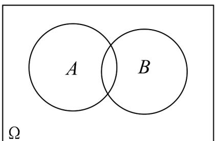

## 知识点 05 两点分布

1、若随机变量 X 服从两点分布，即其分布列为

<table><tr><td>X</td><td>0</td><td>1</td></tr><tr><td>P</td><td>1-p</td><td>p</td></tr></table>

其中 $0 < p < 1$ ，则称离散型随机变量 $X$ 服从参数为 $p$ 的两点分布．其中 $P(X = 1)$ 称为成功概率．

注意：

(1) 两点分布的试验结果只有两个可能性，且其概率之和为1；

(2) 两点分布又称 $0 - 1$ 分布、伯努利分布，其应用十分广泛。

2、两点分布的均值与方差：若随机变量 $X$ 服从参数为 $p$ 的两点分布，则 $E(X) = 1 \times p + 0 \times (1 - p) = p$

$$
D (X) = p (1 - p)
$$

【即学即练】

1. 若随机变量 $X$ 服从两点分布，其中 $P(X = 0) = \frac{1}{3}$ ，则下列结论正确的是（）A. $P(X = 1) = E(X)$ B. $E(3X + 2) = 4$ C. $D(3X + 2) = 4$ D. $D(X) = \frac{4}{9}$

【答案】AB

【分析】根据两点分布得 $P(X=1)=\frac{2}{3}$ ，再根据期望和方差公式以及性质，即可求解

【详解】由题意可知， $P(X=1)=\frac{2}{3}$ ，

所以 $E(X)=0\times\frac{1}{3}+1\times\frac{2}{3}=\frac{2}{3}$ ，故 A 正确；

$D(X)=\left(0-\frac{2}{3}\right)^{2}\times\frac{1}{3}+\left(1-\frac{2}{3}\right)^{2}\times\frac{2}{3}=\frac{2}{9}$ ，故D错误；

$E(3X+2)=3E(X)+2=4$ ，故 $^{B}$ 正确；

$D(3X+2)=9D(X)=2$ ，故C错误.

故选：AB

2. 已知随机变量 $X$ ， $Y$ 均服从两点分布，且 $P(X = 1) = \frac{1}{2}$ ， $P(Y = 1) = \frac{2}{3}$ ，若 $P(X = 1, Y = 1) = \frac{2}{5}$ ，则 $P(Y = 1|X = 0) = (\quad)$ A. $\frac{2}{5}$ B. $\frac{3}{5}$ C. $\frac{7}{15}$ D. $\frac{8}{15}$

【答案】D

【分析】利用全概率公式，由 $P(X = 1, Y = 1)$ 的值，得到 $P(X = 0, Y = 1)$ 的值，再由条件概率计算公式即可·
【详解】由于 $X$ 服从两点分布，且 $P(X = 1) = \frac{1}{2}$ ，因此 $P(X = 0) = 1 - P(X = 1) = 1 - \frac{1}{2} = \frac{1}{2}$ .

由全概率公式得 $P(Y=1)=P(X=0,Y=1)+P(X=1,Y=1)$

即 $\frac{2}{3}=P(X=0,Y=1)+\frac{2}{5}$

所以 $P(X=0,Y=1)=\frac{2}{3}-\frac{2}{5}=\frac{10}{15}-\frac{6}{15}=\frac{4}{15}$

由条件概率计算公式得 $P(Y=\|X=0)=\frac{P(X=0,Y=1)}{P(X=0)}=\frac{\frac{4}{15}}{\frac{1}{2}}=\frac{4}{15}\times2=\frac{8}{15}$ .

故选：D

知识点 06 二项分布

$n$ 次独立重复试验

1、定义

一般地，在相同条件下重复做的 $n$ 次试验称为 $n$ 次独立重复试验。

注意：独立重复试验的条件：①每次试验在同样条件下进行；②各次试验是相互独立的；③每次试验都只有

两种结果，即事件要么发生，要么不发生。

2、特点

(1) 每次试验中，事件发生的概率是相同的；

(2) 每次试验中的事件是相互独立的，其实质是相互独立事件的特例。

二项分布

1、定义

一般地，在 $n$ 次独立重复试验中，用 $X$ 表示事件 $A$ 发生的次数，设每次试验中事件 $A$ 发生的概率为 $p$ ，不发

生的概率 $q = 1 - p$ ，那么事件 $A$ 恰好发生 $k$ 次的概率是 $P(X = k) = \mathrm{C}_n^k p^k q^{n - k}$ （ $k = 0,1,2,\dots ,n$ ）

于是得到 $X$ 的分布列

<table><tr><td>X</td><td>0</td><td>1</td><td>...</td><td>k</td><td>...</td><td>n</td></tr><tr><td>p</td><td> $C_{n}^{0} p^{0} q^{n}$ </td><td> $C_{n}^{1} p^{1} q^{n-1}$ </td><td>...</td><td> $C_{n}^{k} p^{k} q^{n-k}$ </td><td>...</td><td> $C_{n}^{n} p^{n} q^{0}$ </td></tr></table>

由于表中第二行恰好是二项式展开式

$\left(q + p\right)^{n} = \mathrm{C}_{n}^{0}p^{0}q^{n} + \mathrm{C}_{n}^{1}p^{1}q^{n - 1} + \dots +\mathrm{C}_{n}^{k}p^{k}q^{n - k} + \dots +\mathrm{C}_{n}^{n}p^{n}q^{0}$ 各对应项的值，称这样的离散型随机变量 $X$ 服从参

数为 $n$ ， $p$ 的二项分布，记作 $X\sim B(n,p)$ ，并称 $p$ 为成功概率.

注意：由二项分布的定义可以发现，两点分布是一种特殊的二项分布，即 $n = 1$ 时的二项分布，所以二项分布

可以看成是两点分布的一般形式.

2、二项分布的适用范围及本质

(1) 适用范围：

①各次试验中的事件是相互独立的；

②每次试验只有两种结果：事件要么发生，要么不发生；

③随机变量是这 $n$ 次独立重复试验中事件发生的次数.

(2) 本质：二项分布是放回抽样问题，在每次试验中某一事件发生的概率是相同的。

3、二项分布的期望、方差

若 $X \sim B(n, p)$ ，则 $E(X) = np$ ， $D(X) = np(1 - p)$

【即学即练】

1. 甲、乙、丙三人参加“校史知识竞答”比赛，若甲、乙、丙三人荣获一等奖的概率分别为 $\frac{1}{3}, \frac{2}{3}, \frac{3}{4}$ ，且三人是

否获得一等奖相互独立，则这三人中仅有两人获得一等奖的概率为（）
A. $\frac{11}{36}$ B. $\frac{17}{36}$ C. $\frac{11}{24}$ D. $\frac{17}{24}$

【答案】B

【分析】根据独立事件概率公式，计算即可得出答案·

【详解】设这三人中仅有两人获得一等奖为事件 A，

$$
P (A) = \frac {1}{3} \times \frac {2}{3} \times \left(1 - \frac {3}{4}\right) + \frac {1}{3} \times \left(1 - \frac {2}{3}\right) \times \frac {3}{4} + \left(1 - \frac {1}{3}\right) \times \frac {2}{3} \times \frac {3}{4} = \frac {1 7}{3 6}.
$$

故选：B

2．已知一个古典概型的样本空间 $\Omega$ 和事件 A，B 如图所示·其中 $n(\Omega)=12, n(A)=6, n(B)=4, n(A\cup B)=8$

则事件 A 与事件 B ( )

A. 是互斥事件，不是独立事件 B. 不是互斥事件，是独立事件 C. 既是互斥事件，也是独立事件 D. 既不是互斥事件，也不是独立事件

【答案】B

【分析】根据互斥事件和独立事件的定义和概率公式计算即得

【详解】因 $n(\Omega) = 12, n(A) = 6, n(B) = 4, n(A \cup B) = 8$

则 $n(A \cap B) = n(A) + n(B) - n(A \cup B) = 2$

于是 $P(A) = \frac{1}{2}, P(B) = \frac{1}{3}, P(A \cup B) = \frac{2}{3}, P(A \cap B) = \frac{1}{6}$ ，

因 $P(A)+P(B)=\frac{1}{2}+\frac{1}{3}=\frac{5}{6}\neq P(A\cup B)$ ，则事件 A 与事件 B 不是互斥事件；

$P(A \cap B) = \frac{1}{6} = P(A) \cdot P(B)$ 又，则事件 A 与事件 B 是独立事件.

故选：B.
