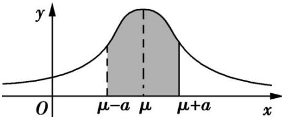

## 知识点 08 正态分布

正态曲线

1、定义：我们把函数 $\varphi_{\mu ,\sigma}(x) = \frac{1}{\sqrt{2\pi}\sigma}\mathrm{e}^{-\frac{(x - \mu)^2}{2\sigma^2}}$ ， $x\in (-\infty , + \infty)$ （其中 $\mu$ 是样本均值， $\sigma$ 是样本标准差）的图象

称为正态分布密度曲线，简称正态曲线．正态曲线呈钟形，即中间高，两边低．

2、正态曲线的性质

(1) 曲线位于 x 轴上方，与 x 轴不相交；

(2) 曲线是单峰的，它关于直线 $x = \mu$ 对称；

(3) 曲线在 $x = \mu$ 处达到峰值（最大值） $\frac{1}{\sqrt{2\pi}\sigma}$ ;

(4) 曲线与 x 轴之间的面积为 1；

(5) 当 $\sigma$ 一定时，曲线的位置由 $\mu$ 确定，曲线随着 $\mu$ 的变化而沿 $x$ 轴平移，如图甲所示：

(6) 当 $\mu$ 一定时，曲线的形状由 $\sigma$ 确定。 $\sigma$ 越小，曲线越“高瘦”，表示总体的分布越集中； $\sigma$ 越大，曲线越

“矮胖”，表示总体的分布越分散，如图乙所示：：

甲乙

正态分布

1、定义

随机变量 $X$ 落在区间 $(a, b]$ 的概率为 $P(a < X \leq b) = \int_{a}^{b} \varphi_{\mu, \sigma}(x) \mathrm{d}x$ ，即由正态曲线，过点 $(a, 0)$ 和点 $(b, 0)$ 的两条 $x$ 轴的垂线，及 $x$ 轴所围成的平面图形的面积，如下图中阴影部分所示，就是 $X$ 落在区间 $(a, b]$ 的概率

的近似值.

一般地，如果对于任何实数 $a$ ， $b(a < b)$ ，随机变量 $X$ 满足 $P(a < X \leq b) = \int_{a}^{b} \varphi_{\mu, \sigma}(x) \mathrm{d}x$ ，则称随机变量 $X$ 服从正态分布．正态分布完全由参数 $\mu$ ， $\sigma$ 确定，因此正态分布常记作 $N(\mu, \sigma^2)$ ．如果随机变量 $X$ 服从正态分布，则记为 $X \sim N(\mu, \sigma^2)$ ：

其中，参数 $\mu$ 是反映随机变量取值的平均水平的特征数，可以用样本的均值去估计； $\sigma$ 是衡量随机变量总体

波动大小的特征数，可以用样本的标准差去估计。

2、 $3\sigma$ 原则

若 $X \sim N(\mu, \sigma^2)$ ，则对于任意的实数 $a > 0$ ， $P(\mu - a < X \leq \mu + a) = \int_{\mu - a}^{\mu + a} \varphi_{\mu, \sigma}(x) \mathrm{d}x$ 为下图中阴影部分的面积，对于固定的 $\mu$ 和 $a$ 而言，该面积随着 $\sigma$ 的减小而变大。这说明 $\sigma$ 越小， $X$ 落在区间 $(\mu - a, \mu + a]$ 的概率越大，即 $X$ 集中在 $\mu$ 周围的概率越大

特别地，有 $P(\mu - \sigma < X \leq \mu + \sigma) = 0.6826$ ； $P(\mu - 2\sigma < X \leq \mu + 2\sigma) = 0.9544$ ； $P(\mu - 3\sigma < X \leq \mu + 3\sigma)$ $= 0.9974$

由 $P(\mu - 3\sigma < X \leq \mu + 3\sigma) = 0.9974$ ，知正态总体几乎总取值于区间 $(\mu - 3\sigma, \mu + 3\sigma)$ 之内。而在此区间以外取值的概率只有 $0.0026$ ，通常认为这种情况在一次试验中几乎不可能发生，即为小概率事件。在实际应用中，通常认为服从于正态分布 $N(\mu, \sigma^2)$ 的随机变量 $X$ 只取 $(\mu - 3\sigma, \mu + 3\sigma)$ 之间的值，并简称之为 $3\sigma$ 原则。
