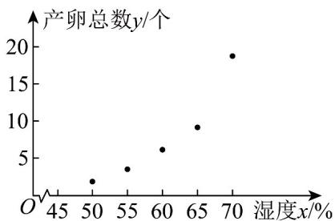

> [!faq]- 《专题01_成对数据的统计相关性的五大常考题型_高效培优专项训练_数学人》官方解析
>
> > [!success]- **【答案】** AC
>
> > [!note]- **【分析】**
> > 根据相关关系的概念判断·
>
> > [!note]- **【解析】**
> > - **①**：③具有相关关系，②④具有确定的关系，即函数关系·
> >
> > 故选：AC
> >
> > 4. 自行选择标准，将下列变量之间的关系分为两类，并分别阐述每一类中变量关系的特点：
> >
> > (1)圆的面积S与半径r之间的关系；
> >
> > (2)16 岁学生的体重 w 与身高 h 之间的关系；
> >
> > (3)商品销售量 $Q$ 与销售价格 $P$ 之间的关系；
> >
> > (4)匀速运动的物体，其运动的路程 $S$ 与时间 $t$ 之间的关系；
> >
> > (5)平均学习时间 t 与学习成绩 f 之间的关系
> >
> > 【答案】答案见解析
> >
> > 【分析】根据变量间的相关关系判断即可·
> >
> > 【详解】 $^{(1)(4)}$ 是变量之间的关系具有确定性，当一个变量确定后，另一个变量就确定了；
> >
> > (2)(3)(5)是变量之间确实有一定的关系，但没有达到可以互相决定的程度，它们之间的关系带有一定的随机性.
> >
> > 5. 蚯蚓是一种生活在土壤中的古老生物，其粪便含有丰富的氮、磷、钾等无机盐，可以增加土壤有机质并改善土壤结构，还能中和酸性或碱性土壤，使土壤适于农作物的生长．《2023年中央一号文件》中关于“加强高标准农田建设”章节里重点提到严厉打击电捕蚯蚓等破坏土壤行为．某研究小组响应保护蚯蚓这一举措，研究了50%-70%湿度区间内，对不同湿度情况下投放10条蚯蚓产卵数的情况，得出以下数据：
> >
> > <table><tr><td>湿度x/%</td><td>50</td><td>55</td><td>60</td><td>65</td><td>70</td></tr><tr><td>产卵总数y/个</td><td>2</td><td>4</td><td>6</td><td>9</td><td>18</td></tr></table>
> >
> > 根据表中数据，可以预测湿度为 $58\%$ 时10条蚯蚓的产卵总数，则此模型为\_\_\_\_，此表刻画了蚯蚓产卵总数与湿度之间的\_\_\_\_关系。
> >
> > 【答案】 回归模型 线性相关
> >
> > 【分析】作出散点图，由散点图结合回归模型的定义作出判断·
> >
> > 【详解】由数据作散点图如下：
> >
> > 
> >
> > 在蚯蚓产卵模型中，蚯蚓产卵总数 $y$ 与湿度 $x$ 相关，变量 $y$ 不完全由变量 $x$ 决定，在观测数据中存在误差，故此模型应为回归模型，刻画了蚯蚓产卵总数与湿度之间的线性相关关系。
> >
> > 故答案为：回归模型；线性相关·
> >
> > 6. 近年来，“共享汽车”在我国各城市迅猛发展，为人们的出行提供了便利，但也给城市交通管理带来了一些困难·为了解“共享汽车”在 $M$ 省的发展情况， $M$ 省某调查机构从该省随机抽取了5个城市，分别收集和分析了“共享汽车”的 $A$ ， $B$ ， $C$ 三项指标数据 $x_{i}, y_{i}, z_{i} (i = 1,2,3,4,5)$ ，数据如表所示：
> >
> > <table><tr><td>城市编号i</td><td>1</td><td>2</td><td>3</td><td>4</td><td>5</td></tr><tr><td>A指标xi</td><td>4</td><td>6</td><td>2</td><td>8</td><td>5</td></tr><tr><td>B指标yi</td><td>4</td><td>4</td><td>3</td><td>5</td><td>4</td></tr><tr><td>C指标zi</td><td>3</td><td>6</td><td>2</td><td>5</td><td>4</td></tr></table>
> >
> > 利用向量夹角来分析 $y$ 与 $x$ 之间及 $z$ 与 $x$ 之间的相关关系·
> >
> > 【答案】答案见解析
> >
> > 【分析】根据坐标运算得出向量，再结合夹角公式求出夹角余弦，进而判断相关性解正负相关。
> >
> > 【详解】由已知得 $\overline{x}=\frac{4+6+2+8+5}{5}=5,\quad\overline{y}=\frac{4+4+3+5+4}{5}=4$
> >
> > $$
> > \overline {{{z}}} = \frac {3 + 6 + 2 + 5 + 4}{5} = 4
> > $$
> >
> > 将题表中 x, y, z 的相关数据分别减去 $\overline{x}, \overline{y}, \overline{z}$
> >
> > 记 $a = \left(x_{1} - \overline{x},x_{2} - \overline{x},x_{3} - \overline{x},x_{4} - \overline{x},x_{5} - \overline{x}\right)$ ， $b = \left(y_{1} - \overline{y},y_{2} - \overline{y},y_{3} - \overline{y},y_{4} - \overline{y},y_{5} - \overline{y}\right)$
> >
> > $$
> > c = \left(z _ {1} - \overline {{z}}, z _ {2} - \overline {{z}}, z _ {3} - \overline {{z}}, z _ {4} - \overline {{z}}, z _ {5} - \overline {{z}}\right).
> > $$
> >
> > 则 $a = (-1, 1, -3, 3, 0)$ ， $b = (0, 0, -1, 1, 0)$ ， $c = (-1, 2, -2, 1, 0)$ .
> >
> > 于是 $\cos\langle a,b\rangle=\frac{-1\times0+1\times0+(-3)\times(-1)+3\times1+0\times0}{\sqrt{(-1)^{2}+1^{2}+(-3)^{2}+3^{2}+0^{2}}\times\sqrt{0^{2}+0^{2}+(-1)^{2}+1^{2}+0^{2}}}$
> >
> > $$
> > = \frac {6}{2 \sqrt {5} \times \sqrt {2}} = \sqrt {0 . 9} \approx 0. 9 5
> > $$
> >
> > $$
> > \cos \langle a, c \rangle = \frac {- 1 \times (- 1) + 1 \times 2 + (- 3) \times (- 2) + 3 \times 1 + 0 \times 0}{\sqrt {(- 1) ^ {2} + 1 ^ {2} + (- 3) ^ {2} + 3 ^ {2} + 0 ^ {2}} \times \sqrt {(- 1) ^ {2} + 2 ^ {2} + (- 2) ^ {2} + 1 ^ {2} + 0 ^ {2}}}
> > $$
> >
> > $$
> > = \frac {1 2}{2 \sqrt {5} \times \sqrt {1 0}} = \frac {3 \sqrt {2}}{5} \approx 0. 8 5
> > $$
> >
> > 所以 $y$ 与 $x$ ， $z$ 与 $x$ 正相关，又 $\cos \langle a, b \rangle > \cos \langle a, c \rangle$ ，则 $y$ 与 $x$ 之间的相关性比 $z$ 与 $x$ 之间的相关性强。
