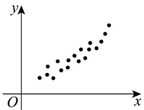
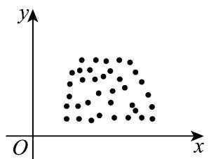
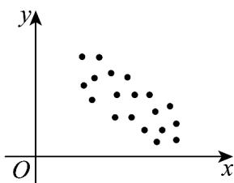

> [!faq]- 《专题01_成对数据的统计相关性的五大常考题型_高效培优专项训练_数学人》官方解析
>
> > [!success]- **【答案】** ②③
>
> > [!note]- **【分析】**
> > 根据相关关系是一种不确定的关系，是两个变量之间确实存在的关系，由此判断即可。
>
> > [!note]- **【解析】**
> > - **对于①**：，曲线上的点与该点的坐标之间的关系是一一对应关系，不是相关关系，是确定性关系；
> > - **对于②**：，苹果的产量与气候之间确实存在一定的关系，虽然变量的值不确定，但它们仍按某种规律在一定的范围内变化，属于相关关系；
> > - **对于③**：，森林中的同一种树木，其断面直径与高度之间确实存在一定的关系，虽然变量的值不确定，但它们仍按某种规律在一定的范围内变化，属于相关关系；
> > - **对于④**：，学生与他（她）的学号之间的关系是一种确定的对应关系，是映射，不是相关关系。
> >
> > 故答案为：②③
> >
> > 8. 观察下列散点图，有三种情况：①正相关，②负相关，③不相关．与散点图的位置相对应的序号依次是\_\_\_\_．
> >
> > 
> > 图1
> >
> > 
> > 图2
> >
> > 
> > 图3
> >
> > 【答案】①③②
> >
> > 【分析】由图象分析即可得到答案·
> >
> > 【详解】第一个图大体趋势从左向右上升，故是正相关，
> >
> > 第二个图不相关，
> >
> > 第三个图大体趋势从左向右下降，故是负相关。
> >
> > 故答案为：①③②。
> >
> > 9. 变量 $X$ 与 $Y$ 相对应的一组数据为 $(10,1)$ , $(11.3,2)$ , $(11.8,3)$ , $(12.5,4)$ , $(13,5)$ ; 变量 $U$ 与 $V$ 相对应的一组数据为 $(10,5)$ , $(11.3,4)$ , $(11.8,3)$ , $(12.5,2)$ , $(13,1)$ . 则变量 $Y$ 与 $X$ 之间\_\_\_\_相关, 变量 $V$ 与 $U$ 相关:
> >
> > 【答案】 正 负
> >
> > 【分析】通过相关系数的知识确定正确答案·
> >
> > 【详解】对于变量 X 与 Y 而言，Y 随 X 的增大而增大，故变量 Y 与 X 正相关；
> >
> > 对于变量 U 与 V 而言，V 随 U 的增大而减小，故变量 V 与 U 负相关。
> >
> > 故答案为：①正；
> > - **②**：负
