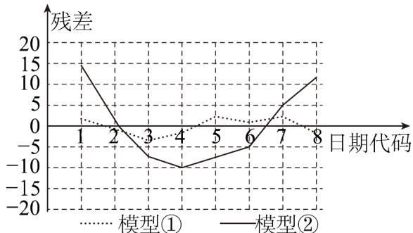

> [!faq]- 《专题01_成对数据的统计相关性的五大常考题型_高效培优专项训练_数学人》官方解析
>
> > [!success]- **【答案】** C
>
> > [!note]- **【分析】**
> > 利用线性回归模型的特点可判断 $^{AB}$ 选项；利用残差图的特点可判断 $^{C}$ 选项；利用决定系数与模型拟合效果的关系可判断 $^{D}$ 选项.
>
> > [!note]- **【解析】**
> > 对于 $^{A}$ 选项，线性回归模型 $y = bx + a + e$ 中，方程表示的是不确定关系，
> >
> > 所以，线性回归模型 $y = bx + a + e$ 不是一次函数，A 错；
> >
> > 对于 B 选项，在线性回归模型 $y = bx + a + e$ 中，因变量 y 由自变量 x 和随机误差共同决定，B 错；
> >
> > 对于 $^{C}$ 选项，在残差图中，残差点比较均匀地落在水平带状区域中，说明选用的模型比较合适， $^{C}$ 对；
> >
> > 对于 D 选项，用 $R^{2}=1-\frac{\sum_{i=1}^{n}\left(y_{i}-\bar{y}_{i}\right)^{2}}{\sum_{i=1}^{n}\left(y_{i}-\bar{y}\right)^{2}}$ 来刻画回归方程，越大，拟合的效果越好，D 错.
> >
> > 故选：C
> >
> > 30. 新型冠状病毒肺炎 COVID-19 疫情发生以来，在世界各地逐渐蔓延·在全国人民的共同努力和各级部门的严格管控下，我国的疫情已经得到了很好的控制·然而，小王同学发现，每个国家在疫情发生的初期，由于认识不足和措施不到位，感染人数都会出现快速的增长·下表是小王同学记录的某国连续 $^{8}$ 天每日新型冠状病毒感染确诊的累计人数·
> >
> > <table><tr><td>日期代码x</td><td>1</td><td>2</td><td>3</td><td>4</td><td>5</td><td>6</td><td>7</td><td>8</td></tr><tr><td>累计确诊人数y</td><td>4</td><td>8</td><td>16</td><td>31</td><td>51</td><td>71</td><td>97</td><td>122</td></tr></table>
> >
> > 为了分析该国累计感染人数的变化趋势，小王同学分别用两杆模型：① $\hat{y}=bx^{2}+a$ ，② $\hat{y}=dx+c$ 对变量 x 和 y 的关系进行拟合，得到相应的回归方程并进行残差分析，残差图如下（注：残差 $\hat{e}_{i}=y_{i}-\hat{y}_{i}$ ）：经过计算得 $\sum_{i=1}^{8}(x_{i}-\bar{x})(y_{i}-\bar{y})=728$ ， $\sum_{i=1}^{8}(x_{i}-\bar{x})^{2}=42$ ， $\sum_{i=1}^{8}(z_{i}-\bar{z})(y_{i}-\bar{y})=6868$ ， $\sum_{i=1}^{8}(z_{i}-\bar{z})^{2}=3570$ ，其中 $z_{i}=x_{i}^{2}$ ， $\bar{z}=\frac{1}{8}\sum_{i=1}^{8}z_{i}$ 。
> >
> > 
> >
> > (1)根据残差图，比较模型①，②的拟合效果，应该选择哪个模型？并简要说明理由；
> >
> > (2)根据（1）问选定的模型求出相应的回归方程（系数均保留两位小数）；
> >
> > (3)由于时差，该国截止第 $^{9}$ 天新型冠状病毒感染确诊的累计人数尚未公布·小王同学认为，如果防疫形势没有得到明显改善，在数据公布之前可以根据他在（2）问求出的回归方程来对感染人数做出预测，那么估计该地区第 $^{9}$ 天新型冠状病毒感染确诊的累计人数是多少？（结果保留整数）
> >
> > 附：回归直线的斜率和截距的最小二乘估计公式分别为： $\hat{b} = \frac{\sum_{i=1}^{8}\left(x_i - \overline{x}\right)\left(y_i - \overline{y}\right)}{\sum_{i=1}^{8}\left(x_i - \overline{x}\right)^2},\quad \hat{a} = \overline{y} -\hat{b}\overline{x}$
> >
> > 【答案】(1)选择模型①，理由见解析
> >
> > (2) $\hat{y} = 1.92x^{2} + 1.04$
> >
> > (3)157
> >
> > 【分析】（1）选择模型①·根据残差的意义直接判断；（2）套公式求出系数，即可得到y关于x的回归方程；（3）将x=9代入，即可求得
> >
> > 【详解】（1）选择模型①·理由如下：根据残差图可以看出，模型①的估计值和真实值相对比较接近，模型②的残差相对较大一些，所以模型①的拟合效果相对较好
> >
> > （2）由（1），知y关于x的回归方程为 $\hat{y}=bx^{2}+a$ ，令 $z=x^{2}$ ，则 $\hat{y}=bz+a$ 。
> >
> > 由所给数据得： $\overline{z}=\frac{1}{8}(1+4+9+16+25+36+49+64)=25.5$ $y=\frac{1}{8}(4+8+16+31+51+71+97+122)=50$ $\hat{b}=\frac{\sum\limits_{i=1}^{8}(z_{i}-\overline{z})(y_{i}-\overline{y})}{\sum\limits_{i=1}^{n}(z_{i}-\overline{z})^{2}}=\frac{6868}{3570}\approx1.92$ $\hat{a}=\overline{y}-\hat{b}\overline{z}\approx50-1.92\times25.5=1.04$ ，∴y关于x的回归方程为 $\hat{y}=1.92x^{2}+1.04$ （3）将x=9代入上式，得 $\hat{y}=1.92\times9^{2}+1.04=156.56\approx157$ （人），
> >
> > 所以预测该地区第9天新型冠状病毒感染确诊的累计人数为 $^{157}$ 人·
> >
> > 题型四：相关指数的计算及分析
