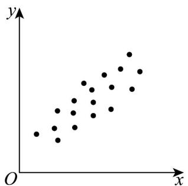
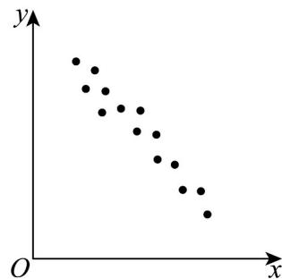

<!-- question-source:start -->
13. 对两组数据进行统计后得到如图所示的散点图，下列结论不正确的是（）

图1

图2

A. 图1、图2两组数据都具有线性相关关系
B. 图1数据正相关，图2数据负相关
C. 图1相关系数 $r_1$ 小于图2相关系数 $r_2$ D. 图1相关系数和图2相关系数之和小于0
<!-- question-source:end -->

![[高中/课堂同步/题库/人教A版高中数学同步讲义(2026)/05_选择性必修第三册/第八章 成对数据的统计分析/专项训练/专题01_成对数据的统计相关性的五大常考题型_高效培优专项训练_数学人/题型二_sec_03/questions/answers/Q00059833A1.md]]
