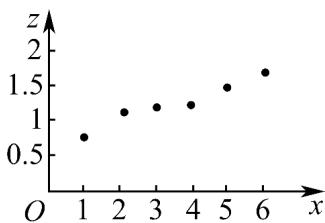

<!-- question-source:start -->
46. 某科技公司为加强研发能力，研发费用逐年增加，最近 $^{6}$ 年的研发费用 $y$ （单位：亿元）与年份编号 $x$ 得到样本数据 $\left(x_{i},y_{i}\right)(i=1,2,3,4,5,6)$ ，令 $z_{1}=\ln y_{1}$ ，并将 $\left(x_{i},z_{i}\right)$ 绘制成下面的散点图。若用方程 $y=a\mathrm{e}^{bx}$ 对 $y$ 与x的关系进行拟合，则（）

A. $a > 1, b > 0$ B. $a > 1, b < 0$ C. $0 < a < 1, b > 0$ D. $0 < a < 1, b < 0$
<!-- question-source:end -->

![[高中/课堂同步/题库/人教A版高中数学同步讲义(2026)/05_选择性必修第三册/第八章 成对数据的统计分析/专项训练/专题01_成对数据的统计相关性的五大常考题型_高效培优专项训练_数学人/题型四_sec_05/questions/answers/Q00059858A1.md]]
