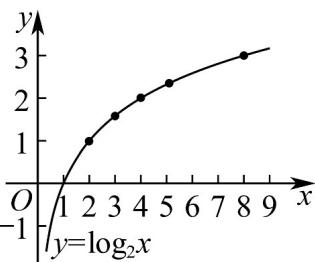

> [!faq]- 《专题01_成对数据的统计相关性的五大常考题型_高效培优专项训练_数学人》官方解析
>
> > [!success]- **【答案】** ④
>
> > [!note]- **【分析】**
> > 根据表中提供的数据，可通过描点，连线，画出图象，看哪个函数的图象能接近所画图象，这个
> >
> > 函数便可反应这些数据的规律.
>
> > [!note]- **【解析】**
> > 根据表中数据，画出图象如下：
> >
> > 
> >
> > 通过图象可看出， $y = \log_2 x$ 能比较近似的反映这些数据的规律。
> >
> > 故答案为：④。
