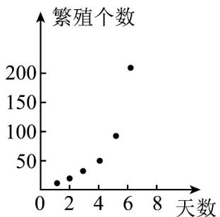
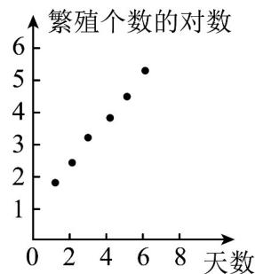
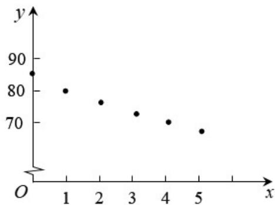

> [!faq]- 《专题01_成对数据的统计相关性的五大常考题型_高效培优专项训练_数学人》官方解析
>
> > [!success]- **【答案】** A
>
> > [!note]- **【分析】**
> > 根据非线性回归方程结合图象即可得到答案·
>
> > [!note]- **【解析】**
> > 因为 $y = ae^{bx}$ ，令 $z = \ln y$ ，则 z 与 x 的回归方程为 $z = bx + \ln a$ 。
> > 根据散点图可知 z 与 x 正相关，所以 b > 0.
> > 从回归直线图象可知， $z = bx + \ln a$ 回归直线的纵截距大于 $^{0}$ ，
> >
> > 即 $\ln a > 0$ ，所以 a > 1。
> >
> > 故选：A.
> >
> > 47. 为了研究某种细菌随时间 $x$ 变化的繁殖个数 $y$ ，收集数据如下：
> >
> > <table><tr><td>天数x</td><td>1</td><td>2</td><td>3</td><td>4</td><td>5</td><td>6</td></tr><tr><td>繁殖个数y</td><td>6</td><td>12</td><td>25</td><td>49</td><td>95</td><td>190</td></tr></table>
> >
> > 求 $y$ 关于 $x$ 的回归方程.
> >
> > 参考数据：In 6≈1.79，In 12≈2.48，In 25≈3.22，In 49≈3.89，In 95≈4.55，In 190≈5.25.
> >
> > 【答案】 $\hat{y}=e^{0.69x+1.115}$
> >
> > 【分析】先作出散点图，由散点图得到样本点分布在一条指数型曲线 $y = c^{\mathrm{e}}bx$ 的周围，即 $\ln y = bx + \ln c$ ，再令 $z = \ln y$ ， $a = \ln c$ ，得到 $z = bx + a$ 求解。
> >
> > 【详解】解：作出散点图如图（1）所示.
> >
> > 
> > (1)
> >
> > 
> > (2)
> > 由散点图看出样本点分布在一条指数型曲线 $y = c^{\mathrm{e}}bx$ 的周围，则 $\ln y = bx + \ln c$ .
> >
> > 令 $z = \ln y, a = \ln c$ ，则 $z = bx + a$ .
> >
> > <table><tr><td>x</td><td>1</td><td>2</td><td>3</td><td>4</td><td>5</td><td>6</td></tr><tr><td>z</td><td>1.79</td><td>2.48</td><td>3.22</td><td>3.89</td><td>4.55</td><td>5.25</td></tr></table>
> >
> > 相应的散点图如图（2）所示．从图（2）可以看出，变换后的样本点分布在一条直线附近，因此可以用线性回归方程来拟合．
> >
> > 由表中数据得 $\overline{x} = \frac{1}{6}\left(1 + 2 + 3 + 4 + 5 + 6\right) = 3.5\overline{z} = \frac{1}{6}\left(1.79 + 2.4 + 3.22 + 3.89 + 4.55 + 5.25\right) = 3.53$ ， $\sum_{i=1}^{6} x_i z_i = 86.22, \sum_{i=1}^{6} x_i^2 = 91$
> >
> > $\hat{b} = \frac{\sum_{i=1}^{6}x_i z_i - 6\overline{xz}}{\sum_{i=1}^{6}x_i^2 - 6\overline{x}^2} = \frac{86.22 - 6 \times 3.5 \times 3.53}{91 - 6 \times 3.5^2} = 0.69$ ， $\hat{a} = \overline{z} - \hat{b}\overline{x} = 1.115$
> >
> > 所以线性回归方程为 $\hat{z}=0.69x+1.115$
> >
> > 因此细菌的繁殖个数对天数的非线性回归方程为 $\hat{y}=e^{0.69x+1.115}$
> >
> > 48. 中国茶文化博大精深，茶水的口感与茶叶类型和水的温度有关为了建立茶水温度 $y$ 随时间 $x$ 变化的函数模型，小明每隔1分钟测量一次茶水温度，得到若干组数据 $(x_1, y_1)$ 、 $(x_2, y_2)$ 、 $L$ 、 $(x_n, y_n)$ ，绘制了如图所示的散点图。小明选择了如下2个函数模型来拟合茶水温度 $y$ 随时间 $x$ 的变化情况，函数模型一： $y = kx + b(k < 0, x - 0)$ ；函数模型二： $y = ka^x + b(k > 0, 0 < a < 1, x - 0)$ ，下列说法不正确的是（）
> >
> > 
> >
> > A. 变量 $y$ 与 $x$ 具有负的相关关系
> >
> > B．由于水温开始降得快，后面降得慢，最后趋于平缓，故模型二能更好的拟合茶水温度随时间的变化情况C．若选择函数模型二，利用最小二乘法求得到 $y = ka^{x} + b$ 的图象一定经过点 $\left(\overline{x},\overline{y}\right)$ D．当 $x = 5$ 时，通过函数模型二计算得 $y = 65.1$ ，用温度计测得实际茶水温度为65.2，则残差为0.1
> >
> > 【答案】C
> >
> > 【分析】根据题中所给散点图，根据正负相关的概念即可判断 $^{A}$ 选项；根据水温的变化情况，以及指数函数的单调性，即可判断 $^{B}$ 选项；根据最小二乘法可求出的回归方程一定经过 $\left(\overline{a^{x}},\overline{y}\right)$ ，即可判断 $^{C}$ 选项；根据残差的定义可判断 $^{D}$ 选项。
> >
> > 【详解】对于 $^{A}$ 选项，观察散点图，变量x与y具有负的相关关系， $^{A}$ 对；
> >
> > 对于 $^{B}$ 选项，由于函数模型二中的函数 $y = ka^{x} + b (k > 0, 0 < a < 1, x = 0)$
> >
> > 在 $x = 0$ 时，函数单调递减，且递减速度越来越慢，
> >
> > 所以，模型二能更好的拟合茶水温度随时间的变化情况， $^{B}$ 对；
> >
> > 对于 $C$ 选项，若选择函数模型二，利用最小二乘法求出的回归方程一定经过 $\left(\overline{a^x},\overline{y}\right)$ ， $C$ 错；
> >
> > 对于 D 选项，根据残差的定义可知，残差 = 真实值 - 预测值，故残差为 65.2 - 65.1 = 0.1，D 对
> > 故选：C.
> >
> > 49. 以模型 $y = \mathrm{e}^{kx - 1}$ 去拟合一组数据时，已知如下数据： $\sum_{i=1}^{6} x_i = 18$ ， $y_1y_2y_3y_4y_5y_6 = \mathrm{e}^{48}$ 则实数 $k$ 的值为\_\_\_\_。
> >
> > 【答案】 $^{3}$
> >
> > 【分析】由指数的运算性质知 $k\sum_{i = 1}^{6}x_{i} - 6 = 48$ ，即可求结果
> >
> > 【详解】由 $y_{1}y_{2}y_{3}y_{4}y_{5}y_{6}=e^{48}\Rightarrow k\sum_{i=1}^{6}x_{i}-6=18k-6=48$ ，则 k=3
> >
> > 故答案为：3
> >
> > 50．数据显示，中国在线直播用户规模及在线直播购物规模近几年都保持高速增长态势，下表为2017-2021年中国在线直播用户规模（单位：亿人），其中2017年-2021年对应的代码依次为1-5.
> >
> > <table><tr><td>年份代码x</td><td>1</td><td>2</td><td>3</td><td>4</td><td>5</td></tr><tr><td>市场规模y</td><td>3.98</td><td>4.56</td><td>5.04</td><td>5.86</td><td>6.36</td></tr></table>
> >
> > (1)由上表数据可知，可用函数模型 $y = b\sqrt{x} + a$ 拟合 $y$ 与 $x$ 的关系，请建立 $y$ 关于 $x$ 的回归方程（ $\hat{a}$ ， $\hat{b}$ 的值精确到0.01）；
> >
> > (2)已知中国在线直播购物用户选择在品牌官方直播间购物与不在品牌官方直播间购物的人数之比为 $^{4}:1$ ，按照分层抽样从这两类用户中抽取 $^{5}$ 人，再从这 $^{5}$ 人中随机抽取 $^{2}$ 人，求这 $^{2}$ 人全是选择在品牌官方直播间购物用户的概率·
> >
> > 参考数据： $\overline{y}=5.16,\quad\overline{v}=1.68,\quad\sum_{i=1}^{5}v_{i}y_{i}=45.10$ ，其中 $v_{i}=\sqrt{x_{i}}$
> >
> > 参考公式：对于一组数据 $\left(v_{1},y_{1}\right),\left(v_{2},y_{2}\right),\ldots ,\left(v_{n},y_{n}\right)$ ，其回归直线 $\hat{y} = \hat{b} v + \hat{a}$ 的斜率和截距的最小二乘
> >
> > 估计公式分别为 $\hat{b} = \frac{\sum_{i=1}^{n} v_i y_i - n\bar{v} \cdot \bar{y}}{\sum_{i=1}^{n} v_i^2 - n\bar{v}^{-2}}$ ， $\hat{a} = \bar{y} - \hat{b}\bar{v}$ 。
> >
> > 【答案】(1) $\hat{y} = 1.98\sqrt{x} + 1.83$
> >
> > (2) $\frac{3}{5}$
> >
> > 【分析】（ $^{1}$ ）结合回归方程的求法，求得回归方程·
> >
> > (2) 利用列举法，结合古典概型的概率计算公式，计算出所求的概率·
> >
> > 【详解】（1）设 $v=\sqrt{x}$ ，则 $\hat{y}=\hat{b}\cdot v+\hat{a}$ ，
> >
> > $$
> > \overline {{y}} = 5. 1 6, \overline {{v}} = 1. 6 8, \sum_ {i = 1} ^ {5} v _ {i} ^ {2} = \sum_ {i = 1} ^ {5} x _ {i} = 1 5
> > $$
> >
> > $$
> > \hat {b} = \frac {\sum_ {i = 1} ^ {5} v _ {i} y _ {i} - 5 \bar {v} \cdot \bar {y}}{\sum_ {i = 1} ^ {5} v _ {i} ^ {2} - 5 \cdot \bar {v} ^ {- 2}} = \frac {4 5 . 1 0 - 5 \times 1 . 6 8 \times 5 . 1 6}{1 5 - 5 \times 1 . 6 8 ^ {2}} = \frac {1 . 7 5 6}{0 . 8 8 8} \approx 1. 9 8
> > $$
> >
> > $$
> > \hat {a} = \bar {y} - \hat {b} \bar {v} = 5. 1 6 - 1. 9 8 \times 1. 6 8 \approx 1. 8 3.
> > $$
> >
> > 所以 $y$ 关于 $x$ 的回归方程为 $\hat{y} = 1.98\sqrt{x} + 1.83$ .
> >
> > (2) 因为中国在线直播购物用户选择在品牌官方直播间购物与不在品牌官方直播间购物的人数之比为 $^{4}$ : 1,
> >
> > 按照分层抽样从这两类用户中抽取 $^{5}$ 人，则选择在品牌官方直播间购物的用户为4人，记作1,2,3,4，
> >
> > 不在品牌官方直播间购物的用户为1人，记作5
> >
> > 从这5人随机抽取2人，结果有：
> >
> > $(1,2),(1,3),(1,4),(1,5),(2,3),(2,4),(2,5),(3,4),(3,5),(4,5)$ ，共10种，
> >
> > 其中 2 人全是选择在品牌官方直播间购物用户的结果为：
> >
> > $(1,2),(1,3),(1,4),(2,3),(2,4),(3,4)$ ，共6种，
> >
> > 所以这 $^{2}$ 人全是选择在品牌官方直播间购物用户的概率为 $\frac{6}{10}=\frac{3}{5}$ .
