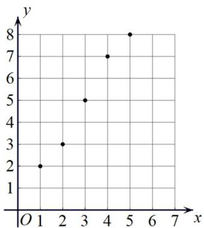

<!-- question-source:start -->
5. 某企业投资两个新型项目，投资新型项目 $A$ 的投资额 $m$ （单位：十万元）与纯利润 $n$ （单位：万元）的关系式为 $n = 1.7m - 0.5$ ，投资新型项目 $B$ 的投资额 $x$ （单位：十万元）与纯利润 $y$ （单位：万元）的散点图如图所示。

(1) 求 $y$ 关于 $x$ 的线性回归方程；

(2) 若该企业有一笔资金 $Q$ （万元）用于投资 $A, B$ 两个项目中的一个，为了收益最大化，应如何设计投资方案？

附：回归直线的斜率和截距的最小二乘估计分别为 $\hat{b} = \frac{\sum_{i=1}^{n}x_iy_i - n\overline{x}\overline{y}}{\sum_{i=1}^{n}x_i^2 - n\overline{x}^2}$ ， $\hat{a} = \overline{y} -\hat{b}\overline{x}$
<!-- question-source:end -->

![[高中/课堂同步/题库/人教A版高中数学同步讲义(2026)/05_选择性必修第三册/第八章 成对数据的统计分析/专项训练/专题02_一元线性回归模型及应用的五大常考题型_高效培优专项训练_数学/题型一_sec_02/questions/answers/Q00059862A1.md]]
