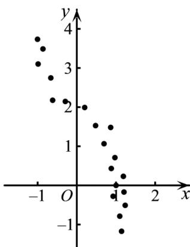

<!-- question-source:start -->
6. 如图是两个变量的散点图，y 关于 x 的回归方程可能是（）

A. $y = 3\ln |x| + 2$ B. $y = 3e^{x} - 1$ C. $y = -2x^{3} + 2$ D. $y = -\frac{1}{10} x + 2$
<!-- question-source:end -->

![[高中/课堂同步/题库/人教A版高中数学同步讲义(2026)/05_选择性必修第三册/第八章 成对数据的统计分析/专项训练/专题02_一元线性回归模型及应用的五大常考题型_高效培优专项训练_数学/题型一_sec_02/questions/answers/Q00059863A1.md]]
