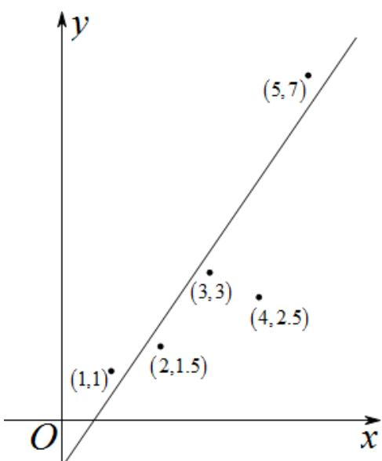

> [!faq]- 《专题02_一元线性回归模型及应用的五大常考题型_高效培优专项训练_数学》官方解析
>
> > [!success]- **【答案】** C
>
> > [!note]- **【分析】**
> > 在坐标系中画出五个点，结果除去 $(4,2.5)$ 之外，其余的点都在一条线附近，去掉这个点以后剩下的数据更具有相关关系：
>
> > [!note]- **【解析】**
> > $(1,1),(2,1.5),(3,3),(4,2.5),(5,7)$ ，在坐标系中画出五个点，
> >
> > 
> >
> > 结果除去 $(4,2.5)$ 之外，其余的点都在一条线附近，
> >
> > 去掉这个点以后剩下的数据更具有相关关系，
> >
> > 故选 **C**
