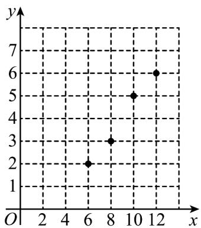
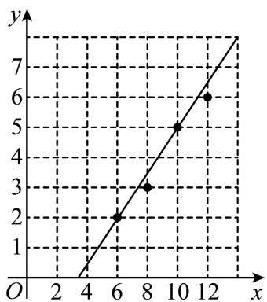

> [!faq]- 《专题02_一元线性回归模型及应用的五大常考题型_高效培优专项训练_数学》官方解析
>
> > [!success]- **【答案】** $^{(1)}$ 答案见解析 (2)答案见解析 (3)4.
>
> > [!note]- **【分析】**
> > （1）利用给出的成对数据，画出散点图；
> >
> > (2) 通过观察图象找到近似拟合的直线并画图；
> >
> > (3) 求出这条拟合直线的方程，并进行预测
>
> > [!note]- **【解析】**
> > （1）如图：
> >
> > 
> >
> > (2) 观察发现这四个点在点 $(6,2)$ 和点 $(10,5)$ 连线的附近，故过两点的直线可以近似地表示记忆力与判断力的关系·如图：
> >
> > 
> >
> > （3）由表中数据可得， $\overline{x} = \frac{6 + 8 + 10 + 12}{4} = 9$ ， $\overline{y} = \frac{2 + 3 + 5 + 6}{4} = 4$ ， $4\overline{x} \cdot \overline{y} = 4 \times 9 \times 4 = 144$ ， $\sum_{i=1}^{4} x_i y_i = 6 \times 2 + 8 \times 3 + 10 \times 5 + 12 \times 6 = 158$ ， $\sum_{i=1}^{4} x_i^2 = 6^2 + 8^2 + 10^3 + 12^2 = 344$ ，则 $\hat{b} = \frac{\sum_{i=1}^{4} x_i y_i - 4\overline{x} \cdot \overline{y}}{\sum_{i=1}^{4} x_i^2 - 4\overline{x}^2} = \frac{158 - 144}{344 - 4 \cdot 9^2} = 0.7$ ， $\hat{a} = \overline{y} - \hat{b}\overline{x} = 4 - 0.7 \times 9 = -2.3$ ，故所求回归直线方程为 $\hat{y} = 0.7x - 2.3$ ，令 $x = 9$ ，则 $\hat{y} = 0.7 \times 9 - 2.3 = 4$ 。所以记忆力为 $^9$ 的同学的判断力约为 $^4$
