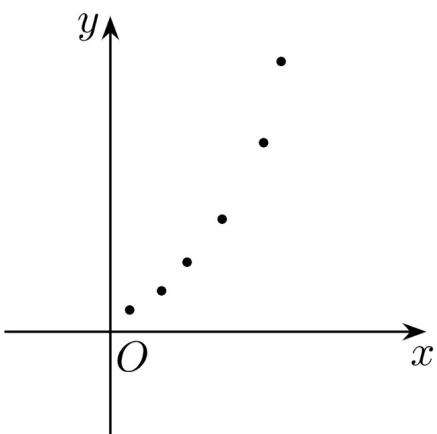

> [!faq]- 《专题02_一元线性回归模型及应用的五大常考题型_高效培优专项训练_数学》官方解析
>
> > [!success]- **【答案】** C
>
> > [!note]- **【分析】**
> > 根据散点图与给所函数的图象的偏离情况，即可求解·
>
> > [!note]- **【解析】**
> > 由散点图可知， $y$ 与 $x$ 负相关，故排除 $\mathsf{A},\mathsf{B}$ ，对于 $\mathsf{D}:y = -\frac{1}{10} x + 2$ ，点 $(x,y)$ 偏离 $y = -\frac{1}{10} x + 2$ 较大，而点 $(x,y)$ 近似在曲线 $y = -2x^{3} + 2$ 附近，所以 $y$ 关于 $x$ 的回归方程是 $\mathbb{C}$ 的可能性大。
> >
> > $$
> > \mathrm{C}
> > $$
> >
> > 7. 变量 $x, y$ 的散点图如图所示，根据散点图，下面四个回归方程类型中最适宜作为 $y$ 和 $x$ 的回归方程类型的是（）.
> >
> > 
> >
> > A. $y = -b^{2}x + a$ B. $y = bx^{2} + a$ C. $y = \frac{b^{2}}{x} +a$ D. $y = b\sqrt{x} +a$
> >
> > 【答案】B
> >
> > 【分析】根据散点图据曲线形状结合一次函数，二次函数，反比例函数及幂函数的性质判断即得.
> >
> > 【详解】由散点图可以看出 $y$ 随着 $x$ 的增长速度越来越快，结合一次函数，二次函数，反比例函数及幂函数的性质可知，
> >
> > 最适宜作为 $y$ 和 $x$ 的回归方程类型的是： $y = bx^2 + a$
> >
> > 故选 **B**.
