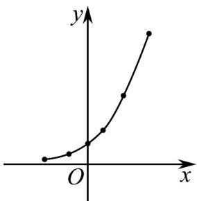

> [!faq]- 《专题02_一元线性回归模型及应用的五大常考题型_高效培优专项训练_数学》官方解析
>
> > [!success]- **【答案】** B
>
> > [!note]- **【分析】**
> > 根据题设中表格中的数据画出散点图，结合图象和选项，得到答案·
>
> > [!note]- **【解析】**
> > 由表格中的数据，作出数据的散点图，如图所示，
> >
> > 数据散点图和指数型函数的图象类似，所以选项 B 最能反映 x, y 之间的函数关系。故选：B.
> >
> > 
