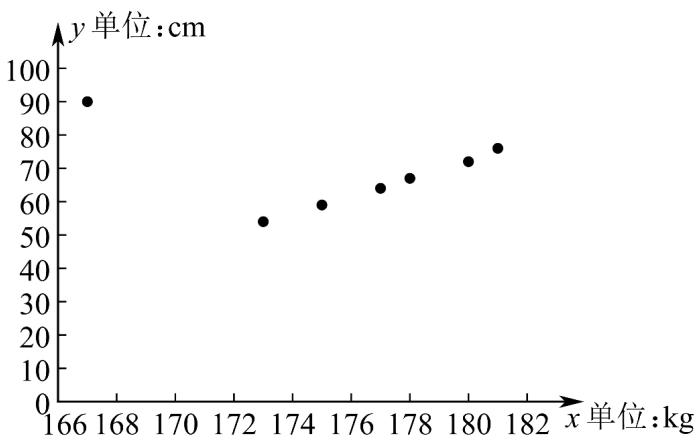

<!-- question-source:start -->
42. 某校为了解本校高一男生身高和体重的相关关系，在该校高一年级随机抽取了 $^{7}$ 名男生，测量了他们的身高和体重得下表：

<table><tr><td>身高x(单位:cm)</td><td>167</td><td>173</td><td>175</td><td>177</td><td>178</td><td>180</td><td>181</td></tr><tr><td>体重y(单位:kg)</td><td>90</td><td>54</td><td>59</td><td>64</td><td>67</td><td>72</td><td>76</td></tr></table>

由表格制作成如图所示的散点图：

由最小二乘法计算得到经验回归直线 $l_{1}$ 的方程为 $\hat{y} = \bar{b}_1x + \bar{a}_1$ ，其相关系数为 $r_1$ ；经过残差分析，点(167,90)对应残差过大，把它去掉后，再用剩下的6组数据计算得到经验回归直线 $l_{2}$ 的方程为 $\hat{y} = \bar{b}_2x + \bar{a}_2$ ，相关系数为 $r_2$ ·则下列选项正确的是（ ）A. $\bar{b}_1 < \bar{b}_2, \bar{a}_1 > \bar{a}_2, r_1 < r_2$ B. $\bar{b}_1 < \bar{b}_2, \bar{a}_1 < \bar{a}_2, r_1 > r_2$ C. $\bar{b}_1 > \bar{b}_2, \bar{a}_1 < \bar{a}_2, r_1 > r_2$ D. $\bar{b}_1 > \bar{b}_2, \bar{a}_1 > \bar{a}_2, r_1 < r_2$
<!-- question-source:end -->

![[高中/课堂同步/题库/人教A版高中数学同步讲义(2026)/05_选择性必修第三册/第八章 成对数据的统计分析/专项训练/专题02_一元线性回归模型及应用的五大常考题型_高效培优专项训练_数学/题型五_sec_06/questions/answers/Q00059887A1.md]]
