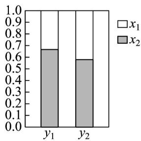
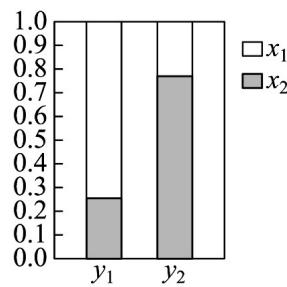
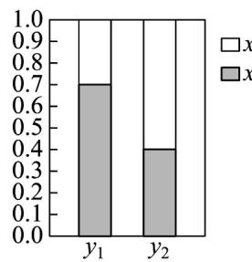
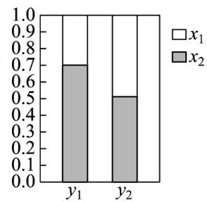

> [!faq]- 《专题03_列联表与独立性检验的四大常考题型_高效培优专项训练_数学人教》官方解析
>
> > [!success]- **【答案】** B
>
> > [!note]- **【分析】**
> > 由列联表数据，列出等式即可求解；
>
> > [!note]- **【解析】**
> > 由 $a + 35 = 45$ ，得 $a = 10$
> >
> > 由 $a + 7 = m$ ，得 $m = 17$
> >
> > 由 $m + 73 = s$ ，得 s = 90。
> >
> > 由 $45 + n = s$ ，得 n = 45。
> >
> > 故选：B
> >
> > 8．2022年9月23日，以“庆丰收同心共富，迎盛会齐向未来”为主题的第五个中国农民丰收节开幕式在盐城市射阳县海河镇举行，射阳县政府同步开展以“湿地绿城庆丰收、向海图强迎盛会”为主题的农民丰收节系列活动，现从某活动现场的观众中随机抽取200名（其中男性120名），了解他们对该活动的满意情况，得到下表。
> >
> > <table><tr><td></td><td>不满意</td><td>满意</td><td>合计</td></tr><tr><td>男性</td><td></td><td>75</td><td></td></tr><tr><td>女性</td><td>50</td><td></td><td></td></tr><tr><td>合计</td><td></td><td></td><td>200</td></tr></table>
> >
> > 根据统计数据完成 $2 \times 2$ 列联表.
> >
> > 【答案】答案见解析
> >
> > 【分析】利用给定条件计算数据，补充列联表即可·
> >
> > 【详解】因为男性有120名，一共有200名观众，
> >
> > 所以一共有80名女性观众，而有50名女性观众不满意，
> >
> > 所以有 30 名女性观众满意，而有 75 名男性观众满意，
> >
> > 所以有 45 名男性观众不满意，故有 95 名观众不满意，有 105 名观众满意，
> >
> > 补全的 $2 \times 2$ 列联表如下.
> >
> > <table><tr><td></td><td>不满意</td><td>满意</td><td>合计</td></tr><tr><td>男性</td><td>45</td><td>75</td><td>120</td></tr><tr><td>女性</td><td>50</td><td>30</td><td>80</td></tr><tr><td>合计</td><td>95</td><td>105</td><td>200</td></tr></table>
> >
> > 9. 观察下面各等高堆积条形图，其中两个分类变量 $x$ 、 $y$ 相关关系最强的是 \_\_\_\_。
> >
> > 
> > 甲
> >
> > 
> > 乙
> >
> > 
> > 丙
> >
> > 
> > 丁
> > 【分析】根据选项中的图形，即可直接求解·
> >
> > 【答案】乙
> > 【详解】等高条形图中有两个高度相同的矩形，每个矩形都有两个颜色，观察下方颜色区域的高度，如果高度差越大，则两个分类变量关系越强，观察四个选项可知， $^{B}$ 选项中带颜色区域的高度差最大，两个分类变量x、y相关关系最强；
> > 故答案为：乙
