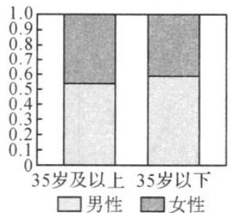
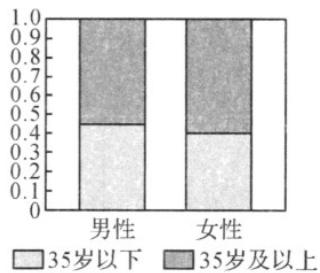

## 题型一：列联表

1．2018年12月1日，贵阳市地铁 $^{1}$ 号线全线开通，在一定程度上缓解了市内交通的拥堵状况．为了了解市民对地铁 $^{1}$ 号线开通的关注情况，某调查机构在地铁开通后的某两天抽取了部分乘坐地铁的市民作为样本，分析其年龄和性别结构，并制作出如下等高堆积条形图．

根据图中的信息，下列结论中一定正确的是（）.
A. 样本中男性比女性更关注地铁 $^{1}$ 号线全线开通
B. 样本中多数女性是 $^{35}$ 岁及以上
C. 样本中 $^{35}$ 岁以下的男性人数比 $^{35}$ 岁及以上的女性人数多
D. 样本中 $^{35}$ 岁及以上的人对地铁 $^{1}$ 号线的开通关注度更高

【答案】ABD

【分析】通过等高堆积条形图构建 $2 \times 2$ 列联表，根据条形图所呈现的信息得出列联表中各部分数量的大小关系，再依据这些关系对各个选项进行分析·

【详解】设等高堆积条形图对应的列联表如下：

<table><tr><td>项目</td><td>35岁及以上</td><td>35岁以下</td><td>合计</td></tr><tr><td>男性</td><td>a</td><td>c</td><td>a+c</td></tr><tr><td>女性</td><td>b</td><td>d</td><td>b+d</td></tr><tr><td>合计</td><td>a+b</td><td>c+d</td><td>a+b+c+d</td></tr></table>

根据第 $^{1}$ 个等高堆积条形图可知， $^{35}$ 岁及以上的男性比女性多，即a>b；

$^{35}$ 岁以下的男性也比女性多，即 c > d ，

根据第 $^{2}$ 个等高堆积条形图可知，男性中 $^{35}$ 岁及以上的比 $^{35}$ 岁以下的多，即a>c；

女性中 $^{35}$ 岁及以上的也比 $^{35}$ 岁以下的多，即b>d

对于选项 $^{A}$ ，男性人数为 $a+c$ ，女性人数为 $b+d$ ，∵a>b,c>d，∴ $a+c>b+d$ ，故 $^{A}$ 正确，

对于选项 $^{B}$ ， $^{35}$ 岁及以上女性人数为 b， $^{35}$ 岁以下女性人数为 d， $\because b > d$ ，故 $^{B}$ 正确，

对于选项 $^{C}$ ， $^{35}$ 岁以下男性人数为 c， $^{35}$ 岁及以上女性人数为 b，由 a > b, a > c, c > d, b > d，无法直接判断 b 与 c 的大小关系，故 $^{C}$ 不一定正确，

对于选项 D， $^{35}$ 岁及以上的人数为 $a + b$ ， $^{35}$ 岁以下的人数为 $c + d$ ， $\because a > c, b > d$ ， $\because a + b > c + d$ ，故 D 正确，

故选：ABD.

![[高中/课堂同步/题库/人教A版高中数学同步讲义(2026)/05_选择性必修第三册/第八章 成对数据的统计分析/专项训练/专题03_列联表与独立性检验的四大常考题型_高效培优专项训练_数学人教/题型一_sec_02/questions/Q00059895.md]]
![[高中/课堂同步/题库/人教A版高中数学同步讲义(2026)/05_选择性必修第三册/第八章 成对数据的统计分析/专项训练/专题03_列联表与独立性检验的四大常考题型_高效培优专项训练_数学人教/题型一_sec_02/questions/Q00059896.md]]
![[高中/课堂同步/题库/人教A版高中数学同步讲义(2026)/05_选择性必修第三册/第八章 成对数据的统计分析/专项训练/专题03_列联表与独立性检验的四大常考题型_高效培优专项训练_数学人教/题型一_sec_02/questions/Q00059897.md]]
![[高中/课堂同步/题库/人教A版高中数学同步讲义(2026)/05_选择性必修第三册/第八章 成对数据的统计分析/专项训练/专题03_列联表与独立性检验的四大常考题型_高效培优专项训练_数学人教/题型一_sec_02/questions/Q00059898.md]]
![[高中/课堂同步/题库/人教A版高中数学同步讲义(2026)/05_选择性必修第三册/第八章 成对数据的统计分析/专项训练/专题03_列联表与独立性检验的四大常考题型_高效培优专项训练_数学人教/题型一_sec_02/questions/Q00059899.md]]
