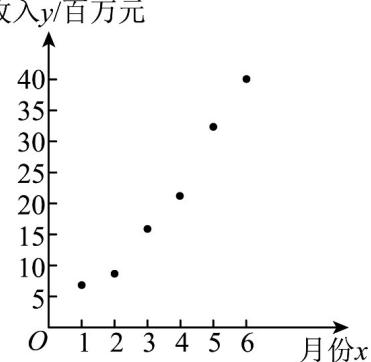

## 题型四：建模

31．2020年，是人类首次成功从北坡登顶珠峰 $^{60}$ 周年，也是中国首次精确测定并公布珠峰高程的 $^{45}$ 周年。华为帮助中国移动开通珠峰峰顶 $^{5G}$ ，有助于测量信号的实时开通，为珠峰高程测量提供通信保障，也验证了超高海拔地区 $^{5G}$ 信号覆盖的可能性，在持续高风速下 $^{5G}$ 信号的稳定性，在条件恶劣地区通过简易设备传输视频信号的可能性·正如任总在一次采访中所说：“华为公司价值体系的理想是为人类服务”有人曾问，在珠峰开通 $^{5G}$ 的意义在哪里？“我认为它是科学技术的一次珠峰登顶，告诉全世界，华为 $^{5G}$ 、中国 $^{5G}$ 的底气来自哪里·现在， $^{5G}$ 的到来给人们的生活带来更加颠覆性的变革，某IT公司基于领先技术的支持， $^{5G}$ 经济收入在短期内逐月攀升，该IT公司在1月份至6月份的 $^{5G}$ 经济收入y（单位：百万元）关于月份x的数据如下表所示，并根据数据绘制了如图所示的散点图·

<table><tr><td>月份x</td><td>1</td><td>2</td><td>3</td><td>4</td><td>5</td><td>6</td></tr><tr><td>收入y(百万元)</td><td>6.6</td><td>8.6</td><td>16.1</td><td>21.6</td><td>33.0</td><td>41.0</td></tr></table>

(1)根据散点图判断， $y = ax + b$ 与 $y = c \cdot e^{ax}$ （ $a, b, c, d$ 均为常数）哪一个更适宜作为 $^{5G}$ 经济收入y关于月份x的回归方程类型？（给出判断即可，不必说明理由）

(2)根据（1）的结果及表中的数据，求出 $y$ 关于 $x$ 的回归方程，并预测该公司7月份的5G经济收入·（结果保留小数点后两位）

(3)从前 $6$ 个月的收入中抽取 $2$ 个，记收入超过 $20$ 百万元的个数为 $X$ ，求 $X$ 的分布列和数学期望·参考数据：

<table><tr><td> $\overline{x}$ </td><td> $\overline{y}$ </td><td> $\overline{u}$ </td><td> $\sum_{i=1}^{6}(x_i - \overline{x})^2$ </td><td> $\sum_{i=1}^{6}(x_i - \overline{x})(y_i - \overline{y})$ </td><td> $\sum_{i=1}^{6}(x_i - \overline{x})(u_i - \overline{u})$ </td><td> $e^{1.52}$ </td><td> $e^{2.66}$ </td></tr><tr><td>3.50</td><td>21.15</td><td>2.85</td><td>17.70</td><td>125.35</td><td>6.73</td><td>4.57</td><td>14.30</td></tr></table>

其中，设 $u = \ln y, u_i = \ln y_i$ （ $i=1, 2, 3, 4, 5, 6$ ）.

参考公式：对于一组具有线性相关关系的数据 $\left( x_{i}, v_{i} \right) ( i=1, 2, 3, \ldots, n )$ ，其回归直线 $\hat{v} = \hat{\beta}x + \hat{\alpha}$ 的

斜率和截距的最小二乘估计公式分别为 $\hat{\beta}=\frac{\sum_{i=1}^{n}(x_{i}-\bar{x})(v_{i}-\bar{v})}{\sum_{i=1}^{n}(x_{i}-\bar{x})^{2}}$ ， $\hat{\alpha}=\bar{v}-\hat{\beta}\bar{x}$

【答案】(1) $y = c \cdot e^{dx}$ 更适宜

(2) $\hat{y} = \mathrm{e}^{1.52 + 0.38x}$ , 65.35 百万元

(3)分布列见解析，1

【分析】（ $^{1}$ ）根据散点图确定正确答案·

(2) 根据非线性回归的知识求得回归方程并求得预测值.

(3) 利用超几何分布的知识求得分布列并求得数学期望.

【详解】（1）根据散点图判断， $y = ce^{dx}$ 更适宜作为5G经济收入y关于月份x的回归方程类型；

(2) 因为 $y = ce^{dx}$ ，所以两边同时取常用对数，得 $\ln y = \ln c + dx$ ，设 $u = \ln y$ ，所以 $u = \ln c + dx$ ，因为

，所以 $\hat{d} = \frac{\sum_{i=1}^{6}(x_i - \overline{x})(u_i - \overline{u})}{\sum_{i=1}^{6}(x_i - \overline{x})^2} = \frac{6.73}{17.70}\approx 0.380,$ $\overline{x} = 3.50,\overline{u} = 2.85$

所以 $\ln c = \overline{u} - \hat{d}\overline{x} \approx 2.85 - 0.380 \times 3.50 = 1.52$

所以 $\hat{u}=1.52+0.38x$ ，即 $\ln\hat{y}=1.52+0.38x$ ，所以 $\hat{y}=e^{1.52+0.38x}$

令 x = 7 ，得 $\hat{y} = e^{1.52 + 0.38 \times 7} = e^{1.52} \times e^{2.66} \approx 4.57 \times 14.30 \approx 65.35$

故预测该公司 $^{7}$ 月份的 $^{5G}$ 经济收入大约为65.35百万元·

(3) 前 $6$ 个月的收入中，收入超过 $20$ 百万元的有 $3$ 个，所以 $X$ 的取值为 $0, 1, 2$

$$
P (X = 0) = \frac {\mathrm{C} _ {3} ^ {2}}{\mathrm{C} _ {6} ^ {2}} = \frac {1}{5}, P (X = 1) = \frac {\mathrm{C} _ {3} ^ {1} \mathrm{C} _ {3} ^ {1}}{\mathrm{C} _ {6} ^ {2}} = \frac {3}{5}, P (X = 2) = \frac {\mathrm{C} _ {3} ^ {2}}{\mathrm{C} _ {6} ^ {2}} = \frac {1}{5},
$$

所以 $X$ 的分布列为：

<table><tr><td>X</td><td>0</td><td>1</td><td>2</td></tr><tr><td>P</td><td> $\frac{1}{5}$ </td><td> $\frac{3}{5}$ </td><td> $\frac{1}{5}$ </td></tr></table>

所以 $E(X)=0\times\frac{1}{5}+1\times\frac{3}{5}+2\times\frac{1}{5}=1$ .

![[高中/课堂同步/题库/人教A版高中数学同步讲义(2026)/05_选择性必修第三册/第八章 成对数据的统计分析/专项训练/专题03_列联表与独立性检验的四大常考题型_高效培优专项训练_数学人教/题型四_sec_05/questions/Q00059909.md]]
![[高中/课堂同步/题库/人教A版高中数学同步讲义(2026)/05_选择性必修第三册/第八章 成对数据的统计分析/专项训练/专题03_列联表与独立性检验的四大常考题型_高效培优专项训练_数学人教/题型四_sec_05/questions/Q00059910.md]]
