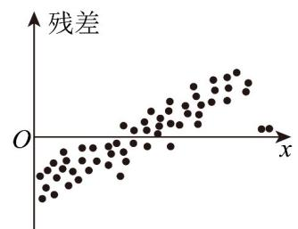
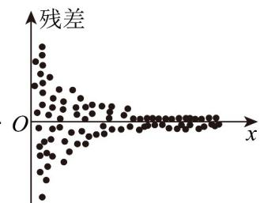
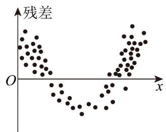
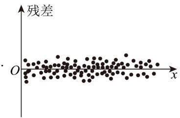

## 题型三：残差的计算

21. 根据变量 $Y$ 和 $x$ 的成对样本数据，由一元线性回归模型 $\left\{ \begin{array}{l} Y = bx + a + e \\ E(e) = 0, D(e) = \sigma^2 \end{array} \right.$ 得到经验回归模型 $\hat{y} = \hat{b} x + \hat{a}$ ，求得残差图·对于以下四幅残差图，满足一元线性回归模型中对随机误差假设的是（）

【答案】

A

B

C

【答案】D

【分析】根据一元线性回归模型中对随机误差的假定进行判断.

【详解】根据一元线性回归模型中对随机误差e的假定，残差应是均值为0、方差为 $\sigma^2$ 的随机变量的观测值.

对于A选项，残差与x有线性关系，故A错误；

对于B选项，残差的方差不是一个常数，随着观测时间变大而变小，故B错；

对于C选项，残差与x有非线性关系，故C错；

对于D选项，残差比较均匀地分布在以取值为0的横轴为对称轴的水平带状区域内，故D正确.

故选：D.

22. 色差和色度是衡量玩具质量优劣的重要指标，已知该产品的色度 $y$ 和色差 $x$ 之间满足线性相关关系，且 $\hat{y} = 0.8x - 1.8$ ，现有一对测量数据为（30,22.8），则该数据的残差为（）A.0.6 B.0.4 C.-0.4 D.-0.6

【答案】A
【分析】将 $x = 30$ 代入回归方程，求出预测值，从而求出残差。
【详解】当 $x = 30$ 时， $\hat{y} = 0.8 \times 30 - 1.8 = 22.2$ ，所以该数据的残差为 $22.8 - 22.2 = 0.6$ 。故选：A.

![[高中/课堂同步/题库/人教A版高中数学同步讲义(2026)/05_选择性必修第三册/第八章 成对数据的统计分析/专题01 成对数据的统计相关性的五大常考题型（高效培优专项训练）数学人教A版高二选择性必修第三册/题型三_残差的计算/questions/Q00083433.md]]
![[高中/课堂同步/题库/人教A版高中数学同步讲义(2026)/05_选择性必修第三册/第八章 成对数据的统计分析/专题01 成对数据的统计相关性的五大常考题型（高效培优专项训练）数学人教A版高二选择性必修第三册/题型三_残差的计算/questions/Q00083434.md]]
![[高中/课堂同步/题库/人教A版高中数学同步讲义(2026)/05_选择性必修第三册/第八章 成对数据的统计分析/专题01 成对数据的统计相关性的五大常考题型（高效培优专项训练）数学人教A版高二选择性必修第三册/题型三_残差的计算/questions/Q00083435.md]]
![[高中/课堂同步/题库/人教A版高中数学同步讲义(2026)/05_选择性必修第三册/第八章 成对数据的统计分析/专题01 成对数据的统计相关性的五大常考题型（高效培优专项训练）数学人教A版高二选择性必修第三册/题型三_残差的计算/questions/Q00083436.md]]
![[高中/课堂同步/题库/人教A版高中数学同步讲义(2026)/05_选择性必修第三册/第八章 成对数据的统计分析/专题01 成对数据的统计相关性的五大常考题型（高效培优专项训练）数学人教A版高二选择性必修第三册/题型三_残差的计算/questions/Q00083437.md]]
![[高中/课堂同步/题库/人教A版高中数学同步讲义(2026)/05_选择性必修第三册/第八章 成对数据的统计分析/专题01 成对数据的统计相关性的五大常考题型（高效培优专项训练）数学人教A版高二选择性必修第三册/题型三_残差的计算/questions/Q00083438.md]]
