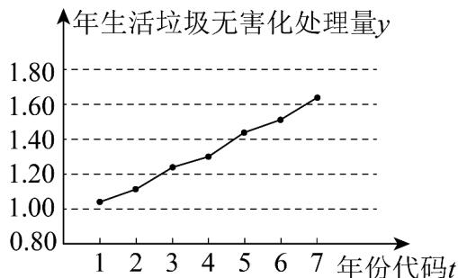

<!-- question-source:start -->
44. 如图是我国 2014 年至 2020 年年生活垃圾无害化处理量（单位：亿吨）的折线图

注：年份代码 1～7 分别对应年份 2014～2020.

由折线图看出，可用线性回归模型拟合 $y$ 与 $t$ 的关系，请用相关系数加以说明：

参考数据： $\sum_{i=1}^{7}y_{i}=9.32,\quad\sum_{i=1}^{7}t_{i}y_{i}=40.17,\quad\sqrt{\sum_{i=1}^{7}\left(y_{i}-\overline{y}\right)^{2}}=0.55,\quad\sqrt{7}\approx2.646.$

参考公式：相关系数 $r=\frac{\sum_{i=1}^{n}\left(t_{i}-\bar{t}\right)\left(y_{i}-\bar{y}\right)}{\sqrt{\sum_{i=1}^{n}\left(t_{i}-\bar{t}\right)^{2}\sum_{i=1}^{n}\left(y_{i}-\bar{y}\right)^{2}}}$
<!-- question-source:end -->

![[高中/课堂同步/题库/人教A版高中数学同步讲义(2026)/05_选择性必修第三册/第八章 成对数据的统计分析/专题01 成对数据的统计相关性的五大常考题型（高效培优专项训练）数学人教A版高二选择性必修第三册/题型五_非线性回归/questions/answers/Q00083450A1.md]]
