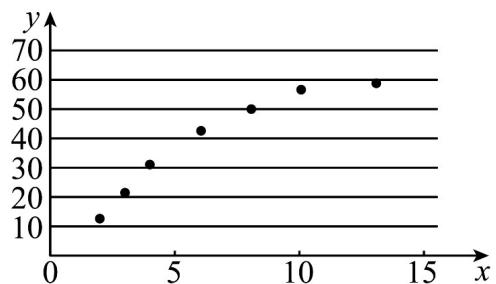

> [!faq]- 《专题01 成对数据的统计相关性的五大常考题型（高效培优专项训练）数学人教A版高二选择性必修第三册》官方解析
>
> > [!success]- **【答案】** A．两个变量 $x, y$ 的相关系数为 $r$ ，则 $r$ 越小， $x$ 与 $y$ 之间的相关性越弱 B．设随机变量 $\xi \sim N(2,1)$ ，若 $p(\xi > 3) = p$ ，则 $p(1 < \xi < 2) = \frac{1}{2} - p$ C．在回归分析中， $R^2$ 为 0.89 的模型比 $R^2$ 为 0.98 的模型拟合得更好 D．某人解答 10 个问题，答对题数为 $X, X \sim B(10,0.8)$ ，则 $E(X) = 8$
>
> > [!note]- **【分析】**
> > A项，通过相关系数的定义即可得出结论；B项，通过求出 $P(2 < \xi < 3)$ 即可求出 $P(-1 < \xi < 0)$ 的值；C项，通过比较相关指数即可得出哪个模型拟合更好；D项，通过计算即可求出 $E(x)$ .
>
> > [!note]- **【解析】**
> > 由题意，
> >
> > A项，
> >
> > 两个变量 x, y 的相关系数为 r， $|r|$ 越小，x 与 y 之间的相关性越弱，
> >
> > 故 $^{A}$ 错误，
> >
> > 对于 B,
> >
> > 随机变量 $\xi$ 服从正态分布 $N(2,1)$ ，由正态分布概念知若 $P(\xi > 3) = p$ ，则
> >
> > $$
> > P (- 1 <   \xi <   0) = P (2 <   \xi <   3) = P (\xi > 2) - P (\xi > 3) = \frac {1}{2} - p,
> > $$
> >
> > 故 B 正确，
> >
> > 对于 C，
> >
> > 在回归分析中， $R^{2}$ 越接近于 1，模型的拟合效果越好，
> >
> > ∴ $R^{2}$ 为 0.98 的模型比 $R^{2}$ 为 0.89 的模型拟合的更好
> >
> > 故 C 错误,
> >
> > 对于 D，
> >
> > 某人在 $^{10}$ 次答题中，答对题数为 $X, X \sim B(10, 0.8)$ ，则数学期望 $E(X) = 10 \times 0.8 = 8$ ，
> >
> > 故 D 正确·
> >
> > 故选：BD.
> >
> > 38. 今年刚过去的 $^{4}$ 月份是“全国消费促进月”，各地拼起了特色经济”，带动消费复苏、市场回暖“小饼烤炉加蘸料，灵魂烧烤三件套”，最近，淄博烧烤在社交媒体火爆出圈，吸引全国各地的游客坐着高铁，直奔烧烤店，而多家店铺的营业额也在近一个月内实现了成倍增长·因此某烧烤店老板考虑投入更多的人工成本，现有以往的服务人员增量x（单位：人）与年收益增量y单位：万元）的数据如下：
> >
> > <table><tr><td>服务人员增量 $x/人$ </td><td>2</td><td>3</td><td>4</td><td>6</td><td>8</td><td>10</td><td>13</td></tr><tr><td>年收益增量 $y/万元$ </td><td>13</td><td>22</td><td>31</td><td>42</td><td>50</td><td>56</td><td>58</td></tr></table>
> >
> > 据此，建立了 $y$ 与 $x$ 的两个回归模型：
> >
> > 
> >
> > 模型①：由最小二乘公式可求得 $y$ 与 $x$ 的一元线性经验回归方程为 $\hat{y} = 4.1x + 11.8$ ；
> >
> > 模型②：由散点图（如图）的样本点分布，可以认为样本点集中在曲线 $\hat{y} = \hat{b}\sqrt{x} +\hat{a}$ 的附近.
> >
> > 对数据进行初步处理后，得到了一些统计的量的值： $\overline{t}=2.5,\quad\overline{y}=38.9,\quad\sum_{i=1}^{7}t_{i}y_{i}=761.75,\quad\sum_{i=1}^{7}t_{i}^{2}=47.55$ 其中 $t_{i}=\sqrt{x_{i}}$ ， $\bar{t}=\frac{1}{7}\sum_{i=1}^{7}t_{1}$
> >
> > (1)根据所给的统计量，求模型②中 $y$ 关于 $x$ 的经验回归方程（精确到0.1）；
> >
> > (2)根据下列表格中的数据，比较两种模型的决定系数 $R^{2}$ ，并选择拟合精度更高的模型，预测服务人员增加 $^{25}$ 人时的年收益增量。
> >
> > <table><tr><td>回归模型</td><td>模型1</td><td>模型2</td></tr><tr><td>回归方程</td><td> $\widehat{y} = 4.1x + 11.8$ </td><td> $\widehat{y} = \widehat{b}\sqrt{x} + \widehat{a}$ </td></tr><tr><td> $\sum_{i=1}^{7}\left(y_i - \widehat{y_i}\right)^2$ </td><td>182.4</td><td>79.2</td></tr></table>
> >
> > 附：样本的最小二乘估计公式为 $\hat{b}=\frac{\sum_{i=1}^{n}\left(t_{i}-\bar{t}\right)\left(y_{i}-\bar{y}\right)}{\sum_{i=1}^{n}\left(t_{i}-\bar{t}\right)^{2}}=\frac{\sum_{i=1}^{n}t_{i}y_{i}-nt\bar{y}}{\sum_{i=1}^{n}t_{i}^{2}-nt^{-2}}$ ，刻画样 $(t_{i},y_{i})(i=1,2,\cdots,n)$
> >
> > 本回归效果的决定系数 $R^2 = 1 - \frac{\sum_{i=1}^{n}\left(y_i - \hat{y}_i\right)^2}{\sum_{i=1}^{n}\left(y_i - \overline{y}\right)^2}$
> >
> > 【答案】(1) $\hat{y} = 21.3\sqrt{x}$ - 14.4
> >
> > (2)模型①的 $R^{2}$ 小于模型②，说明回归模型②刻画的拟合效果更好，92.1万元。
> >
> > 【分析】（1）令 $t = \sqrt{x}$ ，则 $\hat{y} = \hat{b}t + \hat{a}$ ，然后根据表中的数据和公式可求出模型②中 $y$ 关于 $x$ 的经验回归方程；
> >
> > (2) 由表中的数据和样本回归效果的决定系数可判断回归模型②刻画的拟合效果更好，再根据模型②的回归方程可预测服务人员增加 $^{25}$ 人时的年收益增量。
> >
> > 【详解】（1）令 $t = \sqrt{x}$ ，则 $\hat{y} = \hat{b} t + \hat{a}$ 由参考数据得
> >
> > $$
> > \hat {b} = \frac {\sum_ {i = 1} ^ {7} t _ {i} y _ {i} - 7 \overline {{t}} \overline {{y}}}{\sum_ {i = 1} ^ {7} t _ {i} ^ {2} - 7 \overline {{t}} ^ {2}} = \frac {7 6 1 . 7 5 - 7 \times 2 . 5 \times 3 8 . 9}{4 7 . 5 5 - 7 \times 2 . 5 ^ {2}} = \frac {8 1}{3 . 8} \approx 2 1. 3 2 \approx 2 1. 3
> > $$
> >
> > $\hat{a} = \overline{y} - \hat{b}\overline{t} = 38.9 - 21.32 \times 2.5 \approx -14.4$ 所以，模型②中 $y$ 关于 $x$ 的经验回归方程为 $\hat{y} = 21.3\sqrt{x} - 14.4$ （2）由表格中的数据，有 $182.4 > 79.2$ ，即 $\frac{182.4}{\sum_{i=1}^{7}\left(y_i - \overline{y}\right)^2} > \frac{79.2}{\sum_{i=1}^{7}\left(y_i - \overline{y}\right)^2}$ 模型①的 $R^2$ 小于模型②，说明回归模型②刻画的拟合效果更好当 $x = 25$ 时，模型②的收益增量的预测值为 $\hat{y} = 21.3 \times \sqrt{25} - 14.4 = 21.3 \times 5 - 14.4 = 92.1$ （万元）所以预测服务人员增加 $^{25}$ 人时的年收益增量为 $^{92.1}$ 万元。
