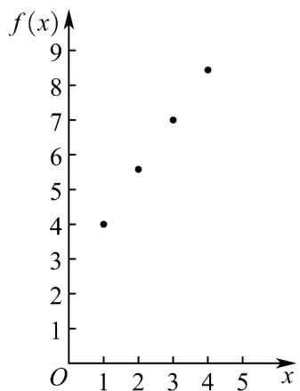
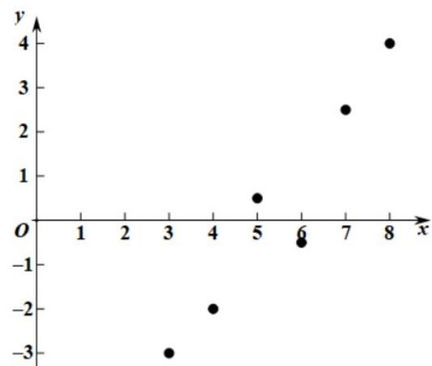

> [!faq]- 《专题02 一元线性回归模型及应用的五大常考题型（高效培优专项训练）数学人教A版高二选择性必修第三册》官方解析
>
> > [!success]- **【答案】** （1）散点图见解析（2）模型见解析， $f(x)=1.5x+2.5$ （3）7万件·
>
> > [!note]- **【分析】**
> > （ $^{1}$ ）根据表格信息，即可画出2016～2019年该企业年产量的散点图；
> >
> > (2) 由散点图可知，可选用一次函数模型，设 $f(x) = ax + b$ ，代入两个点坐标即可求出函数 $f(x)$ 的解析式，经检验符号误差要求；
> >
> > （3）根据所建立的函数模型，预计2020年的年产量 $f(5)$ ，再根据年产量减少30%，即可求出2020年的年产量。
>
> > [!note]- **【解析】**
> > （ $^{1}$ ）画出散点图，如图所示：
> >
> > 
> >
> > 由散点图可知，可选用一次函数模型，设 $f(x) = ax + b (a \neq 0)$
> >
> > 代入点 $(1,4),(3,7)$
> >
> > 得： $\left\{\begin{aligned}a+b=4\\ 3a+b=7\end{aligned}\right.$ ，解得 $\left\{\begin{aligned}a=1.5\\ b=2.5\end{aligned}\right.$
> >
> > $$
> > \therefore f (x) = 1. 5 x + 2. 5
> > $$
> >
> > 检验： $f(2)=1.5\times2+2.5=5.5$ ，且 $|5.58-5.5|=0.08<0.1$
> >
> > $f(4) = 1.5 \times 4 + 2.5 = 8.5$ ，且 $|8.44 - 8.5| = 0.06 < 0.1$
> >
> > ∴一次函数模型 $f(x)=1.5x+2.5$ 能基本反映这一时期该企业年产量变化；
> >
> > (3) 根据所建立的函数模型，预计 2020 年的年产量为 $f$ (5) = 1.5 × 5 + 2.5 = 10（万件），又年产量减少 30%，即 $10 \times (1 - 30\%) = 7$ （万件），
> >
> > 即 2020 年的年产量为 7 万件.
> >
> > 10．根据如下样本数据，得到回归直线方程 $\hat{y} = \hat{b} x + \hat{a}$ ，则（）
> >
> > 【答案】
> >
> > <table><tr><td>x</td><td>3</td><td>4</td><td>5</td><td>6</td><td>7</td><td>8</td></tr><tr><td>y</td><td>-3.0</td><td>-2.0</td><td>0.5</td><td>-0.5</td><td>2.5</td><td>4.0</td></tr></table>
> >
> > $$
> > \hat {a} > 0, \hat {b} > 0
> > $$
> >
> > C. $\hat{a} < 0, \hat{b} > 0$ D. $\hat{a} < 0, \hat{b} < 0$
> >
> > $$
> > \hat {a} > 0
> > $$
> >
> > $$
> > \hat {b} <   0
> > $$
> >
> > 【答案】C
> >
> > 【解析】做出散点图，由散点图判断 $\hat{a}, \hat{b}$ 的正负.
> >
> > 
> >
> > 从整体上看这些点大致分布在一条直线的周围，且该回归直线的斜率为正，在 $y$ 轴上的截距为负则 $\hat{a} < 0$
> >
> > $$
> > \hat {b} > 0
> > $$
> >
> > 故选 **C**
