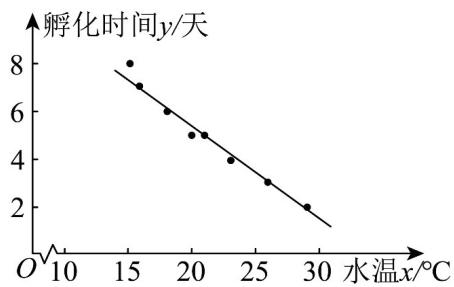
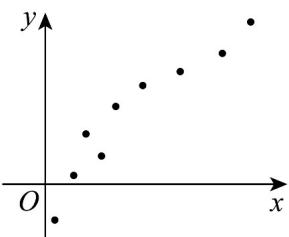

## 题型一：由散点图求回归直线

1. 鲫鱼产卵后，鱼卵的孵化时间（单位：天）会受到水温（单位：°C）的影响，下面是某生物研究小组进行 $^{8}$ 次观察实验收集到的数据：

<table><tr><td>水温x/°C</td><td>15</td><td>16</td><td>18</td><td>20</td><td>21</td><td>23</td><td>26</td><td>29</td></tr><tr><td>孵化时间y/天</td><td>8</td><td>7</td><td>6</td><td>5</td><td>5</td><td>4</td><td>3</td><td>2</td></tr></table>

(1)画出上述成对数据的散点图；

(2)已知水温对鱼卵的孵化时间可表示为一元线性回归模型，请在散点图中近似地作出表示孵化时间 $y$ 和水温 $x$ 之间关系的直线，并说明该一元线性回归模型的自变量与因变量．

【答案】 $^{(1)}$ 作图见解析

(2)作图见解析，水温 $x$ 为自变量，孵化时间 $y$ 为因变量

【分析】（1）根据表格中的数据，以 $x$ 轴表示水温， $y$ 轴表示孵化时间，画出散点图；

(2) 由一元线性回归模型定义，近似作出直线，并分析回归模型中自变量和因变量.

【详解】（1）以 $x$ 轴表示水温， $y$ 轴表示孵化时间，可作散点图如下：

(2) 直线如图所示，由 (1) 中散点图及一元线性回归模型定义可得，其中水温 $x$ 为自变量，孵化时间 $y$ 为因变量．

![[高中/课堂同步/题库/人教A版高中数学同步讲义(2026)/05_选择性必修第三册/第八章 成对数据的统计分析/专题02 一元线性回归模型及应用的五大常考题型（高效培优专项训练）数学人教A版高二选择性必修第三册/题型一_由散点图求回归直线/questions/Q00083452.md]]
![[高中/课堂同步/题库/人教A版高中数学同步讲义(2026)/05_选择性必修第三册/第八章 成对数据的统计分析/专题02 一元线性回归模型及应用的五大常考题型（高效培优专项训练）数学人教A版高二选择性必修第三册/题型一_由散点图求回归直线/questions/Q00083453.md]]
![[高中/课堂同步/题库/人教A版高中数学同步讲义(2026)/05_选择性必修第三册/第八章 成对数据的统计分析/专题02 一元线性回归模型及应用的五大常考题型（高效培优专项训练）数学人教A版高二选择性必修第三册/题型一_由散点图求回归直线/questions/Q00083454.md]]
![[高中/课堂同步/题库/人教A版高中数学同步讲义(2026)/05_选择性必修第三册/第八章 成对数据的统计分析/专题02 一元线性回归模型及应用的五大常考题型（高效培优专项训练）数学人教A版高二选择性必修第三册/题型一_由散点图求回归直线/questions/Q00083455.md]]
![[高中/课堂同步/题库/人教A版高中数学同步讲义(2026)/05_选择性必修第三册/第八章 成对数据的统计分析/专题02 一元线性回归模型及应用的五大常考题型（高效培优专项训练）数学人教A版高二选择性必修第三册/题型一_由散点图求回归直线/questions/Q00083456.md]]
![[高中/课堂同步/题库/人教A版高中数学同步讲义(2026)/05_选择性必修第三册/第八章 成对数据的统计分析/专题02 一元线性回归模型及应用的五大常考题型（高效培优专项训练）数学人教A版高二选择性必修第三册/题型一_由散点图求回归直线/questions/Q00083457.md]]
![[高中/课堂同步/题库/人教A版高中数学同步讲义(2026)/05_选择性必修第三册/第八章 成对数据的统计分析/专题02 一元线性回归模型及应用的五大常考题型（高效培优专项训练）数学人教A版高二选择性必修第三册/题型一_由散点图求回归直线/questions/Q00083458.md]]
