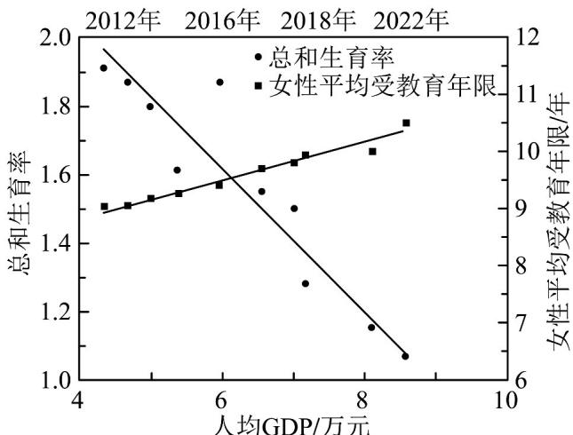

> [!faq]- 《专题02 一元线性回归模型及应用的五大常考题型（高效培优专项训练）数学人教A版高二选择性必修第三册》官方解析
>
> > [!success]- **【答案】** A．为60.316 kg B．约为60.316 kg C．大于60.316 kg D．小于60.316 kg
>
> > [!note]- **【分析】**
> > 根据题意，令 $X = 172$ ，代入回归直线方程，即可求解·【详解】由身高 $X$ 和体重 $Y$ 的回归方程为 $Y = 0.849X - 85.712$ ，令 $X = 172$ ，可得 $Y = 0.849 \times 172 - 85.712 = 60.316(\mathrm{~kg})$ ，即由回归方程可以预测其体重大约为 $60.316(\mathrm{kg})$
> >
> > 故选：B.
> >
> > 16．牛膝是苋科多年生药用草本植物，具有活血通经、补肝肾、强筋骨等功效，可用于治疗腰膝酸痛等症状．某农户种植牛膝的时间 $x$ （单位：天）和牛膝的根部直径 $\mathcal{Y}$ （单位： $\mathrm{mm}$ ）的统计表如下：
> >
> > <table><tr><td>x</td><td>20</td><td>30</td><td>40</td><td>50</td><td>60</td></tr><tr><td>y</td><td>0.8</td><td>1.3</td><td>2.2</td><td>3.3</td><td>4.5</td></tr></table>
> >
> > 由上表可得经验回归方程为 $\hat{y} = 0.094x + \hat{a}$ ，若此农户准备在 $y = 9\mathrm{mm}$ 时采收牛膝，据此模型预测，此批牛膝采收时间预计是第\_\_\_\_天。
> >
> > 【答案】110
> >
> > 【分析】由表格求出中心点坐标从而得出 $\hat{a} = -1.34$ ，利用回归直线估计即可
>
> > [!note]- **【解析】**
> > $\overline{x} = \frac{20 + 30 + 40 + 50 + 60}{5} = 40$ ， $\overline{y} = \frac{0.8 + 1.3 + 2.2 + 3.3 + 4.5}{5} = 2.42$ ，
> > 又 $\hat{y}=0.094x+\hat{a}$ 过点 (40,2.42)，所以 $\hat{a}=-1.34$ ，即 $\hat{y}=0.094x-1.34$ ，
> > 当 y=9 时，x=110，所以此批牛膝采收时间预计是第110天。
> >
> > 故答案为：110
> >
> > 17. 总和生育率有时也简称生育率，是指一个人口群体的各年龄别妇女生育率的总和。它反映的是一名妇女在每年都按照该年龄别现有生育率生育的假设下，在育龄期间生育的子女总数。为了了解中国人均 $GDPx$ （单位：万元）和总和生育率y以及女性平均受教育年限z（单位：年）的关系，采用2012\~2022近十年来的数据 $(x_{i},y_{i},z_{i})(i=1,2,\cdots10)$ 绘制了散点图，并得到经验回归方程 $\hat{z}=7.54+0.33x$ ， $\hat{y}=2.88-0.41x$ ，对应的决定系数分别为 $R_{1}^{2}$ ， $R_{2}^{2}$ ，则（）
> >
> > 【答案】
> >
> > 
> >
> > A. 人均 GDP 和女性平均受教育年限正相关.
> > B. 女性平均受教育年限和总和生育率负相关
> > C. $R_{1}^{2} < R_{2}^{2}$ D. 未来三年总和生育率一定继续降低
> >
> > 【答案】AB
> >
> > 【分析】根据回归方程判断 $^{A}$ ，写出女性平均受教育年限z和总和生育率y的关系式，从而判断 $^{B}$ ，根据散点图的拟合效果判断 $^{C}$ ，由回归方程可预测未来趋势，但实际值不一定会持续降低，从而判断 $^{D}$ .
> >
> > 【详解】由回归方程 $\hat{z}=7.54+0.33x$ 知人均 GDP 和女性平均受教育年限正相关，故 A 正确；
> >
> > 因为 $\hat{z} = 7.54 + 0.33x$ ， $\hat{y} = 2.88 - 0.41x$
> >
> > 可得女性平均受教育年限 z 和总和生育率 y 的关系式为 $\hat{y}=2.88-0.41\times\frac{\hat{z}-7.54}{0.33}$
> >
> > 所以女性平均受教育年限 z 和总和生育率 y 负相关，故 $^{B}$ 正确；
> >
> > 由散点图可知，回归方程 $\hat{z} = 7.54 + 0.33x$ 相对 $\hat{y} = 2.88 - 0.41x$ 拟合效果更好，
> >
> > 所以 $R_{1}^{2} > R_{2}^{2}$ ，故 C 错误；
> >
> > 根据回归方程 $\hat{y}=2.88-0.41$ 预测，未来总和生育率预测值有可能降低，
> >
> > 但实际值不一定会降低，故 $^{D}$ 错误。
> >
> > 故选：AB
> >
> > 18. 中国新能源汽车出口实现跨越式突破，是国产汽车品牌实现弯道超车，打造核心竞争力的主要抓手·下表是2022年我国某新能源汽车厂前5个月的销量y和月份x的统计表，根据表中的数据可得线性回归方程为 $\hat{y} = \hat{b} x + 1.16$ ，则下列四个命题正确的个数为（）
> >
> > 【答案】
> >
> > <table><tr><td>月份x</td><td>1</td><td>2</td><td>3</td><td>4</td><td>5</td></tr><tr><td>销量y(万辆)</td><td>1.5</td><td>1.6</td><td>2</td><td>2.4</td><td>2.5</td></tr></table>
> > - **①**：变量 x 与 y 正相关；
> > - **②**：$\hat{b}=0.24$ ；
> > - **③**：y 与 x 的样本相关系数 r>0；
> > - **④**：2022 年 7 月该新能源汽车厂的销量一定是 3.12 万辆。
> > A. 1 B. 2 C. 3 D. 4
> >
> > 【答案】B
> >
> > 【分析】根据回归直线方程经过样本中心即可求解 $\hat{b} = 0.28$ ，结合相关性的定义以及回归方程即可逐一判断·
> >
> > 【详解】由 $\overline{x} = \frac{1 + 2 + 3 + 4 + 5}{5} = 3$ ， $\overline{y} = \frac{1.5 + 1.6 + 2 + 2.4 + 2.5}{5} = 2$ ，因为回归直线过样本中心 $(\overline{x},\overline{y})$
> >
> > $2 = 3\hat{b} + 1.16$ ， $\hat{b} = 0.28$ ，②错误；
> >
> > 可知 y 随着 x 变大而变大，所以变量 x 与 y 正相关，①③正确；
> >
> > 由回归直线可知，2022年7月该新能源汽车厂的销量的估计值是 $\hat{y} = 0.28 \times 7 + 1.16 = 3.12$ 万辆，④错误。
> >
> > 故选 **B**．
