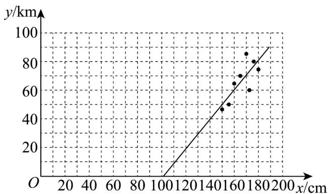
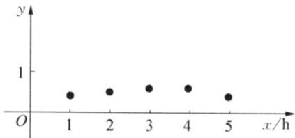

> [!faq]- 《专题02 一元线性回归模型及应用的五大常考题型（高效培优专项训练）数学人教A版高二选择性必修第三册》官方解析
>
> > [!success]- **【答案】** $y = 1.05x - 107.8$
>
> > [!note]- **【分析】**
> > 首先从数据出发确定自变量 $x$ 与因变量 $y$ ，根据数据绘制相应的散点图，根据数据分布呈线性关系，选用回归模型 $y = \hat{b} x + \hat{a}$ ，其次利用最小二乘法估计系数 $\hat{b}$ 、 $\hat{a}$ ，最后得到线性回归模型方程．
>
> > [!note]- **【解析】**
> > 建立平面直角坐标系，x 轴表示身高，y 轴表示体质量，散点图如图 8.2 - 1 所示。
> >
> > 
> >
> > 可以观察到数据呈线性关系，故选用回归模型 $y = \hat{b} x + \hat{a}$
> >
> > $$
> > \overline {{{x}}} = \frac {1}{8} (1 7 2 + 1 5 0 + 1 7 0 + 1 6 5 + 1 8 0 + 1 7 6 + 1 5 5 + 1 6 0) = 1 6 6.
> > $$
> >
> > $$
> > \bar {y} = \frac {1}{8} (6 0 + 4 7 + 8 5 + 7 0 + 7 5 + 8 0 + 5 0 + 6 5) = 6 6. 5,
> > $$
> >
> > $$
> > \sum_ {i = 1} ^ {8} x _ {i} y _ {i} = 1 7 2 \times 6 0 + 1 5 0 \times 4 7 + 1 7 0 \times 8 5 + 1 6 5 \times 7 0 + 1 8 0 \times 7 5 + 1 7 6 \times 8 0 + 1 5 5 \times 5 0 + 1 6 0 \times 6 5 = 8 9 1 0 0
> > $$
> >
> > $$
> > \sum_ {i = 1} ^ {8} x _ {i} ^ {2} = 1 7 2 ^ {2} + 1 5 0 ^ {2} + 1 7 0 ^ {2} + 1 6 5 ^ {2} + 1 8 0 ^ {2} + 1 7 6 ^ {2} + 1 5 5 ^ {2} + 1 6 0 ^ {2} = 2 2 1 2 1 0,
> > $$
> >
> > $$
> > \text {则} \hat {b} = \frac {\sum_ {i = 1} ^ {8} x _ {i} y _ {i} - 8 \overline {{x y}}}{\sum_ {i = 1} ^ {8} x _ {i} ^ {2} - 8 \overline {{x}} ^ {2}} = \frac {8 9 1 0 0 - 8 \times 1 6 6 \times 6 6 . 5}{2 2 1 2 0 0 - 8 \times 1 6 6 ^ {2}} = \frac {7 8 8}{7 5 2} \approx 1. 0 5,
> > $$
> >
> > 故 $\hat{a} = \overline{y} -\hat{b}\overline{x}\approx 66.5 - 1.05\times 166 = -107.8$
> >
> > 故回归模型方程为 $y = 1.05x - 107.8$
> >
> > 37. 为了了解飞镖爱好者小李的飞镖命中率与其扔飞镖时间之间的关系，下表记录了小李某月 $^{1}$ 号到 $^{5}$ 号每天扔飞镖时间 x 与当天飞镖命中率 y 的数据：
> >
> > <table><tr><td>x/h</td><td>1</td><td>2</td><td>3</td><td>4</td><td>5</td></tr><tr><td>y</td><td>0.4</td><td>0.5</td><td>0.6</td><td>0.6</td><td>0.4</td></tr></table>
> >
> > 利用线性回归分析，预测小李该月 $^{6}$ 号扔 $^{6h}$ 飞镖的命中率。
> >
> > 【答案】0.53
> >
> > 【分析】作出散点图，观察到数据呈线性关系，建立线性回归模型，得到回归模型后，就可以根据题意将相关数据代入回归方程，从而进行相应的预测。
> >
> > 【详解】建立平面直角坐标系，x 轴表示时间，y 轴表示命中率，散点图如图所示，
> >
> > 
> >
> > 可以观察到数据呈线性关系，故选用回归模型 $y = \hat{b} x + \hat{a}$
> >
> > $$
> > \overline {{{{x}}}} = \frac {1 + 2 + 3 + 4 + 5}{5} = 3, \overline {{{{y}}}} = \frac {0 . 4 + 0 . 5 + 0 . 6 + 0 . 6 + 0 . 4}{5} = 0. 5
> > $$
> >
> > 利用最小二乘法估计：
> >
> > $$
> > \hat {b} = \frac {\sum_ {i = 1} ^ {5} \left(x _ {i} - \bar {x}\right) \left(y _ {i} - \bar {y}\right)}{\sum_ {i = 1} ^ {5} \left(x _ {i} - \bar {x}\right) ^ {2}} = \frac {\sum_ {i = 1} ^ {5} x _ {i} y _ {i} - 5 \overline {{{x y}}}}{\sum_ {i = 1} ^ {5} x _ {i} ^ {2} - 5 \bar {x} ^ {2}} = \frac {0 . 4 + 1 + 1 . 8 + 2 . 4 + 2 - 5 \times 3 \times 0 . 5}{1 + 4 + 9 + 1 6 + 2 5 - 5 \times 3 ^ {2}} = \frac {0 . 1}{1 0} = 0. 0 1,
> > $$
> >
> > $$
> > \hat {a} = \overline {{{y}}} - \hat {b} \overline {{{x}}} = 0. 5 - 0. 0 1 \times 3 = 0. 4 7
> > $$
> >
> > 故回归模型为 $y = 0.01x + 0.47$ .
> >
> > 当 x=6 时， $y=0.47+0.01\times6=0.53$ .
> >
> > 所以预测小李该月 $^{6}$ 号扔6h飞镖的命中率约为0.53.
