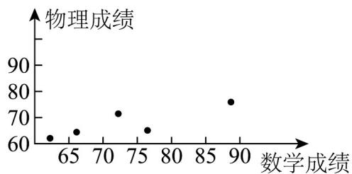

> [!faq]- 《专题02 一元线性回归模型及应用的五大常考题型（高效培优专项训练）数学人教A版高二选择性必修第三册》官方解析
>
> > [!success]- **【答案】** (1)作图见解析 (2) $\hat{y} = 0.625x + 22.05$ (3)82
>
> > [!note]- **【分析】**
> > （ $^{1}$ ）直接作出散点图；
> >
> > (2) 利用最小二乘法求回归直线方程；
> >
> > (3) 根据回归直线方程预测·
>
> > [!note]- **【解析】**
> > （1）散点图如图.
> >
> > 
> >
> > (2) $\overline{x} = \frac{1}{5} \times (88 + 76 + 73 + 66 + 63) = 73.2$ ， $\overline{y} = \frac{1}{5} \times (78 + 65 + 71 + 64 + 61) = 67.8$
> >
> > $$
> > \sum_ {i = 1} ^ {5} x _ {i} y _ {i} = 8 8 \times 7 8 + 7 6 \times 6 5 + 7 3 \times 7 1 + 6 6 \times 6 4 + 6 3 \times 6 1 = 2 5 0 5 4
> > $$
> >
> > $$
> > \sum_ {i = 1} ^ {5} x _ {i} ^ {2} = 8 8 ^ {2} + 7 6 ^ {2} + 7 3 ^ {2} + 6 6 ^ {2} + 6 3 ^ {2} = 2 7 1 7 4
> > $$
> >
> > $$
> > \text {以} \hat {b} = \frac {\sum_ {i = 1} ^ {5} x _ {i} y _ {i} - 5 \overline {{x y}}}{\sum_ {i = 1} ^ {5} x _ {i} ^ {2} - 5 \overline {{x}} ^ {2}} = \frac {2 5 0 5 4 - 5 \times 7 3 . 2 \times 6 7 . 8}{2 7 1 7 4 - 5 \times 7 3 . 2 ^ {2}} \approx 0. 6 2 5
> > $$
> >
> > $$
> > \hat {a} = \overline {{y}} - \hat {b} \overline {{x}} \approx 6 7. 8 - 0. 6 2 5 \times 7 3. 2 = 2 2. 0 5
> > $$
> >
> > 所以 $y$ 关于 $x$ 的回归直线方程是 $\hat{y} = 0.625x + 22.05$
> >
> > (3) $x = 96$ ，则 $\hat{y} = 0.625 \times 96 + 22.05 \approx 82$
> >
> > 即可以预测他的物理成绩是 $^{82}$ .
