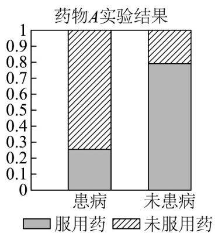
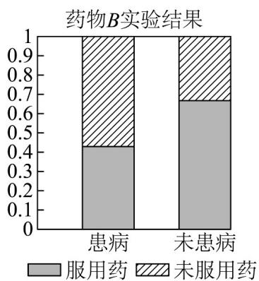

> [!faq]- 《专题03 列联表与独立性检验的四大常考题型（高效培优专项训练）数学人教A版高二选择性必修第三册》官方解析
>
> > [!success]- **【答案】** 74
>
> > [!note]- **【分析】**
> > 根据联表性质计算求解·
>
> > [!note]- **【解析】**
> > 由题意知 $a+21+5+c=100$ ，所以 $a+c=74$ 。
> >
> > 故答案为：74·
> >
> > 4．为考查 A、B 两种药物预防某疾病的效果，进行动物实验，分别得到如下等高条形图：根据图中信息，在下列各项中，说法最佳的一项是（）
> >
> > 【答案】
> >
> > 
> >
> > 
> >
> > A. 药物 $B$ 的预防效果优于药物 $A$ 的预防效果
> > B. 药物 $A$ 的预防效果优于药物 $B$ 的预防效果
> > C. 药物 $A$ 、 $B$ 对该疾病均有显著的预防效果
> > D. 药物 $A$ 、 $B$ 对该疾病均没有预防效果
> >
> > 【答案】B
> >
> > 【分析】根据等高条形图中的数据即可得出选项·
> >
> > 【详解】根据两个表中的等高条形图知，药物 A 实验显示不服药与服药时患病差异较药物 B 实验显示明显大，
> >
> > 所以药物 A 的预防效果优于药物 B 的预防效果，
> >
> > 故选 **B**.
