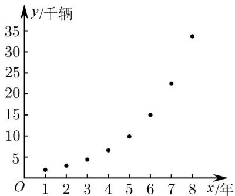

<!-- question-source:start -->
34. 在国家大力发展新能源汽车产业的政策下，我国新能源汽车的产销量高速增长·已知某地区2014年底到2021年底新能源汽车保有量的数据统计表如下：

<table><tr><td>年份(年)</td><td>2014</td><td>2015</td><td>2016</td><td>2017</td><td>2018</td><td>2019</td><td>2020</td><td>2021</td></tr><tr><td>年份代码x</td><td>1</td><td>2</td><td>3</td><td>4</td><td>5</td><td>6</td><td>7</td><td>8</td></tr><tr><td>保有量y/千辆</td><td>1.95</td><td>2.92</td><td>4.38</td><td>6.58</td><td>9.87</td><td>15.00</td><td>22.50</td><td>33.70</td></tr></table>

参考数据： $\overline{y}=12.1,\overline{t}=2.1,\sum_{i=1}^{8}x_{i}^{2}=204,\quad\sum_{i=1}^{8}x_{i}y_{i}=613.7,\sum_{i=1}^{8}x_{i}t_{i}=92.4,$ ，其中 $t_{i}=\ln y_{i},\lg2\approx0.30,1g3\approx0.48,\lg e\approx0.43.$

(1)根据统计表中的数据画出散点图（如图），请判断 $\hat{y} = \hat{b} x + \hat{a}$ 与 $\hat{y} = \mathrm{e}^{\hat{c} x + \hat{d}}$ 哪一个更适合作为 $y$ 关于 $x$ 的经验回归方程（给出判断即可，不必说明理由），并根据你的判断结果建立 $y$ 关于 $x$ 的经验回归方程：

(2)假设每年新能源汽车保有量按（1）中求得的函数模型增长，且传统能源汽车保有量每年下降的百分比相同·若2021年底该地区传统能源汽车保有量为500千辆，预计到2026年底传统能源汽车保有量将下降10%.试估计到哪一年底新能源汽车保有量将超过传统能源汽车保有量·

参考公式：对于一组数据 $(u_{1},v_{1})$ ， $(u_{2},v_{2})$ ，…， $(u_{n},v_{n})$ ，其经验回归直线 $\hat{v}=\hat{\beta}u+\hat{a}$ 的斜率和截距的最小二乘估计公式分别为 $\hat{\beta}=\frac{\sum_{i=1}^{n}(u_{i}-\bar{u})(v_{i}-\bar{v})}{\sum_{i=1}^{n}(u_{i}-\bar{u})^{2}}=\frac{\sum_{i=1}^{n}u_{i}v_{i}-n\bar{u}\cdot\bar{v}}{\sum_{i=1}^{n}u_{i}^{2}-n\bar{u}^{2}}$ ， $\hat{\alpha}=\bar{v}-\hat{\beta}\bar{u};$
<!-- question-source:end -->

![[高中/课堂同步/题库/人教A版高中数学同步讲义(2026)/05_选择性必修第三册/第八章 成对数据的统计分析/专题03 列联表与独立性检验的四大常考题型（高效培优专项训练）数学人教A版高二选择性必修第三册/题型四_建模/questions/answers/Q00083503A1.md]]
