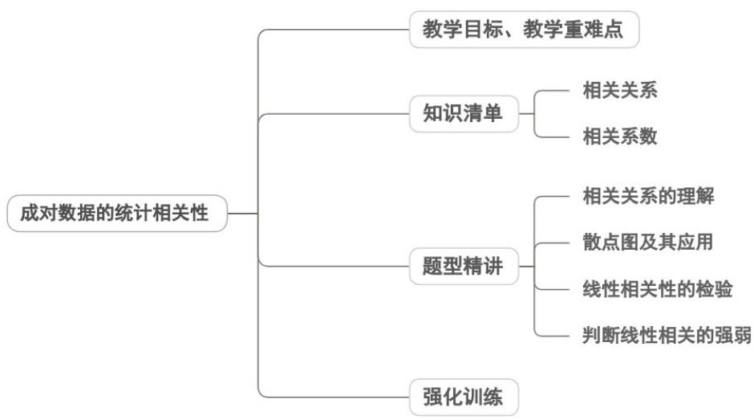
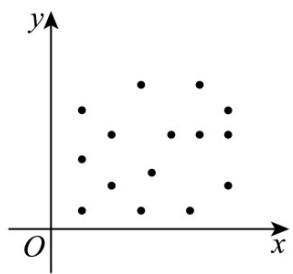
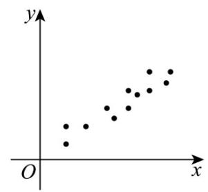
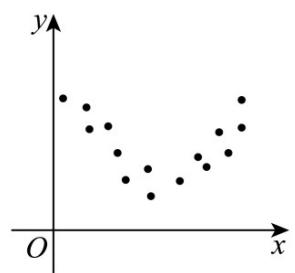
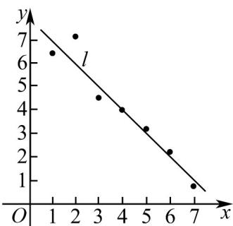
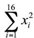

<!-- source-part:1 pages:1-50 -->

## 专题8.1 成对数据的统计相关性

## 内容概览

## 教学目标、教学重难点

<table><tr><td>教学目标</td><td>1.理解相关关系的含义,能区分函数关系与相关关系,会用散点图识别正/负/无相关。2.掌握样本相关系数r的意义、取值范围([-1,1]),能通过r判断线性相关强弱,了解r与标准化向量夹角的关联。3.会用散点图+相关系数分析成对数据,比较多组数据的相关性。</td></tr><tr><td>教学重难点</td><td>1.重点能结合散点图与r值,对成对数据的相关性做完整分析。2.难点辨析相关关系与因果关系,纠正“相关即因果”的认知偏差。</td></tr></table>

## 知识清单

## 知识点 01 相关关系

1、相关关系

两个变量间的关系有函数关系，相关关系和不相关关系

两个变量有关系，但又没有确切到可由其中的一个去精确地决定另一个的程度，这种关系称为相关关系。

2、正相关、负相关

从整体上看，当一个变量的值增加时，另一个变量的相应值也呈现增加的趋势，我们就称这两个变量正相关；

如果一个变量值增加时，另一个变量的相应值呈现减少的趋势，则称这个两个变量负相关。

3、线性相关：

一般地，如果两个变量的取值呈现正相关或负相关，而且散点落在一条线附近，我们就称这两个变量线性相

关.

一般地，如果两个变量具有相关性，但不是线性相关，那么我们就称这两个变量非线性相关或曲线相关。

【即学即练】

1. 下图是两个分类变量 $x, y$ 取值绘制成的散点图，则图中变量 $x, y$ 具有线性相关关系的是（）

【答案】

A.

B

C

D

【答案】BC

【分析】根据散点图的特征逐一验证即可得到答案·

【详解】由题意，

对于 $^{A}$ ：散点杂乱无章，无规律可言，看不出两个变量有什么相关性；故 $^{A}$ 错误；

对于 $^{B}$ ：呈正相关关系，分布在一条直线附近，具有线性相关关系；故 $^{B}$ 正确；

对于 $C$ ：两个变量具有负相关关系，分布在一条直线附近，具有线性相关关系；故 $C$ 正确；

对于 $^{D}$ ：两个变量具有相关性，但不是正相关，也不是负相关，故 $^{D}$ 错误·

故选：BC.

2. 某研究调查了 6 个城市的医院病床数量 $\left(X\right)$ 与年人均看病次数 $\left(Y\right)$ ，数据如下：

<table><tr><td>城市</td><td>病床数量(X)(万张)</td><td>年人均看病次数(Y)</td></tr><tr><td>A</td><td>0.8</td><td>3.1</td></tr><tr><td>B</td><td>1.2</td><td>4.0</td></tr><tr><td>C</td><td>1.5</td><td>4.6</td></tr><tr><td>D</td><td>2.0</td><td>5.9</td></tr><tr><td>E</td><td>2.5</td><td>6.7</td></tr><tr><td>F</td><td>3.0</td><td>7.8</td></tr></table>

散点图显示 $X$ 与 $Y$ 呈明显正相关·学生丙认为：“增加医院病床数量会使人们更容易生病，导致看病次数增加”

问：学生丙说的对吗？

【答案】学生丙说的不对

【分析】 $^{1}$ ·混淆相关与因果：学生丙将统计关联直接解释为“病床增加→生病增多”的因果关系；

2. 忽略混杂变量：实际存在隐藏变量——城市人口基数和老龄人口比例：人口多的城市需更多病床，同时因

基数大导致人均看病次数统计值更高；老龄化严重的城市对病床需求高，且老年人看病频率天然更高；

3.因果倒置风险：病床增加常是应对医疗需求的结果（需求高→增病床），而非致病原因

【详解】由题意，

对于相关性：表格中病床数量 $(X)$ 增加时，人均看病次数 $(Y)$ 同步上升，存在统计正相关。

对于因果性：若人为在偏远小镇新建医院 $(X \text{ 增加})$ ，但人口少且年轻，Y 不会显著上升·若某城市突发传染病

(Y 剧增)，病床数 X 不会自动增加·

结论：病床数量与人均看病次数的正相关反映共同影响因素的存在(人口结构、医疗需求)，但不能证明“病床

增加导致生病”，决策者若据此减少病床，反而会加剧医疗资源短缺，故学生丙说的不对·

3. 某食品科学家小张想研究一种新型固体饮料粉末（Y）在冷水中的溶解速率（溶解所需时间，单位：秒）

与水初始温度（ $X$ ，单位： ${}^{\circ}\mathrm{C}$ ）之间的关系·他初步进行了少量实验，收集了以下5组数据：

<table><tr><td>水温(X)</td><td>溶解时间(Y)</td></tr><tr><td>5</td><td>120</td></tr><tr><td>10</td><td>90</td></tr><tr><td>15</td><td>105</td></tr><tr><td>20</td><td>60</td></tr><tr><td>25</td><td>110</td></tr></table>

小张观察这 $^{5}$ 个数据点，发现水温升高时，溶解时间并没有呈现出明显一致的下降趋势（例如 $15^{\circ}C$ 时时间较

长， $25^{\circ}\mathrm{C}$ 时时间也较长）·他初步判断：“水温对这款饮料的溶解速率似乎没有显著影响，或者影响规律不明

显。”

问题：

(1)小张基于这 $^{5}$ 组数据得出的初步结论可能有什么问题？结合数据具体解释·

(2)为什么仅凭这 $^{5}$ 个数据点就下结论是危险的？请解释样本量不足在评估变量关系时可能导致什么错误。

(3)为了更准确地了解水温 $(X)$ 与溶解时间 $(Y)$ 的真实关系，小张应该怎么做？如果他增加了样本量（例如再

做 $^{20}$ 次严格控制的实验），可能会观察到什么不同的现象？

【答案】(1)样本数量太少、信息量有限、包含异常数据、随机波动掩盖趋势；

(2) 易受极端值 / 异常值影响、统计功效低、无法捕捉潜在规律；

(3)显著增加样本量（n>5），最好增至20-30组，可能观察到的现象见解析

【分析】（1）从样本量少、信息量有限、包含异常数据、正确且有用信息未显示被掩盖等出发分析即可；

(2) 根据变量的相关关系方面定义、数据特点、统计影响等方面出发分析即可；

(3) 从统计的科学性角度出发即可得解·

【详解】由题意，

(1) 样本量太小 (n=5): 只有 $^{5}$ 个数据点，信息量极其有限，数据点包含“异常”或“扰动”：

$15^{\circ} \mathrm{C}$ 时溶解时间 $^{105}$ 秒偏长； $25^{\circ} \mathrm{C}$ 时溶解时间 $^{110}$ 秒偏长·

随机波动掩盖趋势：在水温升高溶解时间减少存在的情况下，小样本中少数几个受干扰的数据点所产生

的随机波动，完全可能暂时掩盖掉潜在的真实趋势·

当前 $^{5}$ 个点看起来就是“高高低低”，没有明确规律·

(2) 易受极端值 / 异常值影响：小样本中，任何一个异常数据点，如受干扰的 $15^{\circ} \mathrm{C}$ 和 $25^{\circ} \mathrm{C}$ 数据，

对整体数据模式的权重都会被不成比例地放大，扭曲对整体关系的判断·

统计功效低：即使存在真实的、中等强度的负相关，水温越高，时间越短，

小样本也可能因为随机波动而无法可靠地检测到这种关系，导致第二类错误，

误以为没有关系而实际上有关系·结果不稳定且不可靠，小样本得出的结论对特定抽到的几个数据点非常敏感

再抽另外 $^{5}$ 个点，可能看起来像正相关、负相关或无相关·结论缺乏代表性和可重复性·

无法捕捉潜在规律：变量间的关系，尤其是非线性关系需要足够的数据点才能清晰地显现其模式，

5 个点太少，难以区分是随机噪声还是真实模式。

(3) 显著增加样本量 (n > 5): 小张应该进行更多次、严格控制实验条件的实验,

例如：确保搅拌均匀、粉末完全分散、记录准确·

建议至少增加到20-30个或更多不同水温下的数据点·

可能观察到的现象：随着样本量增加，实验过程中偶然的干扰，如一次搅拌失误、一次结块，对整体数据模

式的影响会被稀释·

## 知识点 02 相关系数

## 1、相关系数 $r$ 的计算

注意：相关系数是研究变量之间线性相关程度的量

假设两个随机变量的数据分别为 $(x_{1},y_{1}),(x_{2},y_{2}),\ldots ,(x_{n},y_{n})$ ，对数据作进一步的“标准化处理”处理，用 $s_x$

$= ,s_{y} =$ 分别除 $x_{i} - x$ 和 $y_{i} - y$ $(i = 1,2,\dots ,n,x$ 和 $y$ 分别为 $x_{1},x_{2},\ldots ,x_{n}$ 和 $y_{1},y_{2},\ldots ,y_{n}$ 的均值），得，，

…，，为简单起见，把上述“标准化”处理后的成对数据分别记为 $(x_{1}^{\prime},y_{1}^{\prime})$ ， $(x_{2}^{\prime},y_{2}^{\prime})$ ，…， $(x_{n}^{\prime},y_{n}^{\prime})$ ，则变量

$x$ 和变量 $y$ 的样本相关系数 $r$ 的计算公式如下：

$$
r = \left(x _ {1} ^ {\prime} y _ {1} ^ {\prime} + x _ {2} ^ {\prime} y _ {2} ^ {\prime} + \dots + x _ {n} ^ {\prime} y _ {n} ^ {\prime}\right)
$$

=.

2、相关系数 $r$ 的性质

(1)当 $r > 0$ 时，称成对样本数据正相关；当 $r < 0$ 时，成对样本数据负相关；当 $r = 0$ 时，成对样本数据间没有

线性相关关系.

(2)样本相关系数 r 的取值范围为 $[-1, 1]$ .

当 $|r|$ 越接近1时，成对样本数据的线性相关程度越强；

当 $|r|$ 越接近0时，成对样本数据的线性相关程度越弱。

3、样本相关系数与标准化数据向量夹角的关系

$r = x' \cdot y' = |x'||y'| \cos \theta = \cos \theta$ (其中 $x' = (x_1', x_2', \ldots, x_n')$ , $y' = (y_1', y_2', \ldots, y_n')$ , $|x'| = |y'| = \theta$ 为向量 $x'$ 和向量 $y'$ 的夹角).
【即学即练】

1. 通过随机抽样，得到变量 $x$ 和变量 $y$ 的 7 对数据，并绘制成散点图如图所示，已知变量 $y$ 和变量 $x$ 线性相关，且回归直线是图中直线 $l$ ，则下列说法正确的是（）

【答案】

A. 直线 $l$ 的斜率是负数
B. 变量 $y$ 与变量 $x$ 正相关

C. 相关系数 $r < 0$

D．若去掉图中点 A 后，剩余数据的相关系数 r 变大

【答案】AC

【分析】根据数据的散点图，结合相关性、相关系数的概念与定义，逐项判定，即可得解

【详解】对于 A、B、C：由图可知直线 l 的斜率是负数，所以变量 y 与变量 x 负相关，相关系数 r < 0，故 A、

C 正确，B 错误；

对于 $^{D}$ ：若去掉图中点 A 后，剩余的数据会更集中，相关程度会更高，相关系数的绝对值 $\left|r\right|$ 变大，又 r<0

所以相关系数 r 变小，故 $^{D}$ 错误·

故选：AC.

2. 下列四个选项正确的有（ ）

【答案】
A．样本相关系数 r 越大，成对样本数据的线性相关性越强
B．一组样本数据 47, 48, 48, 49, 50, 51, 52, 60，该组数据的第 60 百分位数为 50
C．决定系数 $R^{2}$ 越大，残差平方和越小，模型的拟合效果越好
D．若数据 $2x_{1} + 1, 2x_{2} + 1, \cdots, 2x_{16} + 1$ 的方差为 8，则数据 $x_{1}, x_{2}, \cdots, x_{16}$ 的方差为 2

【答案】BCD

【分析】逐一结合相关系数、百分位数、决定系数、方差的性质，分析各选项的正误

【详解】 $^{A}$ ：样本相关系数 r 的绝对值越接近 $^{1}$ ，成对样本数据的线性相关性越强，r 的数值大小不直接决定

相关性强弱，故 $^{A}$ 错误·

B：样本量为 $^{8}$ ，第 $^{60}$ 百分位数的位置为 $8 \times 60\% = 4.8$ ，向上取整为 $^{5}$ ，对应数据为 $^{50}$ ，故 B 正确。

C：决定系数 $R^2$ 越大，残差平方和越小，模型对数据的拟合效果越好，故C正确·

D：由方差性质 $D(aX+b)=a^{2}D(X)$ ，新数据 $2x_{i}+1$ 的方差为 8，得 $8=2^{2}\times D(X)$ ，解得原数据方差为 2，故

D 正确·

故选：BCD

3. 为了监控某种零件的一条生产线的生产过程，检验员每隔 $30\mathrm{min}$ 从该生产线上随机抽取一个零件，并测量

其尺寸（单位：cm）做好记录·下表是检验员在一天内依次抽取的 $^{16}$ 个零件的尺寸：经计算得

$$
\bar {x} = \frac {1}{1 6} \sum_ {i = 1} ^ {1 6} x _ {i} = 9. 9 7, s = \sqrt {\frac {1}{1 6} \sum_ {i = 1} ^ {1 6} \left(x _ {i} - \bar {x}\right) ^ {2}} = \sqrt {\frac {1}{1 6} \left(\sum_ {i = 1} ^ {1 6} x _ {i} ^ {2} - 1 6 \bar {x} ^ {2}\right)} \approx 0. 2 1 2,
$$

$\sqrt{\sum_{i=1}^{16}\left(i-8.5\right)^{2}}\approx18.439,\quad\sum_{i=1}^{16}\left(x_{i}-\bar{x}\right)\left(i-8.5\right)=-2.78$ ，其中 $x_{i}$ 为抽取的第i个零件的尺寸（ $i=1,2,\cdots,16$ ）.

<table><tr><td>抽取次序</td><td>1</td><td>2</td><td>3</td><td>4</td><td>5</td><td>6</td><td>7</td><td>8</td></tr><tr><td>零件尺寸( $^{cm}$ )</td><td>9.95</td><td>10.12</td><td>9.96</td><td>9.96</td><td>10.01</td><td>9.92</td><td>9.98</td><td>10.04</td></tr><tr><td>抽取次序</td><td>9</td><td>10</td><td>11</td><td>12</td><td>13</td><td>14</td><td>15</td><td>16</td></tr><tr><td>零件尺寸( $^{cm}$ )</td><td>10.26</td><td>9.91</td><td>10.13</td><td>10.02</td><td>9.22</td><td>10.04</td><td>10.05</td><td>9.95</td></tr></table>

(1)求 $\left(x_{i},i\right)\quad(i=1,2,\cdots,16)$ 的相关系数 $^{r}$ ，并回答是否可以认为这一天生产的零件尺寸不随生产过程的进行

而系统地变大或变小（若 $|r| < 0.25$ ，则可以认为零件的尺寸不随生产过程的进行而系统地变大或变小）；

(2)一天内抽检的零件中，如果出现了尺寸在 $\left(\overline{x} - 3s, \overline{x} + 3s\right)$ 之外的零件，就认为这条生产线在这一天的生产过

程可能出现了异常情况，需对当天的生产过程进行检查。从这一天抽检的结果看，是否需对当天的生产过程

进行检查？

(3)在 $\left(\overline{x} - 3s, \overline{x} + 3s\right)$ 之外的数据称为离群值，试剔除离群值，估计这条生产线当天生产的零件尺寸的均值与标

准差．（精确到 $0.01$ ）

【答案】 $^{(1)}$ 可以认为这一天生产的零件尺寸不随生产过程的进行而系统地变大或变小

(2)需对当天的生产过程进行检查

(3)均值10.02cm；标准差0.09cm

【分析】（1）由样本数据得相关系数 $r$ ，验证 $|r| < 0.25$ 是否成立，然后得结论；

(2) 由 $\overline{x}, s$ 求得 $\overline{x} - 3s, \overline{x} + 3s$ ，即可得到得结论；

(3) 剔除离群值，求剩下数据的平均值，即求得这条生产线当天生产的零件尺寸的均值的估计值·由 $s$ 得

$\sum_{i=1}^{16} x_i^2$ ，即可求出剔除第 $^{13}$ 个数据，剩下数据的样本方差，即求得这条生产线当天生产的零件尺寸的标准差

的估计值·

【详解】（1）由样本数据得相关系数：

$$
r = \frac {\sum_ {i = 1} ^ {1 6} \left(x _ {i} - \bar {x}\right) (i - 8 . 5)}{\sqrt {\sum_ {i = 1} ^ {1 6} \left(x _ {i} - \bar {x}\right) ^ {2}} \sqrt {\sum_ {i = 1} ^ {1 6} (i - 8 . 5) ^ {2}}} \approx \frac {- 2 . 7 8}{0 . 2 1 2 \times \sqrt {1 6} \times 1 8 . 4 3 9} \approx - 0. 1 8
$$

$\because |r| < 0.25$ ， $\therefore$ 可以认为这一天生产的零件尺寸不随生产过程的进行而系统地变大或变小.

(2) $\because \overline{x} = 9.97, s \approx 0.212, \therefore \overline{x} - 3s = 9.334, \overline{x} + 3s = 10.606$

∴ 抽取的第 13 个零件的尺寸在 $\left(\overline{x}-3s,\overline{x}+3s\right)$ 以外，

需对当天的生产过程进行检查.

(3) 剔除离群值，即第 13 个数据，

剩下数据的平均数为 $\frac{1}{15} \times (16 \times 9.97 - 9.22) = 10.02$

即这条生产线当天生产的零件尺寸的均值的估计值为10.02cm；

由 s 得： $\sum_{i=1}^{16}x_{i}^{2}\approx16\times0.212^{2}+16\times9.97^{2}\approx1591.134$

剔除第 $^{13}$ 个数据，剩下数据的样本方差为 $\frac{1}{15}\times\left(1591.134-9.22^{2}-15\times10.02^{2}\right)\approx0.008$

$\therefore$ 样本标准差为 $\sqrt{0.008} \approx 0.09$

即这条生产线当天生产的零件尺寸的标准差的估计值为 $0.09\mathrm{cm}$

## 题型精讲

![[高中/课堂同步/题库/人教A版高中数学同步讲义(2026)/05_选择性必修第三册/第八章 成对数据的统计分析/专题8.1 成对数据的统计相关性（高效培优讲义）数学人教A版高二选择性必修第三册/题型01_相关关系的理解/题型01_相关关系的理解.md]]
![[高中/课堂同步/题库/人教A版高中数学同步讲义(2026)/05_选择性必修第三册/第八章 成对数据的统计分析/专题8.1 成对数据的统计相关性（高效培优讲义）数学人教A版高二选择性必修第三册/题型02_散点图及其应用/题型02_散点图及其应用.md]]
![[高中/课堂同步/题库/人教A版高中数学同步讲义(2026)/05_选择性必修第三册/第八章 成对数据的统计分析/专题8.1 成对数据的统计相关性（高效培优讲义）数学人教A版高二选择性必修第三册/题型03_线性相关性的检验/题型03_线性相关性的检验.md]]
![[高中/课堂同步/题库/人教A版高中数学同步讲义(2026)/05_选择性必修第三册/第八章 成对数据的统计分析/专题8.1 成对数据的统计相关性（高效培优讲义）数学人教A版高二选择性必修第三册/题型04_判断线性相关的强弱/题型04_判断线性相关的强弱.md]]
![[高中/课堂同步/题库/人教A版高中数学同步讲义(2026)/05_选择性必修第三册/第八章 成对数据的统计分析/专题8.1 成对数据的统计相关性（高效培优讲义）数学人教A版高二选择性必修第三册/强化训练/强化训练.md]]
