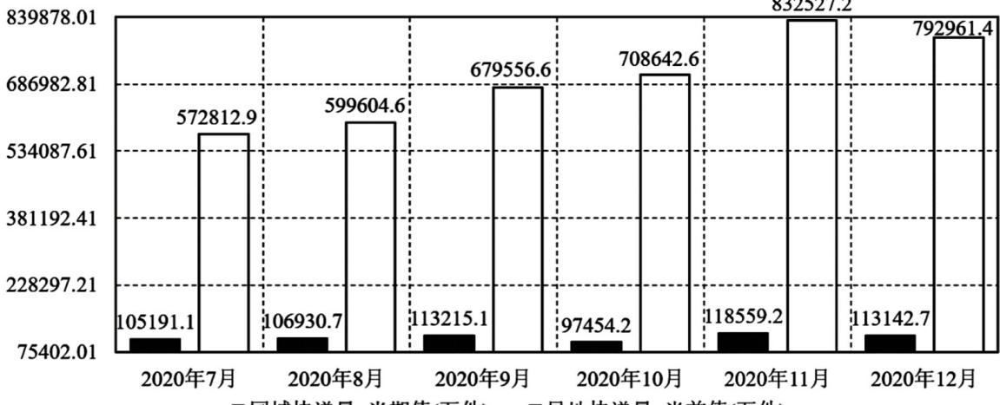

> [!faq]- 《专题8.1 成对数据的统计相关性（高效培优讲义）数学人教A版高二选择性必修第三册》官方解析
>
> > [!success]- **【答案】**  ■同城快递量\_当期值(万件) □异地快递量\_当前值(万件) A. 2020 年下半年，同城和异地快递量最高均出现在 $^{11}$ 月 B. 2020 年 $^{10}$ 月份异地快递增长率小于 $^{9}$ 月份的异地快递增长率(注·增长率指相对前一个月而言) C. 2020 年下半年，异地快递量与月份呈正相关关系 D. 2020 年下半年，每个月的异地快递量都是同城快递量的 $^{6}$ 倍以上
>
> > [!note]- **【解析】**
> > 对于 $^{A}$ ，由图可看出，同城和异地快递量最高都在 $^{11}$ 月份，故 $^{A}$ 正确；
> >
> > 对于 B，因为 $\frac{679556.6 - 599604.6}{599604.6} > \frac{708642.6 - 679556.6}{679556.6}$ ，9月异地快递增长率明显高于10月异地快递增长率，
> >
> > 故 $^{B}$ 正确；
> >
> > 对于 $^{C}$ ，由图可看出，除2020年12月异地快递量较11月略少，其余都有较明显增加，因此可以判断异地快
> >
> > 递量与月份呈正相关关系，故 $^{C}$ 正确；
> >
> > 对于 D，2020 年 7 月的异地快递量为 572812.9 万件，同城快递量为 105191.1 万件，异地快递量不到同城快递
> >
> > 量的 $^{6}$ 倍，故 $^{D}$ 不正确·
> >
> > 故选 **D**.
