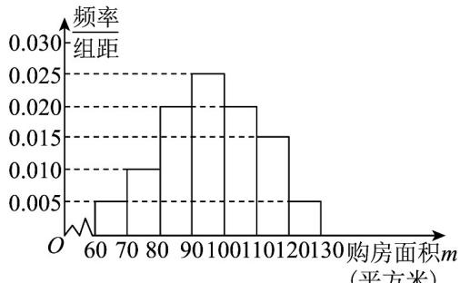
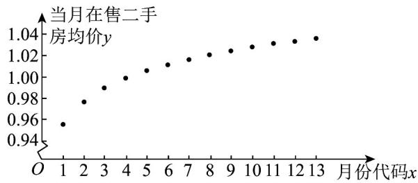

<!-- question-source:start -->
【变式2】某市实施二手房新政一年多以来，为了了解新政对居民的影响，房屋管理部门调查了2018年6月

至 $^{2019}$ 年 $^{6}$ 月期间购买二手房情况，首先随机抽取了其中的 $^{400}$ 名购房者，并对其购房面积 $^{m}$ （单位：平方

米， $60 \leq m \leq 130$ ）讲行了一次统计，制成了如图 $^{1}$ 所示的频率分布直方图，接着调查了该市 $^{2018}$ 年 $^{6}$ 月至

2019 年 6 月期间当月在售二手房的均价 $y$ （单位：万元/平方米），制成了如图 2 所示的散点图（图中月份代

码 $^{1-13}$ 分别对应 $^{2018}$ 年 $^{6}$ 月至 $^{2019}$ 年 $^{6}$ 月）

图1

图2
(1) 试估计该市市民的平均购房面积 $m$ （同一组中的数据用该组区间的中点值为代表）；
(2) 从该市 $^{2018}$ 年 $^{6}$ 月至 $^{2019}$ 年 $^{6}$ 月期间所有购买二手房的市民中任取 $^{3}$ 人，用频率估计概率，记这 $^{3}$ 人

购房面积不低于 $100$ 平方米的人数为 $X$ ，求 $X$ 的分布列与数学期望；
(3) 根据散点图选择 $\hat{y} = \hat{a} + \hat{b}\sqrt{x}$ 和 $\hat{y} = \hat{c} + \hat{d}\ln x$ 两个模型讲行拟合，经过数据处理得到两个回归方程，分别
为 $\hat{y} = 0.9369 + 0.0285\sqrt{x}$ 和 $\hat{y} = 0.9554 + 0.0306\ln x$ ，并得到一些统计量的值，如表所示：

<table><tr><td></td><td> $\hat{y} = 0.9369 + 0.0285\sqrt{x}$ </td><td> $\hat{y} = 0.9554 + 0.0306\ln x$ </td></tr><tr><td> $\sum_{i=1}^{n}\left(x_i - \bar{x}\right)\left(y_i - \bar{y}\right)$ </td><td>0.005459</td><td>0.005886</td></tr><tr><td> $\sqrt{\sum_{i=1}^{n}\left(x_i - \bar{x}\right)^2\sum_{i=1}^{n}\left(y_i - \bar{y}\right)^2}$ </td><td colspan="2">0.006050</td></tr></table>

请利用相关系数判断哪个模型的拟合效果更好，并用拟合效果更好的模型预测 $^{2019}$ 年 $^{8}$ 月份的二手房购房均

价（精确到 0.001）.

参考数据： $\ln 2\approx 0.69$ ， $\ln 3\approx 1.10$ ， $\ln 15\approx 2.71$ ， $\sqrt{3}\approx 1.73$ ， $\sqrt{15}\approx 3.87$ ， $\sqrt{17}\approx 4.12$

参考公式： $r = \frac{\sum_{i=1}^{n}\left(x_i - \overline{x}\right)\left(y_i - \overline{y}\right)}{\sqrt{\sum_{i=1}^{n}\left(x_i - \overline{x}\right)^2\sum_{i=1}^{n}\left(y_i - \overline{y}\right)^2}}$
<!-- question-source:end -->

![[高中/课堂同步/题库/人教A版高中数学同步讲义(2026)/05_选择性必修第三册/第八章 成对数据的统计分析/专题8.1 成对数据的统计相关性（高效培优讲义）数学人教A版高二选择性必修第三册/题型02_散点图及其应用/questions/answers/Q00083510A1.md]]
