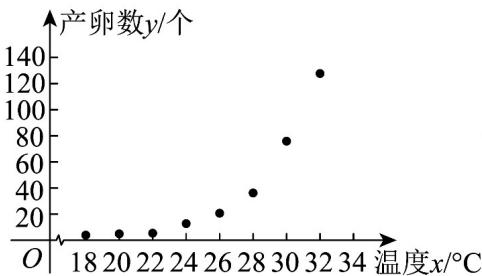
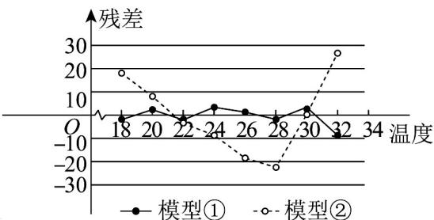

<!-- source-part:1 pages:1-50 -->

## 专题8.2 一元线性回归模型及其应用

## 内容概览

## 教学目标、教学重难点

<table><tr><td>教学目标</td><td>1.解一元线性回归模型的结构,区分线性回归直线方程与函数解析式的本质差异,掌握最小二乘法的核心思想。2.能运用公式求解线性回归方程的系数和截距,会用回归方程进行简单的预测分析。3.了解残差、残差图的含义,能通过残差判断模型的拟合效果,知晓线性回归模型的适用范围。</td></tr><tr><td>教学重难点</td><td>1.重点用线性回归方程对实际问题进行预测,能解释回归系数的实际意义。2.难点区分线性回归直线与散点图中近似直线的差异,理解回归方程的统计意义(非确定函数关系)。</td></tr></table>

## 知识清单

## 知识点 01 一元线性回归模型

我们称

为 $Y$ 关于 $x$ 的一元线性回归模型，其中 $Y$ 称为因变量或响应变量， $x$ 称为自变量或解释变量； $a$ 和 $b$ 为模型的

未知参数， $a$ 称为截距参数， $b$ 称为斜率参数； $e$ 是 $Y$ 与 $bx + a$ 之间的随机误差.

【即学即练】

1. 某软件科技公司近 $^{8}$ 年的年利润额 y 与投入的年研发经费 x （单位：千万元）如表所示。

<table><tr><td>x</td><td>3</td><td>4</td><td>5</td><td>6</td><td>6</td><td>7</td><td>8</td><td>9</td></tr><tr><td>y</td><td> $y_1$ </td><td> $y_2$ </td><td> $y_3$ </td><td> $y_4$ </td><td> $y_5$ </td><td> $y_6$ </td><td> $y_7$ </td><td> $y_8$ </td></tr></table>

根据散点图可以认为 $x$ 与 $y$ 之间存在线性相关关系，且相关系数 $r = \frac{83}{84}$ ，用最小二乘法求线性回归方程

$\hat{y} = \hat{b} x + \hat{a}$ （ $\hat{a}$ ， $\hat{b}$ 用分数表示）， $\hat{b} =$ \_\_\_\_。（参考数据： $\sum_{i=1}^{8}\left(y_i - \bar{y}\right)^2 = 252$ ）

【答案】 $\frac{83}{28}$

【详解】 $\overline{x} = \frac{3 + 4 + 5 + 6 + 6 + 7 + 8 + 9}{8} = 6$

$$
\sum_ {i = 1} ^ {8} \left(x _ {i} - \bar {x}\right) ^ {2} = (3 - 6) ^ {2} + (4 - 6) ^ {2} + (5 - 6) ^ {2} + 2 \times (6 - 6) ^ {2} + (7 - 6) ^ {2} + (8 - 6) ^ {2} + (9 - 6) ^ {2} = 2 8
$$

由条件可知 $r=\frac{\sum_{i=1}^{8}\left(x_{i}-\bar{x}\right)\left(y_{i}-\bar{y}\right)}{\sqrt{\sum_{i=1}^{8}\left(x_{i}-\bar{x}\right)^{2}\sum_{i=1}^{8}\left(y_{i}-\bar{y}\right)^{2}}}=\frac{\sum_{i=1}^{8}\left(x_{i}-\bar{x}\right)\left(y_{i}-\bar{y}\right)}{\sqrt{28\times252}}=\frac{83}{84}$ ，
得 $\sum_{i=1}^{8}(x_{i}-\bar{x})(y_{i}-\bar{y})=83$ ，所以 $\hat{b}=\frac{\sum_{i=1}^{8}(x_{i}-\bar{x})(y_{i}-\bar{y})}{\sum_{i=1}^{8}(x_{i}-\bar{x})^{2}}=\frac{83}{28}$ ，故答案为： $\frac{83}{28}$

2. 若变量 $x, y$ 线性相关，由数据 $\left(x_{i}, y_{i}\right) (i = 1, 2, 3, 4, 5)$ 求得回归方程为 $\hat{y} = -2x + 5$ ，则下列结论一定成立的是（）A. $\sum_{i=1}^{5} y_{i} = -2\sum_{i=1}^{5} x_{i}$ B. $\sum_{i=1}^{5} y_{i} = -2\sum_{i=1}^{5} x_{i} + 5$ C. $\sum_{i=1}^{5} y_{i} = -10\sum_{i=1}^{5} x_{i} + 25$ D. $\sum_{i=1}^{5} y_{i} = -2\sum_{i=1}^{5} x_{i} + 25$

【答案】D

【详解】由回归直线过样本中心点 $\left(\overline{x},\overline{y}\right)$ ，得 $\overline{y} = -2\overline{x} +5$

$\because \overline{x}=\frac{\sum_{i=1}^{5}x_{i}}{5},\overline{y}=\frac{\sum_{i=1}^{5}y_{i}}{5}$ ，代入，得 $\frac{\sum_{i=1}^{5}y_{i}}{5}=-2\times\frac{\sum_{i=1}^{5}x_{i}}{5}+5$ ，

方程两边同时乘 $^{5}$ ，得 $\sum_{i=1}^{5}y_{i}=-2\sum_{i=1}^{5}x_{i}+25$ 故选：D

## 知识点 02 线性回归方程与最小二乘法

1、回归直线方程过样本点的中心 $(x, y)$ ，是回归直线方程最常用的一个特征

我们将 $y = bx + a$ 称为 $Y$ 关于 $x$ 的线性回归方程，也称经验回归函数或经验回归公式，其图形称为经验回归直

线．这种求经验回归方程的方法叫做最小二乘法，求得的b，a叫做b，a的最小二乘估计(least squares

estimate),

其中

$$
\left\{ \begin{array}{l} \hat {b} = \frac {\sum_ {i = 1} ^ {n} (x _ {i} - \overline {{x}}) (y _ {i} - \overline {{y}})}{\sum_ {i = 1} ^ {n} (x _ {i} - \overline {{x}}) ^ {2}} = \frac {\sum_ {i = 1} ^ {n} x _ {i} y _ {i} - n \overline {{x}} \overline {{y}}}{\sum_ {i = 1} ^ {n} x _ {i} ^ {2} - n \overline {{x}} ^ {2}}, \\ \hat {a} = \overline {{y}} - \hat {b} \overline {{x}}. \end{array} \right.
$$

2、残差的概念：对于响应变量 $Y$ ，通过观测得到的数据称为观测值，通过经验回归方程得到的y称为预测值，

观测值减去预测值称为残差．残差是随机误差的估计结果，通过残差的分析可以判断模型刻画数据的效果，

以及判断原始数据中是否存在可疑数据等，这方面工作称为残差分析。

3、刻画回归效果的方式

(1)残差图法：作图时纵坐标为残差，横坐标可以选为样本编号，或身高数据，或体重估计值等，这样作出的

图形称为残差图．若残差点比较均匀地落在水平的带状区域内，带状区域越窄，则说明拟合效果越好．

(2)残差平方和法：残差平方和 $\sum (y_{i} - y_{i})^{2}$ ，残差平方和越小，模型拟合效果越好，残差平方和越大，模型拟合

效果越差.

(3)利用 $R^2$ 刻画回归效果：决定系数 $R^2$ 是度量模型拟合效果的一种指标，在线性模型中，它代表解释变量客

户预报变量的能力。

$R^2 = 1 -$ ， $R^2$ 越大，即拟合效果越好， $R^2$ 越小，模型拟合效果越差.

## 【即学即练】

1. 红铃虫（Pectinophora gossypiella）是棉花的主要害虫之一，其产卵数与温度有关。现收集到一只红铃虫

的产卵数 $y$ （个）和温度 $x$ （ $^{\circ}\mathrm{C}$ ）的8组观测数据，制成图1所示的散点图·现用两种模型① $y = \mathrm{e}^{bx + a}$ ，②

$$
y = c x ^ {2} + d
$$

分别进行拟合，由此得到相应的回归方程并进行残差分析，进一步得到图2所示的残差图。

图1 产卵数散点图

图2 两种模型的残差图

根据收集到的数据，计算得到如下值：

<table><tr><td> $\overline{x}$ </td><td> $\overline{z}$ </td><td> $\overline{t}$ </td><td> $\sum_{i=1}^{8}\left(x_i - \overline{x}\right)^2$ </td><td> $\sum_{i=1}^{8}\left(t_i - \overline{t}\right)^2$ </td><td> $\sum_{i=1}^{8}\left(z_i - z\right)\left(x_i - x\right)$ </td><td> $\sum_{i=1}^{8}\left(y_i - \overline{y}\right)\left(t_i - \overline{t}\right)$ </td></tr><tr><td>25</td><td>2.9</td><td>646</td><td>168</td><td>422688</td><td>50.4</td><td>70308</td></tr></table>

表中 $z_{i}=\ln y_{i}$ ; $\overline{z}=\frac{1}{8}\sum_{i=1}^{8}z_{i}$ ; $t_{i}=x_{i}^{2}$ ; $\overline{t}=\frac{1}{8}\sum_{i=1}^{8}t_{i}$

(1)根据残差图，比较模型①、②的拟合效果，哪种模型比较合适？

(2)根据（1）中所选择的模型，求出 $y$ 关于 $x$ 的回归方程.

附：对于一组数据 $\left(\omega_1,v_1\right)\left(\omega_2,v_2\right),\ldots \left(\omega_n,v_n\right)$ ，其回归直线 $\hat{v} = \hat{\alpha} +\hat{\beta}\omega$ 的斜率和截距的最小二乘估计分别为，

$$
\hat {\beta} = \frac {\sum_ {i = 1} ^ {n} (\omega_ {i} - \overline {{\omega}}) (v _ {i} - \overline {{v}})}{\sum_ {i = 1} ^ {n} (\omega_ {i} - \overline {{\omega}}) ^ {2}}, \quad \hat {\alpha} = \overline {{v}} - \hat {\beta} \overline {{\omega}}
$$

【答案】(1)①；

(2) $\hat{y} = \mathrm{e}^{0.3x - 4.6}$

【分析】（ $^{1}$ ）根据残差点的分布情况分析即可；

(2) 取对数，将非线性回归转化为线性回归，然后根据所给数据代入公式即可得回归方程.

【详解】（1）模型①更合适.

模型①残差点比较均匀地落在水平的带状区域中，且带状区域的宽度比模型②带状宽度窄，

所以模型①的拟合精度更高，回归方程的预报精度相应就会越高，故选模型①比较合适。

(2) 令 $z = \ln y, z$ 与温度 $x$ 可以用线性回归方程来拟合，则 $\hat{z} = \hat{a} + \hat{b} x$

$$
\hat {b} = \frac {\sum_ {i = 1} ^ {8} \left(x _ {i} - \bar {x}\right) \left(z _ {i} - \bar {z}\right)}{\sum_ {i = 1} ^ {8} \left(x _ {i} - \bar {x}\right) ^ {2}} = \frac {5 0 . 4}{1 6 8} = 0. 3
$$

$$
\hat {a} = \overline {{{z}}} - \hat {b} \overline {{{x}}} = 2. 9 - 0. 3 \times 2 5 = - 4. 6
$$

则 z 关于 x 的线性回归方程为 $\hat{z}=0.3x-4.6$ ，即 $\ln y=0.3x-4.6$ ，

$\therefore$ 产卵数 $y$ 关于温度 $x$ 的回归方程为 $\hat{y} = \mathrm{e}^{0.3x - 4.6}$

2. 某种机械设备随着使用年限的增加，它的使用功能逐渐减退，使用价值逐年减少，通常把它使用价值逐年

减少的“量”换算成费用，称之为“失效费”。某种机械设备的使用年限 $x$ （单位：年）与失效费 $y$ （单位：万

元）的统计数据如下表所示：

<table><tr><td>使用年限 $x$ (单位:年)</td><td>2</td><td>4</td><td>5</td><td>6</td><td>8</td></tr><tr><td>失效费 $^y$ (单位:万元)</td><td>3</td><td>4</td><td>5</td><td>6</td><td>7</td></tr></table>

(1)根据上表数据，计算 $y$ 与 $x$ 的相关系数 $r$ ，并说明 $y$ 与 $x$ 的线性相关性的强弱.

（已知： $0.75 \leq |r| \leq 1$ ，则认为 $y$ 与 $x$ 线性相关性很强； $0.3 \leq |r| < 0.75$ ，则认为与 $x$ 线性相关性一般； $|r| < 0.3$ ，则

认为 $y$ 与 $x$ 线性相关性较弱）（ $r$ 的结果精确到0.0001）

(2)求 $y$ 关于 $x$ 的线性回归方程，并估算该种机械设备使用10年的失效费.

附：样本 $\left(x_{i},y_{i}\right)\left(i=1,2,\cdots,n\right)$ 的相关系数 $r=\frac{\sum_{i=1}^{n}\left(x_{i}-\bar{x}\right)\left(y_{i}-\bar{y}\right)}{\sqrt{\sum_{i=1}^{n}\left(x_{i}-\bar{x}\right)^{2}}\sqrt{\sum_{i=1}^{n}\left(y_{i}-\bar{y}\right)^{2}}}$ ，经验回归方程 $\hat{y}=\hat{b}x+\hat{a}$ 的斜率和截

距的最小二乘估计分别为 $\hat{b}=\frac{\sum_{i=1}^{n}\left(x_{i}-\bar{x}\right)\left(y_{i}-\bar{y}\right)}{\sum_{i=1}^{n}\left(x_{i}-\bar{x}\right)^{2}}$ ， $\hat{a}=\bar{y}-\hat{b}\bar{x}$

【答案】(1) $r \approx 0.9899$ ，线性相关性很强

(2) $y=0.7x+1.5$ ，8.5万元

【分析】（ $^{1}$ ）根据相关系数公式，分别求出变量的均值及和值，代入公式求得相关系数，并判断相关性强弱

即可；

(2) 根据第一问求得的值，结合线性回归方程求解公式求得参数 $\hat{a}, \hat{b}$ ，写出回归方程，并预测 10 年的失效

费即可·

【详解】（1）由表知， $\overline{x}=\frac{1}{5}\times(2+4+5+6+8)=5,\quad\overline{y}=\frac{1}{5}\times(3+4+5+6+7)=5$

$$
\sum_ {i = 1} ^ {5} x _ {i} y _ {i} = 2 \times 3 + 4 \times 4 + 5 \times 5 + 6 \times 6 + 8 \times 7 = 1 3 9
$$

$$
\sum_ {i = 1} ^ {5} x _ {i} ^ {2} = 2 ^ {2} + 4 ^ {2} + 5 ^ {2} + 6 ^ {2} + 8 ^ {2} = 1 4 5, \quad \sum_ {i = 1} ^ {5} y _ {i} ^ {2} = 3 ^ {2} + 4 ^ {2} + 5 ^ {2} + 6 ^ {2} + 7 ^ {2} = 1 3 5,
$$

$$
r = \frac {\sum_ {n} ^ {i = 1} x _ {i} y _ {i} - n \overline {{{x y}}}}{\sqrt {\sum_ {n} ^ {i = 1} x _ {i} ^ {2} - n \overline {{{x}}} ^ {2}} \sqrt {\sum_ {n} ^ {i = 1} y _ {i} ^ {2} - n \overline {{{y}}} ^ {2}}} = \frac {1 3 9 - 5 \times 5 \times 5}{\sqrt {1 4 5 - 5 \times 5 ^ {2}} \sqrt {1 3 5 - 5 \times 5 ^ {2}}} = \frac {7 \sqrt {2}}{1 0} \approx 0. 9 8 9 9
$$

故 $0.75 < r < 1$ ，认为 $y$ 与 $x$ 线性相关性很强；

(2) 由 (1) 知， $\hat{b} = \frac{\sum_{i=1}^{n} x_i y_i - n\overline{xy}}{\sum_{i=1}^{n} x_i^2 - n\overline{x}^2} = \frac{139 - 5 \times 5 \times 5}{145 - 5 \times 5^2} = 0.7$

又 $\overline{x} = \overline{y} = 5$ ， $\overline{a} = \overline{y} - \overline{b}x = 5 - 0.7 \times 5 = 1.5$

故 y 关于 x 的线性回归方程为 $\hat{y}=0.7x+1.5$

当 $x = 10$ 时， $\hat{y} = 0.7 \times 10 + 1.5 = 8.5$ ，即估算 $^{10}$ 年的失效费为 $8.5$ 万元。

## 题型精讲

![[高中/课堂同步/题库/人教A版高中数学同步讲义(2026)/05_选择性必修第三册/第八章 成对数据的统计分析/专题8.2 一元线性回归模型及其应用（高效培优讲义）数学人教A版高二选择性必修第三册/题型01_求回归直线方程/题型01_求回归直线方程.md]]
![[高中/课堂同步/题库/人教A版高中数学同步讲义(2026)/05_选择性必修第三册/第八章 成对数据的统计分析/专题8.2 一元线性回归模型及其应用（高效培优讲义）数学人教A版高二选择性必修第三册/题型02_利用回归直线方程对总体进行估计/题型02_利用回归直线方程对总体进行估计.md]]
![[高中/课堂同步/题库/人教A版高中数学同步讲义(2026)/05_选择性必修第三册/第八章 成对数据的统计分析/专题8.2 一元线性回归模型及其应用（高效培优讲义）数学人教A版高二选择性必修第三册/题型03_线性回归分析/题型03_线性回归分析.md]]
![[高中/课堂同步/题库/人教A版高中数学同步讲义(2026)/05_选择性必修第三册/第八章 成对数据的统计分析/专题8.2 一元线性回归模型及其应用（高效培优讲义）数学人教A版高二选择性必修第三册/题型04_残差分析与相关指数的应用/题型04_残差分析与相关指数的应用.md]]
![[高中/课堂同步/题库/人教A版高中数学同步讲义(2026)/05_选择性必修第三册/第八章 成对数据的统计分析/专题8.2 一元线性回归模型及其应用（高效培优讲义）数学人教A版高二选择性必修第三册/题型05_非线性回归分析/题型05_非线性回归分析.md]]
![[高中/课堂同步/题库/人教A版高中数学同步讲义(2026)/05_选择性必修第三册/第八章 成对数据的统计分析/专题8.2 一元线性回归模型及其应用（高效培优讲义）数学人教A版高二选择性必修第三册/强化训练/强化训练.md]]
