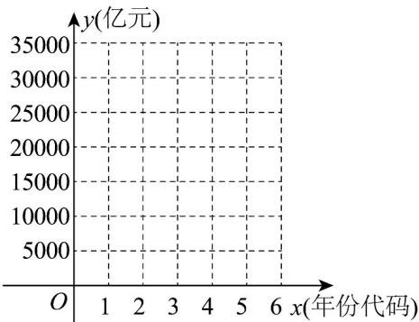
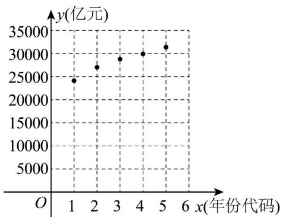

> [!faq]- 《专题8.2 一元线性回归模型及其应用（高效培优讲义）数学人教A版高二选择性必修第三册》官方解析
>
> > [!success]- **【答案】** (1)100，7；(2) $R^{2}=0.9062$ ， $\hat{y}=3.2x-151.8$ 拟合程度更好。
>
> > [!note]- **【分析】**
> > （1）根据经验回归方程过样本中心点 $\left(\overline{x},\overline{y}\right)$ ，先由经验回归方程和x的平均数 $\overline{x}$ ，求出y的平均数 $\overline{y}$ ，再根据平均数的定义求出m；然后根据残差定义 $\hat{e}_{i}=y_{i}-\hat{y}_{i}$ 计算8月份的残差·
> >
> > (2) 先求出残差平方和，再代入公式计算 $R^{2}$ ，最后与非线性回归模型的 $R_{0}^{2}$ 比较大小，即可判断
>
> > [!note]- **【解析】**
> > （1）因为 $\hat{y}=3.2x-151.8,\quad\overline{x}=84,\quad\overline{y}=3.2\times84-151.8=117$
> >
> > 则 $114 + 116 + 106 + 122 + 132 + 114 + m + 132 = 117 \times 8$ ，解得 $m = 100$
> >
> > 8 月份对应的残差值 $\hat{e}_8 = y_8 - \hat{y}_8 = 132 - (3.2 \times 86.5 - 151.8) = 7$
> >
> > (2) 因为 $\hat{e}_{7}=y_{7}-\hat{y}_{7}=100-(3.2\times79-151.8)=-1$
> >
> > 所以 $\sum_{i=1}^{8}\left(y_i - \hat{y}_i\right)^2 = 0.2^2 + 0.6^2 + 1.8^2 + (-3)^2 + (-1)^2 + (-4.6)^2 + (-1)^2 + 7^2 = 84.8$
> >
> > 所以 $R^{2}=1-\frac{\sum_{i=1}^{8}\left(y_{i}-\hat{y}_{i}\right)^{2}}{\sum_{i=1}^{8}\left(y_{i}-\bar{y}\right)^{2}}=1-\frac{84.8}{904}=0.9062>R_{0}^{2}$ ，所以线性回归模型，拟合程度更好·
> >
> > 9．2024年1月24日，云南省统计局发布数据，2023年度云南省生产总值（GDP）为30021亿元，年度GDP
> >
> > 首次突破 $^{3}$ 万亿元．以下是2020年至2024年云南省生产总值表．
> >
> > 
> >
> > <table><tr><td>年份</td><td>2020 年</td><td>2021 年</td><td>2022 年</td><td>2023 年</td><td>2024 年</td></tr><tr><td>年份代码  $x$ </td><td>1</td><td>2</td><td>3</td><td>4</td><td>5</td></tr><tr><td>生产总值  $y$ (亿元)</td><td>24555</td><td>27146</td><td>28954</td><td>30021</td><td>31534</td></tr></table>
> >
> > (1)根据以上数据，在答题卡上画出散点图，并判断成对数据是否线性相关？
> >
> > (2)建立生产总值 $y$ （亿元）关于年份代码 $x$ 的经验回归方程 $\hat{y} = \hat{b} x + \hat{a}$ （ $\hat{a}$ ， $\hat{b}$ 精确到1），并预测2025年度
> >
> > 云南省生产总值.
> >
> > 参考公式： $\hat{b} = \frac{\sum_{i = 1}^{n}\big(x_i - \overline{x}\big)(y_i - \overline{y})}{\sum_{i = 1}^{n}\big(x_i - \overline{x}\big)^2},\hat{a} = \overline{y} -\hat{b}\overline{x}$
> >
> > 【答案】 $^{(1)}$ 答案见解析，正线性相关关系
> >
> > $$
> > \widehat {y} = 1 6 8 3 x + 2 3 3 9 2 \quad , 3 3 4 9 0 \text {亿元}.
> > $$
> >
> > 【分析】（ $^{1}$ ）由题，作出散点图，根据散点图及线性相关的概念判断；
> >
> > (2) 根据相关公式计算 $\hat{b}, \hat{a}$ ，可得回归方程，代入即可预测结果.
> >
> > 【详解】（1）画出成对数据的散点图，从散点图看生产总值 $y$ （亿元）与年份代码 $x$ 的数据呈现出正线性相
> >
> > 关关系，且相关程度很强·
> >
> > 
> >
> > $$
> > \overline {{x}} = 3, \overline {{y}} = \frac {2 4 5 5 5 + 2 7 1 4 6 + 2 8 9 5 4 + 3 0 0 2 1 + 3 1 5 3 4}{5} = \frac {1 4 2 2 1 0}{5} = 2 8 4 4 2
> > $$
> >
> > $$
> > \therefore \sum_ {i = 1} ^ {5} \left(x _ {i} - \bar {x}\right) \left(y _ {i} - \bar {y}\right) = (1 - 3) (2 4 5 5 5 - 2 8 4 4 2) + (2 - 3) (2 7 1 4 6 - 2 8 4 4 2)
> > $$
> >
> > $$
> > + (4 - 3) (3 0 0 2 1 - 2 8 4 4 2) + (5 - 3) (3 1 5 3 4 - 2 8 4 4 2) = 1 6 8 3 3
> > $$
> >
> > $$
> > \sum_ {i = 1} ^ {5} \left(x _ {i} - \bar {x}\right) ^ {2} = (1 - 3) ^ {2} + (2 - 3) ^ {2} + (3 - 3) ^ {2} + (4 - 3) ^ {2} + (5 - 3) ^ {2} = 1 0
> > $$
> >
> > $\hat{b}=\frac{16833}{10}=1683.3\approx1683,\hat{a}=28442-1683.3\times3=23392.1\approx23392$ 所以
> >
> > 所以生产总值 y 关于年份代码 x 的经验回归方程为 $\hat{y}=1683x+23392$
> >
> > 当 $x = 6$ 时， $\hat{y} = 1683\times 6 + 23392 = 33490$
> >
> > 所以根据预测 2025 年云南省生产总值的估计值为 33490 亿元·
