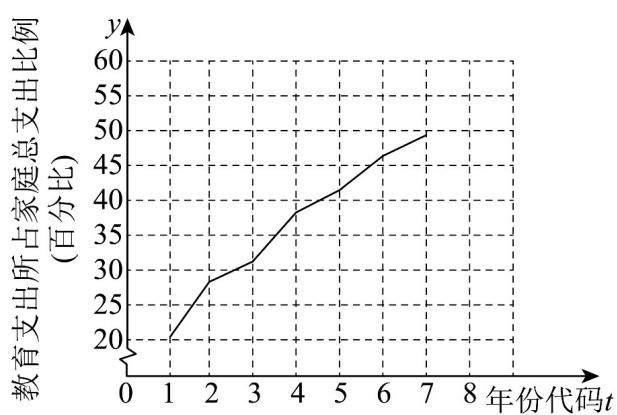

<!-- question-source:start -->
【变式1】近年来，随着社会对教育的重视，家庭的平均教育支出增长较快，随机抽样调查某市2018～2024

年的家庭平均教育支出，得到如下折线图·（附：年份代码 $1\sim 7$ 分别对应的年份是 $2018\sim 2024$ ）经计算得

$$
\sum_ {7} ^ {i = 1} y _ {i} = 2 5 9, \sqrt {7} \approx 2. 6 4 6, \sqrt {\sum_ {7} ^ {i = 1} \left(y _ {i} - \bar {y}\right) ^ {2}} = 2 5, \sum_ {7} ^ {i = 1} \left(t _ {i} - \bar {t}\right) \left(y _ {i} - \bar {y}\right) = 1 3 0.
$$

(1)用线性回归模型拟合 $y$ 与 $t$ 的关系，求出样本相关系数 $r$ （精确到0.01）；

(2)建立 $y$ 关于 $t$ 的经验回归方程（ $\hat{b}$ ， $\hat{a}$ 精确到0.01）；

(3)若 2025 年该市某家庭总支出为 10 万元，预测该家庭教育支出约为多少万元？

附：（i）相关系数： $r = \frac{\sum_{i=1}^{n}\left(t_i - \overline{t}\right)\left(y_i - \overline{y}\right)}{\sqrt{\sum_{i=1}^{n}\left(t_i - \overline{t}\right)^2}\sqrt{\sum_{i=1}^{n}\left(y_i - \overline{y}\right)^2}}$

(ii) 经验回归方程： $\hat{y}=\hat{b}t+\hat{a}$ ，其中 $\hat{b}=\frac{\sum_{i=1}^{n}\left(t_{i}-\overline{t}\right)\left(y_{i}-\overline{y}\right)}{\sum_{i=1}^{n}\left(t_{i}-\overline{t}\right)^{2}},\hat{a}=\overline{y}-\hat{b}\overline{t}$
<!-- question-source:end -->

![[高中/课堂同步/题库/人教A版高中数学同步讲义(2026)/05_选择性必修第三册/第八章 成对数据的统计分析/专题8.2 一元线性回归模型及其应用（高效培优讲义）数学人教A版高二选择性必修第三册/题型03_线性回归分析/questions/answers/Q00083532A1.md]]
