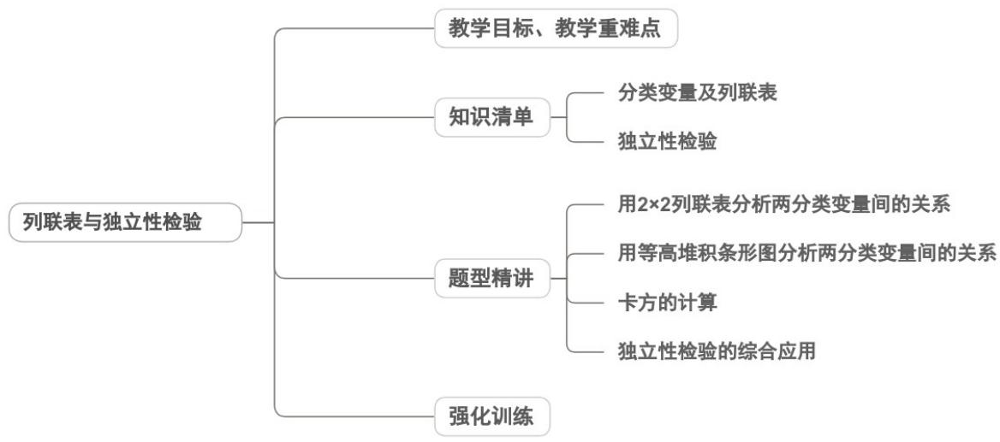

<!-- source-part:1 pages:1-50 -->

## 专题8.3 列联表与独立性检验

## 内容概览

## 教学目标、教学重难点

<table><tr><td>教学目标</td><td>1.理解 $2 \times 2$ 列联表的结构与含义,能根据实际问题数据构建完整的 $2 \times 2$ 列联表,提取表中核心统计信息。2.掌握独立性检验的基本思想,理解卡方统计量的计算公式及意义,熟记临界值表的查阅方法。3.能按步骤完成独立性检验:提出假设→计算 $\chi^{2}$ 值→对比临界值→作出统计推断,解决实际分类变量的独立性检验问题。4.区分“独立性检验的推断结论”与“实际因果关系”,知晓检验结论的随机性和适用范围。</td></tr><tr><td>教学重难点</td><td>1.重点独立性检验的完整解题步骤,能根据 $\chi^{2}$ 值与临界值的大小关系,作出“有多大把握认为两个分类变量有关”的统计推断。2.难点区分“有统计学意义的关联”与实际因果关系,纠正“独立性检验认为有关就是因果关系”的认知偏差。</td></tr></table>

## 知识清单

## 知识点 01 分类变量及列联表

## 1、分类变量

这里所说的变量和值不一定是具体的数值，例如：性别变量，其取值为男和女两种

我们经常会使用一种特殊的随机变量，以区别不同的现象或性质，这类随机变量称为分类变量，分类变量的

取值可以用实数表示.

## 2、 $2 \times 2$ 列联表

在实践中，由于保存原始数据的成本较高，人们经常按研究问题的需要，将数据分类统计，并做成表格加以

保存，我们将这类数据统计表称为 $2 \times 2$ 列联表， $2 \times 2$ 列联表给出了成对分类变量数据的交叉分类频数。

一般地，假设有两个分类变量 $X$ 和 $Y$ ，它们的取值分别为 $\{x_1, x_2\}$ 和 $\{y_1, y_2\}$ ，其 $2 \times 2$ 列联表为

<table><tr><td></td><td> $y_1$ </td><td> $y_2$ </td><td>合计</td></tr><tr><td> $x_1$ </td><td>a</td><td>b</td><td> $a + b$ </td></tr><tr><td> $x_2$ </td><td>c</td><td>d</td><td> $c + d$ </td></tr><tr><td>合计</td><td> $a + c$ </td><td> $b + d$ </td><td> $a + b + c + d$ </td></tr></table>

## 3、等高堆积条形图

等高条形图和表格相比，更能直观地反映出两个分类变量间是否相互影响，常用等高条形图展示列联表数据

的频率特征，依据频率稳定于概率的原理，我们可以推断结果。

## 4、临界值

$\chi^2$ 统计量也可以用来作相关性的度量. $\chi^2$ 越小说明变量之间越独立， $\chi^2$ 越大说明变量之间越相关

$\chi^2 = \underline{\text{忽略}}\chi^2$ 的实际分布与该近似分布的误差后，对于任何小概率值 $\alpha$ ，可以找到相应的正实数 $x_{\alpha}$ ，使得

$P(\chi^2\geq x_\alpha) = \alpha$ 成立．我们称 $x_{\alpha}$ 为 $\alpha$ 的临界值，这个临界值就可作为判断 $\chi^2$ 大小的标准．

## 【即学即练】

1. 设 $A$ ， $B$ 为两个变量，每一个变量都可以取两个值，即 $A: A_1$ ， $A_2$ ，且 $A_2 = \overline{A_1}$ ， $B: B_1$ ， $B_2$ ，且 $B_2 = \overline{B_1}$ ，

随机调查 $n$ 个样本数据后，得到如下列联表，则（）

<table><tr><td></td><td> $B_1$ </td><td> $B_2$ </td><td>合计</td></tr><tr><td> $A_1$ </td><td>a</td><td>b</td><td>a+b</td></tr><tr><td> $A_2$ </td><td>c</td><td>d</td><td>c+d</td></tr><tr><td>合计</td><td>a+c</td><td>b+d</td><td>n=a+b+c+d</td></tr></table>

A．若 $\frac{a}{n}=\frac{(a+b)(a+c)}{n^{2}}$ ，则可以认为 $A_{1}$ 与 $B_{1}$ 独立

B．若变量 A 与 B 独立，则 $\frac{a}{n} = \frac{(a + b)(a + c)}{n^{2}}$

C. 若 $\left|\frac{an-(a+b)(a+c)}{n^{2}}\right|$ 很大，则变量 A 与 B 不独立

D. 若变量 A 与 B 不独立，则 $\left|\frac{an-(a+b)(a+c)}{n^{2}}\right|$ 很大

【答案】AC

【分析】运用独立性检验的步骤原理推理判断即可·

【详解】用频率 $\frac{a}{n}$ 可以估计 $P(A_{1}B_{1})$ ，用频率 $\frac{a + b}{n}$ 可以估计 $P(A_{1})$ ，用频率 $\frac{a + c}{n}$ 可以估计 $P(B_{1})$ ，若

$\frac{a}{n} = \frac{(a + b)(a + c)}{n^2}$ 则 $P(A_{1}B_{1}) = P(A_{1})P(B_{1})$ ，可以认为 $A_{1}$ 与 $B_{1}$ 独立，故A正确；

由于 $\frac{a}{n}$ ， $\frac{a + b}{n}$ ， $\frac{a + c}{n}$ 表示的是频率， $n$ 是抽取的样本数据，故即使变量 $A$ 与 $B$ 独立， $\frac{a}{n} = \frac{(a + b)(a + c)}{n^2}$ 也不

一定成立，故B错误；

若 $\left|\frac{an - (a + b)(a + c)}{n^2}\right|$ 很大，可以说明 $A$ 与 $B$ 不独立，故C正确；

若变量 $A$ 与 $B$ 不独立， $\left|\frac{an - (a + b)(a + c)}{n^2}\right| \neq 0$ ，但并不一定很大，故D错误

故选：AC.

2. 某市热线网站就“民众是否支持加大修建城市地下排水设施的资金投入”进行投票，按照该市暴雨前后两个

时间各收集了 $^{50}$ 份有效投票，所得统计结果如下表：

<table><tr><td>暴雨</td><td>支持情况</td></tr></table>

<table><tr><td>前后</td><td>支持</td><td>不支持</td><td>总计</td></tr><tr><td>暴雨后</td><td>x</td><td>y</td><td>50</td></tr><tr><td>暴雨前</td><td>20</td><td>30</td><td>50</td></tr><tr><td>总计</td><td>A</td><td>B</td><td>100</td></tr></table>

已知工作人员从所有投票中任取一张，取到“不支持投入”的投票概率为 $^{5}$

$$
\frac {2}{5}
$$

(1)求列联表中的数据 x, y, A, B 的值；

(2)能够有多大把握认为暴雨与该市民众是否赞成加大修建城市地下排水设施的投入有关？

(3)用样本估计总体，在该市全体市民中任意选取 $^{4}$ 人，其中“支持加大修建城市地下排水设施的资金投入”的

人数记为 $\xi$ ，求 $\xi$ 的分布列和数学期望·

附： $\chi^{2}=\frac{n(ad-bc)^{2}}{(a+b)(c+d)(a+c)(b+d)}$

【答案】(1) $x = 40$ ， $y = 10$ ， $A = 60$ ， $B = 40$

(2)99%的把握

(3)分布列见解析， $\frac{12}{5}$

【分析】（1）根据古典概型概率计算公式求出 $y$ 值，根据题中条件进一步可求出 $x, A, B$ 的值；

(2) 根据公式求出 $\chi^{2}$ 的值，即可；

(3) 根据随机变量 $\xi$ 服从二项分布，即可列出分布列，求出期望.

【详解】（1）设“从所有投票中任取一张，取到‘不支持投入’的投票”为事件 C，

由已知得 $P(C) = \frac{y + 30}{100} = \frac{2}{5}$

所以 y=10 ，所以 B=40 ，x=40 ，A=60 ；

$$
\left(^ {2}\right) \chi^ {2} = \frac {1 0 0 (3 0 \times 4 0 - 2 0 \times 1 0) ^ {2}}{5 0 \times 5 0 \times 4 0 \times 6 0} \approx 1 6. 6 7 > 6. 6 3 5,
$$

故有 $99\%$ 的把握认为暴雨对该市民众是否赞成加大对修建城市地下排水设施的投入有关

(3) $\zeta$ 的所有可能取值为 $0, 1, 2, 3, 4$ ，用样本估计总体，任取一人支持的概率 $P = \frac{60}{100} = \frac{3}{5}$ ，所以

$$
\xi \sim B (4, \frac {3}{5}) \quad P (\xi = k) = C _ {4} ^ {k} \cdot (\frac {3}{5}) ^ {k} \cdot (\frac {2}{5}) ^ {4 - k}.
$$

所以 $\xi$ 的分布列为：

<table><tr><td>ξ</td><td>0</td><td>1</td><td>2</td><td>3</td><td>4</td></tr><tr><td>P</td><td> $\frac{16}{625}$ </td><td> $\frac{96}{625}$ </td><td> $\frac{216}{625}$ </td><td> $\frac{216}{625}$ </td><td> $\frac{81}{625}$ </td></tr></table>

$E(\xi) = np = 4 \times \frac{3}{5} = \frac{12}{5}$ .

## 知识点 02 独立性检验

1、基于小概率值 $\alpha$ 的检验规则是：

当 $\chi^2 \geq x_{\alpha}$ 时，我们就推断 $H_0$ 不成立，即认为 $X$ 和 $Y$ 不独立，该推断犯错误的概率不超过 $\alpha$ ；

当 $\chi^2 < x_{\alpha}$ 时，我们没有充分证据推断 $H_0$ 不成立，可以认为 $X$ 和 $Y$ 独立。

这种利用 $\chi^2$ 的取值推断分类变量 $X$ 和 $Y$ 是否独立的方法称为 $\chi^2$ 独立性检验，读作“卡方独立性检验”，简称独

立性检验(test of independence).

下表给出了 $\chi^2$ 独立性检验中几个常用的小概率值和相应的临界值

<table><tr><td> $\alpha$ </td><td>0.1</td><td>0.05</td><td>0.01</td><td>0.005</td><td>0.001</td></tr><tr><td> $x_{\alpha}$ </td><td>2.706</td><td>3.841</td><td>6.635</td><td>7.879</td><td>10.828</td></tr></table>

2、应用独立性检验解决实际问题的大致步骤

(1)提出零假设 $H_0: X$ 和 $Y$ 相互独立，并给出在问题中的解释；

(2)根据抽样数据整理出 $2 \times 2$ 列联表，计算 $\chi^2$ 的值，并与临界值 $x_{\alpha}$ 比较；

(3)根据检验规则得出推断结论；

(4)在 $X$ 和 $Y$ 不独立的情况下，根据需要，通过比较相应的频率，分析 $X$ 和 $Y$ 间的影响规律.

## 【即学即练】

1. 为了解居民体育锻炼情况，某地区对辖区内居民体育锻炼进行抽样调查。统计其中 $^{400}$ 名居民体育锻炼的

次数与年龄，得到如下的频数分布表。

<table><tr><td rowspan="2">次数</td><td colspan="4">年龄</td></tr><tr><td>[20,30)</td><td>[30,40)</td><td>[40,50)</td><td>[50,60]</td></tr><tr><td>每周0-2次</td><td>70</td><td>55</td><td>36</td><td>59</td></tr><tr><td>每周3-4次</td><td>25</td><td>40</td><td>44</td><td>31</td></tr><tr><td>每周5次及以上</td><td>5</td><td>5</td><td>20</td><td>10</td></tr></table>

(1)若把年龄在 $\left[20,40\right)$ 的锻炼者称为青年，年龄在 $\left[40,60\right]$ 的锻炼者称为中年，每周体育锻炼不超过 $^2$ 次的称

为体育锻炼频率低，不低于3次的称为体育锻炼频率高，请完成以下列联表，并判断在犯错误概率不超过

0.005

的前提下，能否认为体育锻炼频率的高低与年龄有关联；

<table><tr><td></td><td>青年</td><td>中年</td><td>合计</td></tr><tr><td>体育锻炼频率低</td><td></td><td></td><td></td></tr><tr><td>体育锻炼频率高</td><td></td><td></td><td></td></tr><tr><td>合计</td><td></td><td></td><td></td></tr></table>

(2)从每周体育锻炼5次及以上的样本锻炼者中，按照表中年龄段采用分层随机抽样的方法抽取8人，再从这8人中随机抽取3人，记这3人中年龄在 $[30,40)$ 与 $[50,60]$ 的人数分别为 $X$ 、 $Y$ ，记 $\xi = |X - Y|$ ，求 $\xi$ 的分布列

与期望．

参考公式： $\chi^{2}=\frac{n(ad-bc)^{2}}{(a+b)(c+d)(a+c)(b+d)}$ ， $n=a+b+c+d$

附：

<table><tr><td> $\alpha = P(\chi^{2} \quad k)$ </td><td>0.1</td><td>0.05</td><td>0.01</td><td>0.005</td><td>0.001</td></tr><tr><td>k</td><td>2.706</td><td>3.841</td><td>6.635</td><td>7.879</td><td>10.828</td></tr></table>

【答案】 $^{(1)}$ 列联表见解析，有关，理由见解析

(2)分布列答案见解析， $E(\xi)=\frac{41}{56}$

【分析】（ $^{1}$ ）求出卡方值并与临界值比较即可得到结论；

(2) 分析可知随机变量 $\xi$ 的可能取值有 0、1、2，求出随机变量 $\xi$ 在不同取值下的概率，可得出随机变量 $\xi$

的分布列，进而可求得 $E(\xi)$ 的值.

【详解】（1）零假设 $H_{0}$ ：体育锻炼频率的高低与年龄无关，

由题意得如下 $2 \times 2$ 列联表：

<table><tr><td></td><td>青年</td><td>中年</td><td>合计</td></tr><tr><td>体育锻炼频率低</td><td>125</td><td>95</td><td>220</td></tr><tr><td>体育锻炼频率高</td><td>75</td><td>105</td><td>180</td></tr><tr><td>合计</td><td>200</td><td>200</td><td>400</td></tr></table>

$\chi^2 = \frac{400\times(125\times 105 - 75\times 95)^2}{200\times 200\times 220\times 180}\approx 9.091 > 7.879$

根据小概率值 $\alpha = 0.005$ 的独立性检验推断 $H_{0}$ 不成立，

即认为体育锻炼频率的高低与年龄有关，此推断犯错误的概率不大于0.005。

(2) 由表格中的数据可知，四个年龄段的人比为 $1:1:4:2$ ，

利用分层抽样的方法抽取的 $^{8}$ 人中，年龄分别在 $\begin{bmatrix}30,40\end{bmatrix}$ 、 $\begin{bmatrix}50,60\end{bmatrix}$ 的人数为1、2，

由题意可知，随机变量 $\xi$ 的可能取值有0、1、2，

则 $P(\xi=0)=\frac{C_{5}^{3}+C_{1}^{1}C_{2}^{1}C_{5}^{1}}{C_{8}^{3}}=\frac{5}{14}$ ， $P(\xi=1)=\frac{C_{5}^{2}\left(C_{1}^{1}+C_{2}^{1}\right)+C_{1}^{1}C_{2}^{2}}{C_{8}^{3}}=\frac{31}{56}$

$$
P (\xi = 2) = \frac {\mathrm{C} _ {5} ^ {1} \mathrm{C} _ {2} ^ {2}}{\mathrm{C} _ {8} ^ {3}} = \frac {5}{5 6}
$$

所以随机变量 $\xi$ 的分布列如下表所示：

<table><tr><td>ξ</td><td>0</td><td>1</td><td>2</td></tr><tr><td>P</td><td> $\frac{5}{14}$ </td><td> $\frac{31}{56}$ </td><td> $\frac{5}{56}$ </td></tr></table>

所以 $E(\xi)=0\times\frac{5}{14}+1\times\frac{31}{56}+2\times\frac{5}{56}=\frac{41}{56}$

2. 某马拉松赛事组委会为研究选手赛前是否进行热身训练与比赛中是否受伤的关联性，随机抽取了 $^{200}$ 名参

赛选手的相关数据，整理得到如下 $2 \times 2$ 列联表·

单位：人

<table><tr><td></td><td>比赛中受伤</td><td>比赛中未受伤</td><td>合计</td></tr><tr><td>赛前进行热身训练</td><td>10</td><td>90</td><td>100</td></tr><tr><td>赛前未进行热身训练</td><td>30</td><td>70</td><td>100</td></tr><tr><td>合计</td><td>40</td><td>160</td><td>200</td></tr></table>

(1)从这 $^{200}$ 名参赛选手中随机抽取 $^{1}$ 人，已知此人赛前进行了热身训练，求此人在比赛中受伤的概率；

(2)能否有 $99.9\%$ 的把握认为选手赛前是否进行热身训练与比赛中是否受伤有关？

参考公式： $\chi^2 = \frac{n(ad - bc)^2}{(a + b)(c + d)(a + c)(b + d)}$ ，其中 $n = a + b + c + d$

参考数据：

<table><tr><td> $\alpha = P(\chi^{2} k)$ </td><td>0.1</td><td>0.05</td><td>0.01</td><td>0.005</td><td>0.001</td></tr><tr><td>k</td><td>2.706</td><td>3.841</td><td>6.635</td><td>7.879</td><td>10.828</td></tr></table>

【答案】(1) $\frac{1}{10}$

(2)有 99.9%的把握

【分析】（1）记事件 A 表示此人赛前进行了热身训练，事件 B 表示此人在比赛中受伤，由 $P(B|A)=\frac{P(AB)}{P(A)}$

即可求解；

(2) 求得 $\chi^{2}$ ，对比参考数据，即可判断

【详解】（1）记事件 $A$ 表示此人赛前进行了热身训练，事件 $B$ 表示此人在比赛中受伤，

则 $P(AB) = \frac{10}{200} = \frac{1}{20}$ ， $P(A) = \frac{100}{200} = \frac{1}{2}$ ，

$$
P (B \mid A) = \frac {P (A B)}{P (A)} = \frac {1}{1 0}.
$$

(2) 由题意可得 $\chi^{2}=\frac{200\times(10\times70-90\times30)^{2}}{100\times100\times40\times160}=\frac{25}{2}=12.5$

因为 $12.5 > 10.828$ ，所以有 $99.9\%$ 的把握认为选手赛前是否进行热身训练与比赛中是否受伤有关

## 题型精讲

![[高中/课堂同步/题库/人教A版高中数学同步讲义(2026)/05_选择性必修第三册/第八章 成对数据的统计分析/专题8.3 列联表与独立性检验（高效培优讲义）数学人教A版高二选择性必修第三册/题型01_用_2_times_2_列联表分析两分类变量间的关系/题型01_用_2_times_2_列联表分析两分类变量间的关系.md]]
![[高中/课堂同步/题库/人教A版高中数学同步讲义(2026)/05_选择性必修第三册/第八章 成对数据的统计分析/专题8.3 列联表与独立性检验（高效培优讲义）数学人教A版高二选择性必修第三册/题型02_用等高堆积条形图分析两分类变量间的关系/题型02_用等高堆积条形图分析两分类变量间的关系.md]]
![[高中/课堂同步/题库/人教A版高中数学同步讲义(2026)/05_选择性必修第三册/第八章 成对数据的统计分析/专题8.3 列联表与独立性检验（高效培优讲义）数学人教A版高二选择性必修第三册/题型03_卡方的计算/题型03_卡方的计算.md]]
![[高中/课堂同步/题库/人教A版高中数学同步讲义(2026)/05_选择性必修第三册/第八章 成对数据的统计分析/专题8.3 列联表与独立性检验（高效培优讲义）数学人教A版高二选择性必修第三册/题型04_独立性检验的综合应用/题型04_独立性检验的综合应用.md]]
![[高中/课堂同步/题库/人教A版高中数学同步讲义(2026)/05_选择性必修第三册/第八章 成对数据的统计分析/专题8.3 列联表与独立性检验（高效培优讲义）数学人教A版高二选择性必修第三册/强化训练/强化训练.md]]
