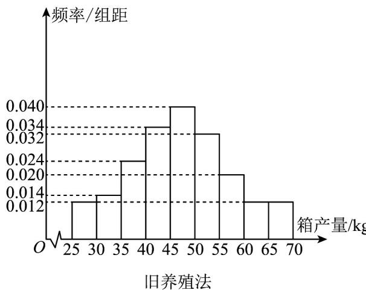

<!-- question-source:start -->
【典例1】海水养殖场进行某水产品的新、旧网箱养殖方法的产量对比，收获时各随机抽取了 $100$ 个网箱，

测量各箱水产品的产量（单位：kg），其频率分布直方图如下：

殖方法有关；

(2) 根据列联表判断是否有 $99\%$ 的把握认为箱产量与养殖方法有关？

<table><tr><td></td><td>箱产量&lt;50kg</td><td>箱产量≥50kg</td></tr><tr><td>旧养殖法</td><td></td><td></td></tr><tr><td>新养殖法</td><td></td><td></td></tr></table>

参考公式：

(1) 给定临界值表

<table><tr><td> $P(K \geq k_0)$ </td><td>0.50</td><td>0.40</td><td>0.25</td><td>0.15</td><td>0.10</td><td>0.05</td><td>0.025</td><td>0.010</td><td>0.005</td><td>0.001</td></tr><tr><td> $k_0$ </td><td>0.455</td><td>0.708</td><td>1.323</td><td>2.072</td><td>2.706</td><td>3.841</td><td>5.024</td><td>6.635</td><td>7.879</td><td>10.828</td></tr></table>

(2) $K^{2} = \frac{n(ad - bc)^{2}}{(a + b)(c + d)(a + c)(b + d)}$ 其中 $n = a + b + c + d$ 为样本容量·
<!-- question-source:end -->

![[高中/课堂同步/题库/人教A版高中数学同步讲义(2026)/05_选择性必修第三册/第八章 成对数据的统计分析/专题8.3 列联表与独立性检验（高效培优讲义）数学人教A版高二选择性必修第三册/题型02_用等高堆积条形图分析两分类变量间的关系/questions/answers/Q00083555A1.md]]
