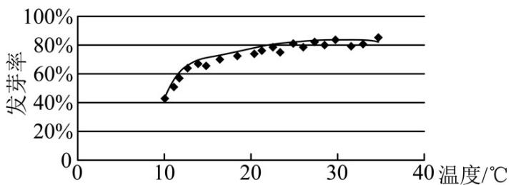

<!-- question-source:start -->
2．某校一个课外学习小组为研究某作物种子的发芽率 $y$ 和温度 $x$ （单位： ${}^{\circ}\mathrm{C}$ ）的关系，在 $^{20}$ 个不同的温度条件下进行种子发芽实验，由实验数据 $\left(x_{i}, y_{i}\right)\left(i = 1, 2, \dots, 20\right)$ 得到下面的散点图：

由此散点图，在 $10^{\circ}\mathrm{C}$ 至 $35^{\circ}\mathrm{C}$ 之间，下面四个回归方程类型中最适宜作为发芽率 $y$ 和温度 $x$ 的回归方程类型的是（ ）A. $y = a + bx$ B. $y = a + bx^{2}$ C. $y = a + be^{x}$ D. $y = a + b\ln x$
<!-- question-source:end -->

![[高中/课堂同步/题库/人教A版高中数学同步讲义(2026)/05_选择性必修第三册/第八章 成对数据的统计分析/单元测试/第八章_成对数据的统计分析_高效培优单元自测_强化卷_数学人教A版高二/一_选择题_sec_02/questions/answers/Q00059971A1.md]]
