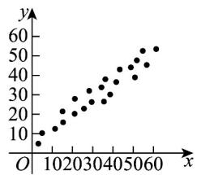
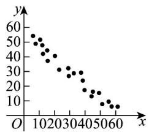
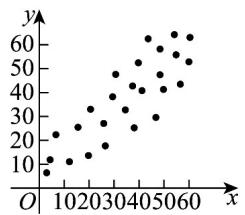
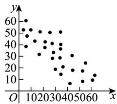

> [!faq]- 《第八章 成对数据的统计分析（高效培优单元自测·强化卷）数学人教A版高二选择性必修第三册》官方解析
>
> > [!success]- **【答案】**  图①(相关系数 $r_{1}$ )  图②(相关系数 $r_{2}$ )  图③(相关系数 $r_{3}$ )  图④(相关系数 $r_{4}$ ) A. $r_1$ B. $r_2$ C. $r_3$ D. $r_4$
>
> > [!note]- **【分析】**
> > 根据散点图和相关性的关系，判断结果·
>
> > [!note]- **【解析】**
> > 由散点图知，相关系数 $r_2$ 对应的散点图呈负相关，且线性相关性比较强·
> >
> > 故选 **B**.
