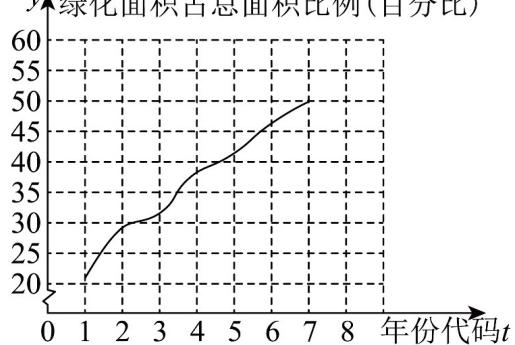

<!-- question-source:start -->
19. （17分）中国防沙治沙成绩斐然，不断书写“绿色奇迹”，截至2025年年底，中国 $53\%$ 的可治理沙化土

地已得到有效治理，沙化土地面积净减少6500万亩，现调查统计了某荒漠地区2019\~2025年绿化面积变化

情况，得到如下折线图。

$y \uparrow$ 绿化面积占总面积比例(百分比)

（附：年份代码 $1\sim 7$ 分别对应的年份是 $2019\sim 2025$ ，经计算得 $\sum_{i = 1}^{7}y_{i} = 259$ ， $\sum_{i = 1}^{7}t_iy_i = 1162$ ， $\sqrt{7}\approx 2.65$ ， $\sqrt{\sum_{i = 1}^{7}\left(y_i - \overline{y}\right)^2} = 27$ ， $\sum_{i = 1}^{7}\left(t_i - \overline{t}\right)\left(y_i - \overline{y}\right) = 126$

(1)用线性回归模型拟合 $y$ 与 $t$ 的关系，求出相关系数 $r$ （精确到0.01）；

(2)求出 $y$ 关于 $t$ 的回归方程；

(3)若该荒漠地区原面积共 $^{10}$ 万亩，预测该地区 $^{2026}$ 年绿化面积达到多少亩？

附：（i）相关系数： $r = \frac{\sum_{i=1}^{n}\left(t_i - \overline{t}\right)\left(y_i - \overline{y}\right)}{\sqrt{\sum_{i=1}^{n}\left(t_i - \overline{t}\right)^2\sum_{i=1}^{n}\left(y_i - \overline{y}\right)^2}}$

(ii) 线性回归方程： $\hat{y} = \hat{b}t + \hat{a}$ ，其中 $\hat{b} = \frac{\sum_{i=1}^{n}(t_i - \overline{t})(y_i - \overline{y})}{\sum_{i=1}^{n}(t_i - \overline{t})^2}$ ， $t = \overline{y} - \overline{b}t$ 。
<!-- question-source:end -->

![[高中/课堂同步/题库/人教A版高中数学同步讲义(2026)/05_选择性必修第三册/第八章 成对数据的统计分析/第八章 成对数据的统计分析（高效培优单元自测·强化卷）数学人教A版高二选择性必修第三册/三_填空题/questions/answers/Q00083586A1.md]]
