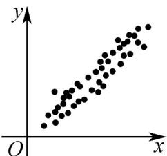
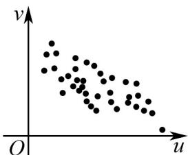

<!-- question-source:start -->
1. 对变量 $x$ 、 $y$ 有观测数据 $\left(x_{i},y_{i}\right)$ ，得散点图1；对变量 $u$ 、 $v$ 有观测数据 $\left(u_{i},v_{i}\right)$ ，得散点图2. 分别用 $r_1$ 、

$r_{2}$ 表示变量 x 与 y 、 u 与 v 之间的线性相关系数，则下列说法正确的是（）·

图1

图2

A. 变量 $x$ 与 $y$ 呈现正相关，且 $\left|r_1\right| < \left|r_2\right|$ B. 变量 $x$ 与 $y$ 呈现负相关，且 $\left|r_1\right| > \left|r_2\right|$ C. 变量 $u$ 与 $v$ 呈现正相关，且 $\left|r_1\right| < \left|r_2\right|$ D. 变量 $u$ 与 $v$ 呈现负相关，且 $\left|r_1\right| > \left|r_2\right|$
<!-- question-source:end -->

![[高中/课堂同步/题库/人教A版高中数学同步讲义(2026)/05_选择性必修第三册/第八章 成对数据的统计分析/第八章 成对数据的统计分析（高效培优单元自测·提升卷）数学人教A版高二选择性必修第三册/一_选择题/questions/answers/Q00083587A1.md]]
