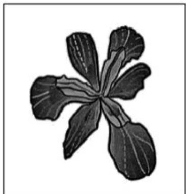
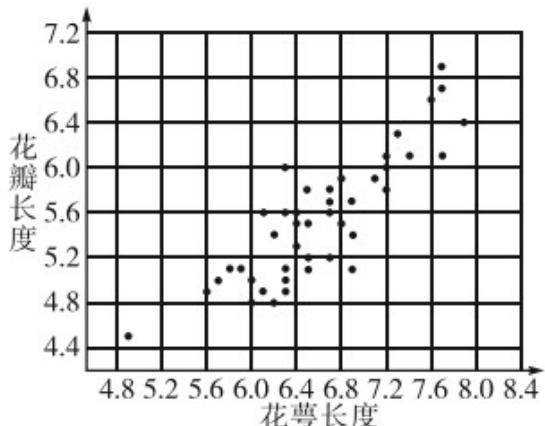

> [!faq]- 《第八章 成对数据的统计分析（高效培优单元自测·提升卷）数学人教A版高二选择性必修第三册》官方解析
>
> > [!success]- **【答案】** D
>
> > [!note]- **【解析】**
> > 解析 对于 A：因为 y = x 在定义域内单调递增且 b > 0，所以 w 随着 x 的增大而增大，不合题意，
> >
> > 故 $^{A}$ 错误；
> >
> > 对于 B：因为 $y = \ln x$ 在定义域内单调递增且 b > 0，所以 w 随着 x 的增大而减小，当解释变量 $x \to +\infty$
> >
> > $w \rightarrow -\infty$ ，不合题意，故 $^{B}$ 错误；
> >
> > 对于 C：因为 $y = \sqrt{x}$ 在定义域内单调递增且 b > 0，所以 w 随着 x 的增大而减小，当解释变量 $x \to +\infty$ ，
> >
> > $w \rightarrow -\infty$ ，不合题意，故 $^{C}$ 错误；
> >
> > 对于D：因为 $y = e^{-x} = \left(\frac{1}{e}\right)^x$ 在定义域内单调递减且 $b > 0$ ，所以 $w$ 随着 $x$ 的增大而减小，当解释变量 $x \to +\infty$ ，
> >
> > $w \rightarrow a$ ，故 D 正确；故选 D.
> >
> > 4. 鸢是鹰科的一种鸟，《诗经·大雅·旱麓》曰“鸢飞戾天，鱼跃于渊”·鸢尾花因花瓣形如鸢尾而得名（图
> >
> > 1），寓意鹏程万里、前途无量·通过随机抽样，收集了若干朵某品种鸢尾花的花萼长度和花瓣长度（单位：
> >
> > cm），绘制对应散点图（图2）如下：
> >
> > 
> > 图1
> >
> > 
> > 图2
> >
> > 计算得样本相关系数为 0.8642，利用最小二乘法求得相应的经验回归方程为少 $\hat{y}=0.7501x+0.6105$ 。根据以上信息，如下判断正确的为（）
> >
> > A．花萼长度和花瓣长度不存在相关关系
> >
> > B．花萼长度和花瓣长度负相关
> >
> > C．花萼长度为 $7cm$ 的该品种鸢尾花的花瓣长度的平均值约为 5.8612cm
> >
> > D．若选取其他品种鸢尾花进行抽样，所得花萼长度与花瓣长度的样本相关系数一定为 0.8642
> >
> > 【答案】C 【详解】解析 因为相关系数 $r = 0.8642 > 0.75$ ，且散点图呈左下角到右上角的带状分布，所以花瓣长度和花萼长度呈正相关，且相关性较强，所以A，B选项错误；当 $x = 7$ 时，代入经验回归方程为 $\hat{y} = 0.7501x + 0.6105$ ，可得 $y = 5.8612$ ，所以花萼长度为 $7\mathrm{cm}$ 的该品种鸢尾花的花瓣长度的平均值约为 $5.8612\mathrm{cm}$ ，所以C选项正确；若选取其他品种狂尾花进行抽样，所得花萼长度与花瓣长度的样本相关系数不一定是0.8642，所以D选项
> >
> > 错误·
> >
> > 故选 **C**.
