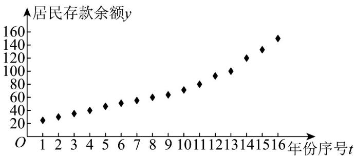

<!-- question-source:start -->
19.（17分）某经济研究所为了解居民存款余额变化情况，对2009年至2024年居民存款余额进行统计分

析，将 $^{2009}$ 年看成第 $^{1}$ 年，依次类推，得到第 $^{1\sim16}$ 年的居民存款余额 $^{y}$ （单位：万亿元）的散点图，如

图所示：

(1)已知从 $2021$ 年开始，居民存款余额超过 $100$ 万亿元，若从 $2009$ 年至 $2024$ 年中任取 $2$ 年，求这 $2$ 年中恰

有一年居民存款余额超过 100 万亿元的概率；

(2)由散点图知， $y$ 和 $t$ 的关系可用经验回归模型 $y = a \cdot e^{bt}$ 进行拟合，求 $y$ 关于 $t$ 的经验回归方程·

参考数据：设 $z_{i} = \ln y_{i}$ ，则 $\overline{z}\approx 4,\sum_{i = 1}^{16}z_{i}t_{i}\approx 578,\sum_{i = 1}^{16}t_{i}^{2} - 16\overline{t}^{-2} = 340,\mathrm{e}^{3.15}\approx 23.34$

参考公式：对于一组数据 $\left(t_{i},z_{i}\right)\left(i=1,2,3,\cdots,n\right)$ ，其经验回归直线 $z=\hat{\alpha}+\hat{\beta}t$ 的斜率和截距的最小二乘估计分

别为 $\hat{\beta}=\frac{\sum_{i=1}^{n}z_{i}t_{i}-n\overline{z}\overline{t}}{\sum_{i=1}^{n}t_{i}^{2}-n\overline{t}^{2}},\hat{\alpha}=\overline{z}-\hat{\beta}\overline{t}$
<!-- question-source:end -->

![[高中/课堂同步/题库/人教A版高中数学同步讲义(2026)/05_选择性必修第三册/第八章 成对数据的统计分析/第八章 成对数据的统计分析（高效培优单元自测·提升卷）数学人教A版高二选择性必修第三册/三_填空题/questions/answers/Q00083602A1.md]]
