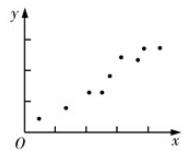
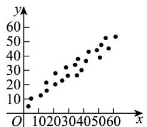
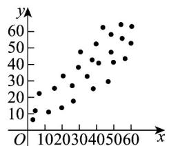
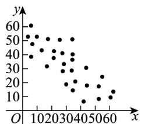
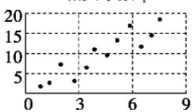

<!-- source-part:1 pages:1-50 -->

## 第八章 成对数据的统计分析

## 内容概览

## 教学目标、教学重难点

<table><tr><td>教学目标</td><td>1. 理解成对数据的含义,会画散点图,能通过散点图直观判断两个变量的线性相关与非线性相关、正相关与负相关。2. 掌握相关系数 r 的含义及计算,明确|r|越接近 1 线性相关越强,会根据 r 的符号判断相关方向,能利用相关系数定量刻画线性相关程度。3. 掌握线性回归方程 y=bx+a 的求法,熟记 b 计算公式,知道样本中心点(x,y)必在回归直线上,能准确求解回归系数。4. 理解残差、残差图的意义,会用残差分析回归模型的拟合效果;了解独立性检验的基本思想,会列 2×2 列联表,能计算统计量并判断变量关联性。</td></tr><tr><td>教学重难点</td><td>重点1.成对变量线性相关关系的判定:散点图直观判断+相关系数定量刻画,掌握正、负相关及线性相关强弱的判断方法。2.线性回归方程的求解与应用:熟练计算回归系数b和a,理解回归直线的意义,能利用方程进行简单预报。3.残差分析的应用:会计算残差、绘制残差图,能根据残差图判断回归模型的拟合效果。4.独立性检验的基本步骤:列联表构建、计算、临界值对比,能准确判断两个分类变量是否有关联。难点1.相关系数r的意义理解:难以理解r的取值与线性相关程度的内在联系,易混淆“相关强”与“因果关系”。2.回归系数b的含义与计算:对b的统计意义(x每变1个单位,y的平均变化量)理解模糊,计算过程易出错。3.残差分析的本质理解:不会通过残差图规律判断模型缺陷,分不清残差误差、系统误差与随机误差的区别。4.统计结论的正确解读:易误将“线性相关”等同于“因果关系”,对回归预报的估计性、独立性检验结论的概率性理解不到位。5.实际问题转化:难以将生活中的成对数据问题(如消费与收入)抽象为统计模型,找不到分析切入点。</td></tr></table>

## 知识清单

## 知识点 01 变量间的相关关系

## 1、变量之间的相关关系

当自变量取值一定时，因变量的取值带有一定的随机性，则这两个变量之间的关系叫相关关系．由于相关关

系的不确定性，在寻找变量之间相关关系的过程中，统计发挥着非常重要的作用．我们可以通过收集大量的

数据，在对数据进行统计分析的基础上，发现其中的规律，对它们的关系作出判断。

注意：相关关系与函数关系是不同的，相关关系是一种非确定的关系，函数关系是一种确定的关系，而且函

数关系是一种因果关系，但相关关系不一定是因果关系，也可能是伴随关系。

2、散点图

将样本中的 n 个数据点 $(x_{i}, y_{i})(i = 1, 2, \cdots, n)$ 描在平面直角坐标系中，所得图形叫做散点图．根据散点图中点的

分布可以直观地判断两个变量之间的关系.

(1) 如果散点图中的点散布在从左下角到右上角的区域内，对于两个变量的这种相关关系，我们将它称为正

相关，如图（1）所示；

(2) 如果散点图中的点散布在从左上角到右下角的区域内，对于两个变量的这种相关关系，我们将它称为负

相关，如图（2）所示。

(1)

(2)

## 3、相关系数

若相应于变量 $x$ 的取值 $x_{i}$ ，变量 $y$ 的观测值为 $y_{i}(1\leq i\leq n)$ ，则变量 $x$ 与 $y$ 的相关系数

$r=\frac{\sum_{i=1}^{n}(x_{i}-\bar{x})(y_{i}-\bar{y})}{\sqrt{\sum_{i=1}^{n}(x_{i}-\bar{x})^{2}\sum_{i=1}^{n}(y_{i}-\bar{y})^{2}}}=\frac{\sum_{i=1}^{n}x_{i}y_{i}-nx\bar{y}}{\sqrt{\sum_{i=1}^{n}x_{i}^{2}-nx^{\bar{2}}}\sqrt{\sum_{i=1}^{n}y_{i}^{2}-ny^{\bar{2}}}}$ ，通常用来衡量与之间的线性关系的强弱，

的范围为 $-1 \leq r \leq 1$

(1) 当 $r > 0$ 时，表示两个变量正相关；当 $r < 0$ 时，表示两个变量负相关。

(2) $|r|$ 越接近1，表示两个变量的线性相关性越强； $|r|$ 越接近0，表示两个变量间几乎不存在线性相关关系．当 $|r|=1$ 时，所有数据点都在一条直线上．

(3) 通常当 $|r| > 0.75$ 时，认为两个变量具有很强的线性相关关系。

## 【即学即练】

1. 对四组数据进行统计，获得如图散点图，其中线性相关性比较强且负相关的是（）

【答案】

图①(相关系数 $r_{1}$ )

图②(相关系数 $r_{2}$ )

图③(相关系数 $r_{3}$ )

图④(相关系数 $r_{4}$ )

A. $r_1$ B. $r_2$ C. $r_3$ D. $r_4$

【答案】B
【分析】根据散点图和相关性的关系，判断结果·
【详解】由散点图知，相关系数 $r_2$ 对应的散点图呈负相关，且线性相关性比较强·
故选：B.

2.（多选）对四组数据进行统计，获得如图所示的散点图，关于其相关系数的关系，正确的有（）

【答案】

相关系数 $r_{1}$

相关系数 $r_{3}$

相关系数 $r_{2}$

相关系数 $r_{4}$

A. $r_1 < r_4$ B. $r_2 < r_3$ C. $r_3 > 0$ D. $r_4 > 0$

【答案】AC

【分析】由散点图结合相关系数定义可得答案·

【详解】由图形特征可知 $r_1$ ， $r_4$ 都是负相关，都是负数， $r_1$ 比 $r_4$ 的相关系数绝对值更大，所以 $r_1 < r_4 < 0$ ， $r_2$ ， $r_3$ 都是正相关， $r_2$ 比 $r_3$ 的相关关系更强，所以 $0 < r_3 < r_2$ .

故选：AC

## 知识点 02 线性回归

## 1、线性回归

线性回归是研究不具备确定的函数关系的两个变量之间的关系（相关关系）的方法.

对于一组具有线性相关关系的数据（x1，y1），（x2，y2），…，（xn，yn），其回归方程 $\hat{y} = \hat{b} x + \hat{a}$ 的求法

为

$$
\left\{ \begin{array}{l} \hat {b} = \frac {\sum_ {i = 1} ^ {n} \left(x _ {i} - \bar {x}\right) \left(y _ {i} - \bar {y}\right)}{\sum_ {i = 1} ^ {n} \left(x _ {i} - \bar {x}\right) ^ {2}} = \frac {\sum_ {i = 1} ^ {n} x _ {i} y _ {i} - n \bar {x} \bar {y}}{\sum_ {i = 1} ^ {n} x _ {i} ^ {2} - n \bar {x} ^ {2}} \\ \hat {a} = \bar {y} - \hat {b} \bar {x} \end{array} \right.
$$

其中， $\overline{x}=\frac{1}{n}\sum_{i=1}^{n}x_{i}$ ， $\overline{y}=\frac{1}{n}\sum_{i=1}^{n}y_{i}$ ， $(\overline{x},\overline{y})$ 称为样本点的中心。

## 2、残差分析

对于预报变量 $y$ ，通过观测得到的数据称为观测值 $y_{i}$ ，通过回归方程得到的 $\hat{y}$ 称为预测值，观测值减去预测

值等于残差， $\hat{e}_i$ 称为相应于点 $(x_i, y_i)$ 的残差，即有 $\hat{e}_i = y_i - \hat{y}_i$ 。残差是随机误差的估计结果，通过对残差的

分析可以判断模型刻画数据的效果以及判断原始数据中是否存在可疑数据等，这方面工作称为残差分析。

(1) 残差图

通过残差分析，残差点 $(x_{i},\hat{e}_{i})$ 比较均匀地落在水平的带状区域中，说明选用的模型比较合适，其中这样的带

状区域的宽度越窄，说明模型拟合精确度越高；反之，不合适。

(2) 通过残差平方和 $Q = \sum_{i=1}^{n} (y_i - \hat{y}_i)^2$ 分析，如果残差平方和越小，则说明选用的模型的拟合效果越好；反之，不合适。

(3) 相关指数

用相关指数来刻画回归的效果，其计算公式是： $R^2 = 1 - \frac{\sum_{i=1}^{n}(y_i - \hat{y}_i)^2}{\sum_{i=1}^{n}(y_i - \overline{y})^2}$ $R^2$ 越接近于1，说明残差的平方和越小，也表示回归的效果越好.

【即学即练】

1. 下列命题错误的是（ ）

【答案】
A．两个随机变量的线性相关性越强，相关系数的绝对值越接近于 $^{1}$ B．设 $\xi \sim N(1, \sigma^{2})$ ，且 $P(\xi < 0) = 0.2$ ，则 $P(1 < \xi < 2) = 0.2$ C．线性回归直线 $\hat{y}=bx+a$ 一定经过样本点的中心 $(\overline{x},\overline{y})$ D．在残差图中，残差点分布的带状区域的宽带越狭窄，其模型拟合的精度越高

【答案】B

【分析】利用相关关系判断 $^{A}$ ；由正态分布的性质判断 $^{B}$ ；由线性回归直线的性质判断 $^{C}$ ；由残差的性质判断D.

【详解】对于 $^{A}$ ，根据相关系数的意义可知， $^{A}$ 正确；

对于 B，由 $\xi\sim N(1,\sigma^{2})$ ，知 $\mu=1$ ，即概率密度函数的图像关于直线 x=1 对称，所以 $P(\xi<0)=P(\xi>2)=0.2$

则 $P(1 < \xi < 2) = \frac{1 - 2P(\xi < 0)}{2} = 0.3$ ，故B错误；

对于 $^{C}$ ，根据线性回归直线的性质可知， $^{C}$ 正确；

对于 D，根据残差图的意义可知，D 正确；

2. 随着互联网行业、传统行业和实体经济的融合不断加深，互联网对社会经济发展的推动效果日益显著，某

大型超市计划在不同的线上销售平台开设网店，为确定开设网店的数量，该超市在对网络上相关店铺做了充

分的调查后，得到下列信息，如图所示（其中 $x$ 表示开设网店数量， $y$ 表示这 $x$ 个分店的年销售额总和），

现已知 $\sum_{i=1}^{5} x_i y_i = 8850, \sum_{i=1}^{5} y_i = 2000$ ，求解下列问题；

(1) 经判断，可利用线性回归模型拟合 $y$ 与 $x$ 的关系，求解 $y$ 关于 $x$ 的回归方程；

(2) 按照经验，超市每年在网上销售获得的总利润 $w$ （单位：万元）满足 $w = y - 5x^{2} - 140$ ，请根据（1）中

的线性回归方程，估算该超市在网上开设多少分店时，才能使得总利润最大。

参考公式；线性回归方程 $\hat{y} = \hat{b}x + \hat{a}$ ，其中 $\hat{a} = \overline{y} -\hat{b}\overline{x},b = \frac{\sum_{i = 1}^{5}x_iy_i - n\overline{xy}}{\sum_{i = 1}^{5}x_i^2 - n\overline{x}^2}$

【答案】（1） $\hat{y}=85x+60$ ；（2）开设 $^{8}$ 或 $^{9}$ 个分店时，才能使得总利润最大。

【分析】（1）先求得 $\sum_{i=1}^{5} x_i^2 = 90, \overline{x} = 4$ ，再根据提供的数据求得 $\hat{b}$ ， $\hat{a}$ ，写出回归直线方程；

(2) 由 (1) 结合 $w = y - 5x^{2} - 140$ ，得到 $w = -5x^{2} + 85x - 80$ ，再利用二次函数的性质求解

【详解】（1）由题意得 $\sum_{i=1}^{5} x_i^2 = 90, \overline{x} = 4, \hat{b} = \frac{8850 - 20 \times 400}{90 - 80} = 85$

$$
\hat {a} = 4 0 0 - 8 5 \times 4 = 6 0,
$$

所以 $\hat{y} = 85x + 60$

(2) 由 (1) 知， $w = -5x^{2} + 85x - 80 = -5\left(x - \frac{17}{2}\right)^{2} + \frac{1125}{4}$

所以当 $x = 8$ 或 $x = 9$ 时能获得总利润最大.

## 知识点 03 非线性回归

解答非线性拟合问题，要先根据散点图选择合适的函数类型，设出回归方程，通过换元将陌生的非线性回归

方程化归转化为我们熟悉的线性回归方程.

求出样本数据换元后的值，然后根据线性回归方程的计算方法计算变换后的线性回归方程系数，还原后即可

求出非线性回归方程，再利用回归方程进行预报预测，注意计算要细心，避免计算错误。

1、建立非线性回归模型的基本步骤：

(1) 确定研究对象，明确哪个是解释变量，哪个是预报变量；

(2) 画出确定好的解释变量和预报变量的散点图，观察它们之间的关系（是否存在非线性关系）；

(3) 由经验确定非线性回归方程的类型（如我们观察到数据呈非线性关系，一般选用反比例函数、二次函

数、指数函数、对数函数、幂函数模型等）；

(4) 通过换元，将非线性回归方程模型转化为线性回归方程模型；

(5) 按照公式计算线性回归方程中的参数（如最小二乘法），得到线性回归方程；

(6) 消去新元，得到非线性回归方程；

(7) 得出结果后分析残差图是否有异常．若存在异常，则检查数据是否有误，或模型是否合适等．

常见的非线性回归模型

(1) 指数函数型 $y = ca^{x}$ (a > 0 且 $a \neq 1, c > 0$ )

两边取自然对数， $\ln y = \ln (ca^x)$ ，即 $\ln y = \ln c + x\ln a$

令 $\left\{ \begin{array}{l} y' = \ln y \\ x' = x \end{array} \right.$ ，原方程变为 $y' = \ln c + x' \ln a$ ，然后按线性回归模型求出 $\ln a$ ， $\ln c$ 。

(2) 对数函数型 $y = b \ln x + a$

令 $\left\{ \begin{array}{l} y' = y \\ x' = \ln x \end{array} \right.$ ，原方程变为 $y' = bx' + a$ ，然后按线性回归模型求出 $b$ ， $a$ 。

(3) 幂函数型 $y = ax^n$

两边取常用对数， $\lg y = \lg (ax^n)$ ，即 $\lg y = n\lg x + \lg a$

令 $\left\{ \begin{array}{l} y' = \lg y \\ x' = \lg x \end{array} \right.$ ，原方程变为 $y' = nx' + \lg a$ ，然后按线性回归模型求出 $n$ ， $\lg a$ 。

(4) 二次函数型 $y = bx^{2} + a$

令 $\left\{ \begin{array}{l} y' = y \\ x' = x^2 \end{array} \right.$ ，原方程变为 $y' = bx' + a$ ，然后按线性回归模型求出 $b$ ， $a$ 。

(5) 反比例函数型 $y = a + \frac{b}{x}$ 型

令 $\left\{ \begin{array}{l} y' = y \\ x' = \frac{1}{x} \end{array} \right.$ ，原方程变为 $y' = bx' + a$ ，然后按线性回归模型求出 $b$ ， $a$ 。

## 【即学即练】

1. 某池塘中水生植物的覆盖水塘面积 $x$ （单位： $\mathrm{dm}^2$ ）与水生植物的株数 $y$ （单位：株）之间的相关关系，

收集了 $^{4}$ 组数据，用模型 $y = ce^{kx} (c > 0)$ 去拟合 $x$ 与 $y$ 的关系，设 $z = \ln y$ ， $x$ 与 $z$ 的数据如表格所示：

<table><tr><td>x</td><td>3</td><td>4</td><td>6</td><td>7</td></tr><tr><td>z</td><td>2.5</td><td>3</td><td>4</td><td>5.9</td></tr></table>

得到 x 与 z 的线性回归方程 $\hat{z}=0.7x+\hat{a}$ ，则 c= \_\_\_\_.

【答案】 $\mathrm{e}^{0.35}$

【分析】根据已知求得 $\overline{x} = 5$ ， $\overline{z} = 3.85$ ，进而代入回归方程可求得 $\hat{a} = 0.35$ ，从而得出 $\hat{z} = 0.7x + 0.35$ ·然后代

入 $z = \ln y$ ，根据指对互化，即可得出答案·

【详解】由已知可得， $\overline{x}=\frac{3+4+6+7}{4}=5$ ， $\overline{z}=\frac{2.5+3+4+5.9}{4}=3.85$

所以，有 $3.85 = 0.7 \times 5 + \hat{a}$ ，解得 $\hat{a} = 0.35$

所以 $\hat{z}=0.7x+0.35$ .

由 $z = \ln y$ ，得 $\ln y = 0.7x + 0.35$ ，

所以 $y = e^{0.7x + 0.35} = e^{0.35} \cdot e^{0.7x}$

所以 $\mathbf{c} = \mathbf{e}^{0.35}$

故答案为： $e^{0.35}$

2. 某生产制造企业统计了近 $^{10}$ 年的年利润 $y$ （千万元）与每年投入的某种材料费用 $x$ （十万元）的相关数

据，作出如下散点图：

选取函数 $y = a \cdot x^{b} (b > 0, a > 0)$ 作为每年该材料费用 $x$ 和年利润 $y$ 的回归模型·若令

$m = \ln x, n = \ln y, m_i = \ln x_i, n_i = \ln y_i$ ，则 $n = bm + \ln a$ ，得到相关数据如表所示：

<table><tr><td> $\sum_{i=1}^{10}m_{i}n_{i}$ </td><td> $\sum_{i=1}^{10}m_{i}$ </td><td> $\sum_{i=1}^{10}n_{i}$ </td><td> $\sum_{i=1}^{10}m_{i}^{2}$ </td></tr><tr><td>31.5</td><td>15</td><td>15</td><td>49.5</td></tr></table>

(1)求出 $y$ 与 $x$ 的回归方程；

(2)计划明年年利润额突破 $^{1}$ 亿，则该种材料应至少投入多少费用？（结果保留到万元）参考数据：

$$
\frac {1 0}{e} \approx 3. 6 7 9, 3. 6 7 9 ^ {2} \approx 1 3. 5 3 5, 3. 6 7 9 ^ {3} \approx 4 9. 7 9 5.
$$

【答案】(1) $y = e \cdot x^{\frac{1}{3}}$

(2)498 万元

【分析】（1）由表中数据代入最小二乘法公式计算即可；

(2) 按照 (1) 中所求回归方程，结合参考数据，代入计算即可·

【详解】（1）因为 $m = \ln x, n = \ln y, n = bm + \ln a$

由表中数据得 $\hat{b} = \frac{\sum_{i=1}^{10} m_i n_i - 10\overline{m} \cdot \overline{n}}{\sum_{i=1}^{10} m_i^2 - 10\overline{m}^2} = \frac{31.5 - 10 \times 1.5 \times 1.5}{49.5 - 10 \times 1.5 \times 1.5} = \frac{1}{3}$

所以 $\ln a = \overline{n} - b\overline{m} = 1.5 - \frac{1}{3} \times 1.5 = 1$ ，所以 a = e，

所以年该材料费用 x 和年利润额 y 的回归方程为 $y = e \cdot x^{\frac{1}{3}}$ ;

(2) 令 $y = \mathrm{e} \cdot x^{\frac{1}{3}} > 10$ ，得 $x^{\frac{1}{3}} > \frac{10}{\mathrm{e}} \approx 3.679$

所以 $x > 3.679^{3} \approx 49.8$ （十万），

故下一年应至少投入 $^{498}$ 万元该材料费用·

知识点 04 独立性检验

1、分类变量和列联表

(1) 分类变量：

变量的不同“值”表示个体所属的不同类别，像这样的变量称为分类变量。

(2) 列联表：

①定义：列出的两个分类变量的频数表称为列联表。

② $2 \times 2$ 列联表.

一般地，假设有两个分类变量 X 和 Y，它们的取值分别为 $\{x1, x2\}$ 和 $\{y1, y2\}$ ，其样本频数列联表（称为

$2 \times 2$ 列联表）为

<table><tr><td></td><td> $y_1$ </td><td> $y_2$ </td><td>总计</td></tr><tr><td> $x_1$ </td><td>a</td><td>b</td><td>a+b</td></tr><tr><td> $x_2$ </td><td>c</td><td>d</td><td>c+d</td></tr><tr><td>总计</td><td>a+c</td><td>b+d</td><td>a+b+c+d</td></tr></table>

从 $2 \times 2$ 列表中，依据 $a + b$ 与 $c + d$ 的值可直观得出结论：两个变量是否有关系。

## 2、等高条形图

（1）等高条形图和表格相比，更能直观地反映出两个分类变量间是否相互影响，常用等高条形图表示列联表

数据的频率特征.

$$
\frac {a}{a + b} \text {与} \frac {c}{c + d}
$$

(2) 观察等高条形图发现 $a + b$ 与 $c + d$ 相差很大，就判断两个分类变量之间有关系。

3、独立性检验

(1) 定义：利用独立性假设、随机变量 $K^2$ 来确定是否有一定把握认为“两个分类变量有关系”的方法称为两

个分类变量的独立性检验．

(2) 公式： $K^{2}=\frac{n(ad-bc)^{2}}{(a+b)(c+d)(a+c)(b+d)}$ ，其中 $n=a+b+c+d$ 为样本容量。

(3) 独立性检验的具体步骤如下：

① 计算随机变量 $K^{2}$ 的观测值 k ，查下表确定临界值 $k_{0}$ ：

<table><tr><td> $p(K^{2} \quad k_{0})$ </td><td>0.5</td><td>0.40</td><td>0.25</td><td>0.15</td><td>0.10</td><td>0.05</td><td>0.025</td><td>0.010</td><td>0.005</td><td>0.001</td></tr><tr><td> $k_{0}$ </td><td>0.455</td><td>0.708</td><td>1.323</td><td>2.072</td><td>2.706</td><td>3.841</td><td>5.024</td><td>6.635</td><td>7.879</td><td>10.828</td></tr></table>

②如果 $k \quad k_{0}$ ，就推断“X 与 Y 有关系”，这种推断犯错误的概率不超过 $p(K^{2} \quad k_{0})$ ；否则，就认为在犯错误的概率不超过 $p(K^{2} \quad k_{0})$ 的前提下不能推断“X 与 Y 有关系”。

(2) 两个分类变量 $X$ 和 $Y$ 是否有关系的判断标准：

统计学研究表明：

当 $K^2 \leq 3.841$ 时，认为 $X$ 与 $Y$ 无关；

当 $K^2 > 3.841$ 时，有 $95\%$ 的把握说 $X$ 与 $Y$ 有关；

当 $K^{2} > 6.635$ 时，有 99% 的把握说 X 与 Y 有关；

当 $K^2 > 10.828$ 时，有 $99.9\%$ 的把握说 $X$ 与 $Y$ 有关。

## 【即学即练】

1. 某中学对学生钻研奥数课程的情况进行调查，将每周独立钻研奥数课程超过 $6$ 小时的学生称为“奥数迷”，

否则称为“非奥数迷”，从调查结果中随机抽取 $^{100}$ 人进行分析，得到数据如表所示：

<table><tr><td></td><td colspan="2">奥数迷</td><td>非奥数迷</td><td>总计</td></tr><tr><td>男</td><td colspan="2">24</td><td>36</td><td>60</td></tr><tr><td>女</td><td colspan="2">12</td><td>28</td><td>40</td></tr><tr><td>总计</td><td colspan="2">36</td><td>64</td><td>100</td></tr><tr><td> $\alpha$ </td><td>0.1</td><td>0.05</td><td>0.01</td><td>0.001</td></tr><tr><td> $x_{\alpha}$ </td><td>2.706</td><td>3.841</td><td>6.635</td><td>10.828</td></tr></table>

(1)对照 $2 \times 2$ 列联表，根据小概率 $\alpha = 0.1$ 的 $\chi^2$ 独立性检验，是否为“奥数迷”与性别有关？

(2)现从抽取的“奥数迷”中，按性别采用分层抽样的方法抽取 $^{3}$ 人参加奥数闯关比赛，已知其中男、女学生独

立闯关成功的概率分别为 $\frac{3}{4}, \frac{2}{3}$ ，在恰有两人闯关成功的条件下，求两人性别相同的概率。

参考数据与公式： $\chi^{2}=\frac{n(ad-bc)^{2}}{(a+b)(c+d)(a+c)(b+d)}$ ，其中 $n=a+b+c+d$

【答案】(1)没有 90% 的把握认为是否为“奥数迷”与性别有关·

(2) $\frac{3}{7}$

【分析】（1）作零假设，根据表中数据计算得 $\chi^2$ 并与 $x_{\alpha}$ 作比较，然后得到结论；

(2) 由分层抽样得到抽取的男生和女生的人数，记“恰有两人闯关成功”为事件 $A$ ，“没有女生闯关成功”为事

件 B，分别求出则 $P(A)$ ， $P(AB)$ ，由条件概率公式求得 $P(B|A)$ .

【详解】（1）零假设 $H_{0}$ ：“奥数迷”与性别无关

根据表中数据计算得 $\chi^2 = \frac{100(24\times 28 - 12\times 36)^2}{60\times 40\times 36\times 64} = \frac{25}{24}\approx 1.042 <   2.706 = x_{0.1}$

根据小概率 $\alpha = 0.1$ 的 $\chi^2$ 独立性检验，没有充分的证据推断 $H_0$ 不成立，因此可以认为“奥数迷”与性别无关。

没有 90% 的把握认为是否为“奥数迷”与性别有关·

(2) 根据分层抽样，抽取的男生人数为 $^{2}$ 人，女生人数为 $^{1}$ 人，

记“恰有两人闯关成功”为事件 A，“没有女生闯关成功”为事件 B，

$$
P (A) = \left(\frac {3}{4}\right) ^ {2} \left(1 - \frac {2}{3}\right) + C _ {2} ^ {1} \left(1 - \frac {3}{4}\right) \times \frac {3}{4} \times \frac {2}{3} = \frac {7}{1 6},
$$

$$
P (A B) = \left(\frac {3}{4}\right) ^ {2} \times \frac {1}{3} = \frac {3}{1 6}.
$$

由条件概率的公式得 $P(B|A)=\frac{P(AB)}{P(A)}=\frac{\frac{3}{16}}{\frac{7}{16}}=\frac{3}{7}$ ，

故在恰有两人闯关成功的条件下，两人性别相同的概率为 $\frac{3}{7}$

2. 近年来，某公司以电影和动漫中的一些元素为主题，开发了一些豪车模型玩具，现抽取了部分孩童，调查

他们是否喜爱豪车模型，所得数据统计如下表所示。

<table><tr><td>性别</td><td>男孩</td><td>女孩</td></tr><tr><td>喜欢豪车模型</td><td>340</td><td>160</td></tr><tr><td>不喜欢豪车模型</td><td>300</td><td>200</td></tr></table>

(1)现按照性别进行分层，用分层随机抽样的方法在不喜欢豪车模型的样本孩童中随机抽取 $^{10}$ 人，再从这 $^{10}$

人中随机抽取 $^{3}$ 人，求至少 $^{1}$ 人是女孩的概率；

(2)根据 $\alpha = 0.001$ 的独立性检验，能否认为是否喜欢豪车模型与性别具有相关性。

附： $\chi^{2}=\frac{n(ad-bc)^{2}}{(a+b)(c+d)(a+c)(b+d)}$ ， $n=a+b+c+d$

<table><tr><td> $\alpha$ </td><td>0.05</td><td>0.01</td><td>0.001</td></tr><tr><td> $x_{\alpha}$ </td><td>3.841</td><td>6.635</td><td>10.828</td></tr></table>

【答案】(1) $\frac{5}{6}$

(2)不能认为是否喜欢豪车模型与性别具有相关性

【分析】（ $^{1}$ ）根据对立事件的概率及古典概型求解；

(2) 计算 $\chi^{2}$ ，与对应临界值比较即可得出结论.

【详解】（1）抽取的 $^{10}$ 人中，男孩有6人，女孩有4人，

故至少有 $^{1}$ 人是女孩的概率为 $P=1-\frac{C_{6}^{3}}{C_{10}^{3}}=1-\frac{1}{6}=\frac{5}{6}$

(2) 零假设：是否喜欢豪车模型与性别无关，

$$
\chi^ {2} = \frac {1 0 0 0 \times (3 4 0 \times 2 0 0 - 3 0 0 \times 1 6 0) ^ {2}}{5 0 0 \times 5 0 0 \times 3 6 0 \times 6 4 0} \approx 6. 9 4 4 <   1 0. 8 2 8,
$$

故不能拒绝零假设，即根据 $\alpha = 0.001$ 的独立性检验，不能认为是否喜欢豪车模型与性别具有相关性。

## 题型精讲

![[高中/课堂同步/题库/人教A版高中数学同步讲义(2026)/05_选择性必修第三册/第八章 成对数据的统计分析/第八章 成对数据的统计分析（高效培优讲义）数学人教A版高二选择性必修第三册/题型01_变量间的相关关系/题型01_变量间的相关关系.md]]
![[高中/课堂同步/题库/人教A版高中数学同步讲义(2026)/05_选择性必修第三册/第八章 成对数据的统计分析/第八章 成对数据的统计分析（高效培优讲义）数学人教A版高二选择性必修第三册/题型02_线性回归/题型02_线性回归.md]]
![[高中/课堂同步/题库/人教A版高中数学同步讲义(2026)/05_选择性必修第三册/第八章 成对数据的统计分析/第八章 成对数据的统计分析（高效培优讲义）数学人教A版高二选择性必修第三册/题型03_非线性回归/题型03_非线性回归.md]]
![[高中/课堂同步/题库/人教A版高中数学同步讲义(2026)/05_选择性必修第三册/第八章 成对数据的统计分析/第八章 成对数据的统计分析（高效培优讲义）数学人教A版高二选择性必修第三册/题型04_独立性检验/题型04_独立性检验.md]]
![[高中/课堂同步/题库/人教A版高中数学同步讲义(2026)/05_选择性必修第三册/第八章 成对数据的统计分析/第八章 成对数据的统计分析（高效培优讲义）数学人教A版高二选择性必修第三册/题型05_误差分析/题型05_误差分析.md]]
![[高中/课堂同步/题库/人教A版高中数学同步讲义(2026)/05_选择性必修第三册/第八章 成对数据的统计分析/第八章 成对数据的统计分析（高效培优讲义）数学人教A版高二选择性必修第三册/强化训练/强化训练.md]]
