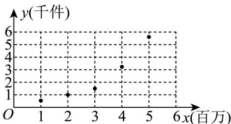

<!-- question-source:start -->
9. 某科技公司在人工智能领域逐年加大投入，根据近年来该公司对产品研发年投入额 $x$ （单位：百万元）与

其年销售量 $y$ （单位：千件）的数据统计，得到散点图如图．用线性回归和指数型回归模型拟合 $y$ 与 $x$ 关系的

决定系数分别为 $R_{1}^{2} = 0.8913$ 和 $R_{2}^{2} = 0.9940$ ，则根据参考数据，下列表达式中最适宜描述 $y$ 与 $x$ 之间关系的函

数为（ ）

参考公式：用最小二乘法求经验回归直线方程 的系数公式为 $\hat{b} = \frac{\sum_{i=1}^{n}(u_i - \overline{u})(v_i - \overline{v})}{\sum_{i}^n (u_i - \overline{u})^2}, \hat{a} = \overline{v} - \hat{b}\overline{u}$ $\hat{v} = \hat{b} u + \hat{a}$

参考数据：令 $\omega_{i} = \ln y_{i}$

<table><tr><td> $\overline{x}$ </td><td> $\overline{y}$ </td><td> $\overline{\omega}$ </td><td> $\sum_{i=1}^{6}(x_i - \overline{x})^2$ </td><td> $\sum_{i=1}^{6}(x_i - \overline{x})(y_i - \overline{y})$ </td><td> $\sum_{i=1}^{6}(x_i - \overline{x})(\omega_i - \overline{\omega})$ </td></tr><tr><td>3</td><td>2.5</td><td>0.5</td><td>10</td><td>12</td><td>6</td></tr></table>

A. $y = 1.2x - 1.1$ B. $y = 0.6x - 1.3$ C. $y = \mathrm{e}^{1.2x - 1.1}$ D. $y = \mathrm{e}^{0.6x - 1.3}$
<!-- question-source:end -->

![[高中/课堂同步/题库/人教A版高中数学同步讲义(2026)/05_选择性必修第三册/第八章 成对数据的统计分析/第八章 成对数据的统计分析（高效培优讲义）数学人教A版高二选择性必修第三册/强化训练/questions/answers/Q00083635A1.md]]
