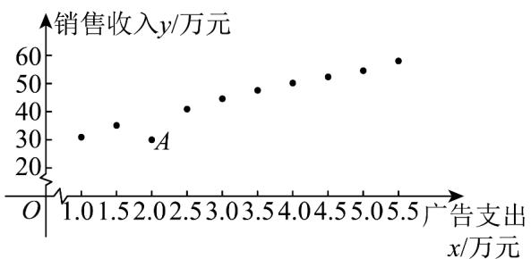

<!-- question-source:start -->
10．某公司收集了某商品销售收入 $^{y}$ （单位：万元）与相应的广告支出 $^{x}$ （单位：万元）共 $^{10}$ 组数据 $(x_{i}, y_{i})(i = 1, 2, 3, \cdots, 10)$ ，绘制出散点图，如图，并利用线性回归模型进行拟合．若将图中 $^{10}$ 个点中去掉A点

后再重新进行线性回归分析，则下列说法错误的是\_\_\_\_。

①决定系数 $R^2$ 变小 ②残差平方和变小

③相关系数 r 的值变小 ④自变量 x 与因变量 y 相关性变弱
<!-- question-source:end -->

![[高中/课堂同步/题库/人教A版高中数学同步讲义(2026)/05_选择性必修第三册/第八章 成对数据的统计分析/第八章 成对数据的统计分析（高效培优讲义）数学人教A版高二选择性必修第三册/强化训练/questions/answers/Q00083636A1.md]]
