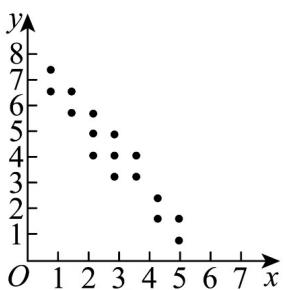

> [!faq]- 《第八章 成对数据的统计分析（高效培优讲义）数学人教A版高二选择性必修第三册》官方解析
>
> > [!success]- **【答案】**  图1  图2  图3 A. 图 $^{1}$ 中 y 与 x 呈正相关 B. 图 $^{2}$ 中 y 与 x 不相关 C. 图 $^{3}$ 中 y 与 x 的线性相关系数小于 0 D．图 1 中 y 与 x 的线性相关系数小于图 2 中 y 与 x 的线性相关系数
>
> > [!note]- **【分析】**
> > 根据给定的散点图，利用正负相关的意义、相关系数的意义逐项判断·
>
> > [!note]- **【解析】**
> > 对于 $^{A}$ ，图 $^{1}$ 中y随x增大而减小，y与x呈负相关， $^{A}$ 错误；
> >
> > 对于 $^{B}$ ，图 $^{2}$ 中各点较分散，y与x的相关性不强，不能肯定不相关， $^{B}$ 错误；
> >
> > 对于 C，图 3 中 y 随 x 增大而增大，y 与 x 呈正相关，相关系数大于 0，C 错误；
> >
> > 对于 $D$ ，图 $1$ 与图 $2$ ， $y$ 与 $x$ 都呈负相关，相关系数为负，
> >
> > 而图 $^{1}$ 中 y 与 x 的线性相关性较图 $^{2}$ 中 y 与 x 的线性相关性强，
> >
> > 所以，图 $^{1}$ 中y与x的线性相关系数小于图 $^{2}$ 中y与x的线性相关系数， $^{D}$ 正确·
> >
> > 故选 **D**
