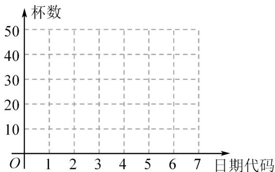

<!-- question-source:start -->
【变式1】秋天的第一杯奶茶是一个网络词汇，最早出自四川达州一位当地民警之口，民警用“秋天的第一杯

奶茶”顺利救下一名女孩，由此而火爆全网·后来很多人开始在秋天里买一杯奶茶送给自己在意的人·某奶茶店

主记录了入秋后前 $^{7}$ 天每天售出的奶茶数量（单位：杯）

如下：

<table><tr><td>日期</td><td>第一天</td><td>第二天</td><td>第三天</td><td>第四天</td><td>第五天</td><td>第六天</td><td>第七天</td></tr><tr><td>日期代码 $x$ </td><td>1</td><td>2</td><td>3</td><td>4</td><td>5</td><td>6</td><td>7</td></tr><tr><td>杯数 $y$ </td><td>4</td><td>15</td><td>22</td><td>26</td><td>29</td><td>31</td><td>32</td></tr></table>

(1)请根据以上数据，绘制散点图，并根据散点图判断， $y = a + bx$ 与 $y = c + d\ln x$ 哪一个更适宜作为 $y$ 关于 $x$ 的

回归方程模型（给出判断即可，不必说明理由）；

(2)建立 $y$ 关于 $x$ 的回归方程（结果保留1位小数），并根据建立的回归方程，试预测要到哪一天售出的奶茶

才能超过 $^{35}$ 杯？

(3)若每天售出至少 $25$ 杯即可盈利，则从第一天至第七天中任选三天，记随机变量 $X$ 表示盈利的天数，求随

机变量 $X$ 的分布列·

参考公式和数据：其中 $u_{i}=\ln x_{i},\overline{u}=\frac{1}{7}\sum_{i=1}^{7}u_{i}$

回归直线方程 中， $\hat{b}=\frac{\sum_{i=1}^{n}x_{1}y_{1}-nx\overline{y}}{\sum_{i=1}^{n}x_{i}^{2}-nx^{2}},\hat{a}=\overline{y}-\hat{b}\overline{x}$

<table><tr><td> $\overline{y}$ </td><td> $\overline{u}$ </td><td> $\sum_{i=1}^{7} x_i y_1$ </td><td> $\sum_{i=1}^{7} u_i y_1$ </td><td> $\sum_{i=1}^{7} u_i^2$ </td><td> $e^{2.1}$ </td></tr><tr><td>22.7</td><td>1.2</td><td>759</td><td>235.1</td><td>13.2</td><td>8.2</td></tr></table>
<!-- question-source:end -->

![[高中/课堂同步/题库/人教A版高中数学同步讲义(2026)/05_选择性必修第三册/第八章 成对数据的统计分析/第八章 成对数据的统计分析（高效培优讲义）数学人教A版高二选择性必修第三册/题型03_非线性回归/questions/answers/Q00083615A1.md]]
