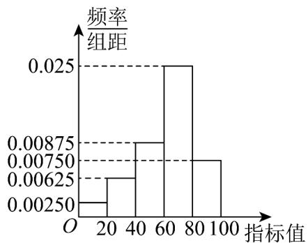

<!-- question-source:start -->
【典例1】某地区为了检测某种农业有机肥料的效果，农业专家播撒肥料到 $200$ 块试验田中，一段时间后测

量土地的某项肥力指标，按 $[0,20), [20,40), [40,60), [60,80), [80,100)$ 分组，绘制成如下频率分布直方图．试验

后发现，产生土地肥力的为 $^{160}$ 块，其中该项指标不小于 $^{60}$ 的有 $^{110}$ 块．假设各块试验田播撒肥料后是否产

生肥力相互独立，并用频率估计概率。

(1)填写下面的 $2 \times 2$ 列联表，并根据列联表判断是否有 $95\%$ 的把握认为播撒肥料后试验田是否产生肥力与指标

值有关；

<table><tr><td></td><td>指标值&lt;60</td><td>指标值 60</td></tr><tr><td>产生肥力</td><td></td><td></td></tr><tr><td>未产生肥力</td><td></td><td></td></tr></table>

(2)为了检验有机肥第二次播撒的有效性，对第一次播撒有机肥后没有产生肥力的试验田进行第二次播撒，经

计算发现同一块试验田在播撒两次有机肥后产生肥力的概率为 0.9．记 $n(n \in \mathbb{N}^*)$ 块土地播撒两次有机肥后产生

肥力的数量为随机变量 $X$ 。试验后统计数据显示，当 $X = 90$ 时， $P(X)$ 取得最大值，求参加播撒有机肥实验

的块数 $n$ 及 $X$ 的数学期望.

附： $K^2 = \frac{n(ad - bc)^2}{(a + b)(c + d)(a + c)(b + d)}, n = a + b + c + d$

<table><tr><td> $P(K^{2} \quad k_{0})$ </td><td>0.15</td><td>0.10</td><td>0.050</td><td>0.010</td><td>0.001</td></tr><tr><td> $k_{0}$ </td><td>2.072</td><td>2.706</td><td>3.841</td><td>6.635</td><td>10.828</td></tr></table>
<!-- question-source:end -->

![[高中/课堂同步/题库/人教A版高中数学同步讲义(2026)/05_选择性必修第三册/第八章 成对数据的统计分析/第八章 成对数据的统计分析（高效培优讲义）数学人教A版高二选择性必修第三册/题型04_独立性检验/questions/answers/Q00083618A1.md]]
